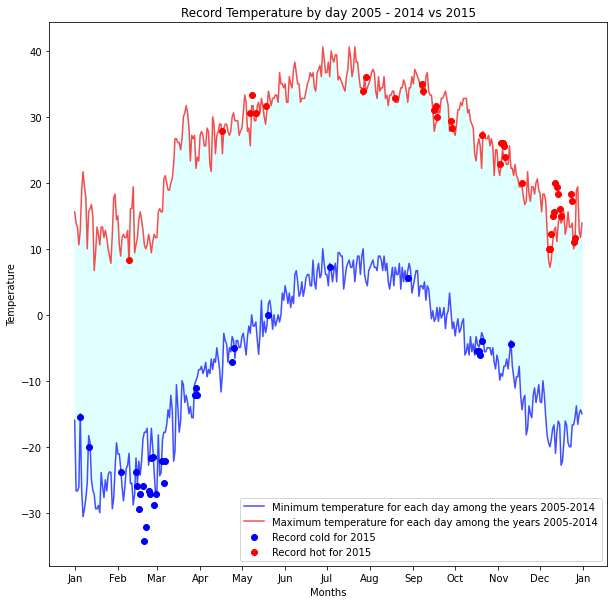

```javascript
%%javascript
IPython.OutputArea.prototype._should_scroll = function(lines) {
    return false; // disable scroll bar when displaying Folium map
}
```


    <IPython.core.display.Javascript object>


# Assignment 2

Before working on this assignment please read these instructions fully. In the submission area, you will notice that you can click the link to **Preview the Grading** for each step of the assignment. This is the criteria that will be used for peer grading. Please familiarize yourself with the criteria before beginning the assignment.

The data for this assignment comes from a subset of The National Centers for Environmental Information (NCEI) [Global Historical Climatology Network daily (GHCNd)](https://www.ncei.noaa.gov/products/land-based-station/global-historical-climatology-network-daily) (GHCN-Daily). The GHCN-Daily is comprised of daily climate records from thousands of land surface stations across the globe - it's a wonderfully large dataset to play with! In particular, you will be asked to use data from the Ann Arbor Michigan location (my home!). and this is stored in the file: `assets/fb441e62df2d58994928907a91895ec62c2c42e6cd075c2700843b89.csv`

Each row in this datafile corresponds to a single observation from a weather station, and has the following variables:
* **id** : station identification code
* **date** : date in YYYY-MM-DD format (e.g. 2012-01-24 = January 24, 2012)
* **element** : indicator of element type
    * TMAX : Maximum temperature (tenths of degrees C)
    * TMIN : Minimum temperature (tenths of degrees C)
* **value** : data value for element (tenths of degrees C)

For this assignment, you must:

1. Read the documentation and familiarize yourself with the dataset, then write a python notebook which plots line graphs of the record high and record low temperatures by day of the year over the period 2005-2014. The area between the record high and record low temperatures for each day should be shaded.
2. Overlay a scatter of the 2015 data for any points (highs and lows) for which the ten year record (2005-2014) record high or record low was broken in 2015. (Based on the graph, do you think extreme weather is getting more frequent in 2015?)
3. Watch out for leap days (i.e. February 29th), it is reasonable to remove these points from the dataset for the purpose of this visualization.
4. Make the visual nice! Leverage principles from the first module in this course when developing your solution. Consider issues such as legends, labels, and chart junk.

I've written some steps I think would be good to go through, but there are other ways to solve this assignment so feel free to explore the pandas library! What I really want to see is an image that looks like this sketch I drew at my desk:


```python
#  I'll be using the folium package to render the data into a map in Jupyter.

import folium
import pandas as pd

# get the location information for this dataset
df = pd.read_csv('assets/BinSize_d400.csv')
station_locations_by_hash = df[df['hash'] == 'fb441e62df2d58994928907a91895ec62c2c42e6cd075c2700843b89']

# get longitude and lattitude to plot
lons = station_locations_by_hash['LONGITUDE'].tolist()
lats = station_locations_by_hash['LATITUDE'].tolist()

# plot on a beautiful folium map
my_map = folium.Map(location = [lats[0], lons[0]], height = 500,  zoom_start = 9)
for lat, lon in zip(lats, lons):
    folium.Marker([lat, lon]).add_to(my_map)

# render map in Jupyter
display(my_map)
```


<div style="width:100%;"><div style="position:relative;width:100%;height:0;padding-bottom:60%;"><span style="color:#565656">Make this Notebook Trusted to load map: File -> Trust Notebook</span><iframe srcdoc="&lt;!DOCTYPE html&gt;
&lt;html&gt;
&lt;head&gt;

    &lt;meta http-equiv=&quot;content-type&quot; content=&quot;text/html; charset=UTF-8&quot; /&gt;

        &lt;script&gt;
            L_NO_TOUCH = false;
            L_DISABLE_3D = false;
        &lt;/script&gt;

    &lt;style&gt;html, body {width: 100%;height: 100%;margin: 0;padding: 0;}&lt;/style&gt;
    &lt;style&gt;#map {position:absolute;top:0;bottom:0;right:0;left:0;}&lt;/style&gt;
    &lt;script src=&quot;https://cdn.jsdelivr.net/npm/leaflet@1.6.0/dist/leaflet.js&quot;&gt;&lt;/script&gt;
    &lt;script src=&quot;https://code.jquery.com/jquery-1.12.4.min.js&quot;&gt;&lt;/script&gt;
    &lt;script src=&quot;https://maxcdn.bootstrapcdn.com/bootstrap/3.2.0/js/bootstrap.min.js&quot;&gt;&lt;/script&gt;
    &lt;script src=&quot;https://cdnjs.cloudflare.com/ajax/libs/Leaflet.awesome-markers/2.0.2/leaflet.awesome-markers.js&quot;&gt;&lt;/script&gt;
    &lt;link rel=&quot;stylesheet&quot; href=&quot;https://cdn.jsdelivr.net/npm/leaflet@1.6.0/dist/leaflet.css&quot;/&gt;
    &lt;link rel=&quot;stylesheet&quot; href=&quot;https://maxcdn.bootstrapcdn.com/bootstrap/3.2.0/css/bootstrap.min.css&quot;/&gt;
    &lt;link rel=&quot;stylesheet&quot; href=&quot;https://maxcdn.bootstrapcdn.com/bootstrap/3.2.0/css/bootstrap-theme.min.css&quot;/&gt;
    &lt;link rel=&quot;stylesheet&quot; href=&quot;https://maxcdn.bootstrapcdn.com/font-awesome/4.6.3/css/font-awesome.min.css&quot;/&gt;
    &lt;link rel=&quot;stylesheet&quot; href=&quot;https://cdnjs.cloudflare.com/ajax/libs/Leaflet.awesome-markers/2.0.2/leaflet.awesome-markers.css&quot;/&gt;
    &lt;link rel=&quot;stylesheet&quot; href=&quot;https://cdn.jsdelivr.net/gh/python-visualization/folium/folium/templates/leaflet.awesome.rotate.min.css&quot;/&gt;

            &lt;meta name=&quot;viewport&quot; content=&quot;width=device-width,
                initial-scale=1.0, maximum-scale=1.0, user-scalable=no&quot; /&gt;
            &lt;style&gt;
                #map_a0b4ac55ba68b60d2602a78cabae4d0c {
                    position: relative;
                    width: 100.0%;
                    height: 500.0px;
                    left: 0.0%;
                    top: 0.0%;
                }
            &lt;/style&gt;

&lt;/head&gt;
&lt;body&gt;


            &lt;div class=&quot;folium-map&quot; id=&quot;map_a0b4ac55ba68b60d2602a78cabae4d0c&quot; &gt;&lt;/div&gt;

&lt;/body&gt;
&lt;script&gt;


            var map_a0b4ac55ba68b60d2602a78cabae4d0c = L.map(
                &quot;map_a0b4ac55ba68b60d2602a78cabae4d0c&quot;,
                {
                    center: [41.9164, -84.0158],
                    crs: L.CRS.EPSG3857,
                    zoom: 9,
                    zoomControl: true,
                    preferCanvas: false,
                }
            );


            var tile_layer_9b43d1acc8c1b6fd9d4cea0275174b1a = L.tileLayer(
                &quot;https://{s}.tile.openstreetmap.org/{z}/{x}/{y}.png&quot;,
                {&quot;attribution&quot;: &quot;Data by \u0026copy; \u003ca href=\&quot;http://openstreetmap.org\&quot;\u003eOpenStreetMap\u003c/a\u003e, under \u003ca href=\&quot;http://www.openstreetmap.org/copyright\&quot;\u003eODbL\u003c/a\u003e.&quot;, &quot;detectRetina&quot;: false, &quot;maxNativeZoom&quot;: 18, &quot;maxZoom&quot;: 18, &quot;minZoom&quot;: 0, &quot;noWrap&quot;: false, &quot;opacity&quot;: 1, &quot;subdomains&quot;: &quot;abc&quot;, &quot;tms&quot;: false}
            ).addTo(map_a0b4ac55ba68b60d2602a78cabae4d0c);


            var marker_481d43b1f132aef60e319394ac6041a7 = L.marker(
                [41.9164, -84.0158],
                {}
            ).addTo(map_a0b4ac55ba68b60d2602a78cabae4d0c);


            var marker_cb65b4c8916de33eb439b2f311aa922f = L.marker(
                [42.2875, -83.7611],
                {}
            ).addTo(map_a0b4ac55ba68b60d2602a78cabae4d0c);


            var marker_9c1575c0e5438a062ce1adfa6fee8fa1 = L.marker(
                [42.2417, -83.6933],
                {}
            ).addTo(map_a0b4ac55ba68b60d2602a78cabae4d0c);


            var marker_9daa2948cdbbb81cc2ce0a153860de3d = L.marker(
                [42.2947, -83.7108],
                {}
            ).addTo(map_a0b4ac55ba68b60d2602a78cabae4d0c);


            var marker_929351d97d1b40f26df7c78ea433f5a1 = L.marker(
                [41.84, -83.8608],
                {}
            ).addTo(map_a0b4ac55ba68b60d2602a78cabae4d0c);


            var marker_fccf44be57886c1ee89b423bb6c7d8dd = L.marker(
                [42.0636, -83.4358],
                {}
            ).addTo(map_a0b4ac55ba68b60d2602a78cabae4d0c);


            var marker_2fa128781c806c61c0718e625a026b90 = L.marker(
                [42.3264, -84.0133],
                {}
            ).addTo(map_a0b4ac55ba68b60d2602a78cabae4d0c);


            var marker_ee12618d046bd254a4f21ec0692a16ac = L.marker(
                [41.9553, -83.6489],
                {}
            ).addTo(map_a0b4ac55ba68b60d2602a78cabae4d0c);


            var marker_6133e49a8cf105b14a6afdc4c4287805 = L.marker(
                [42.4344, -83.9858],
                {}
            ).addTo(map_a0b4ac55ba68b60d2602a78cabae4d0c);


            var marker_4655f115ad2c82235136bb2adb4d2b82 = L.marker(
                [42.1508, -84.0236],
                {}
            ).addTo(map_a0b4ac55ba68b60d2602a78cabae4d0c);


            var marker_8f5c9be21823ef61eb8ae063435871d0 = L.marker(
                [42.0664, -83.6186],
                {}
            ).addTo(map_a0b4ac55ba68b60d2602a78cabae4d0c);


            var marker_306fd31014917751f1670762bda62ff2 = L.marker(
                [42.0811, -83.6769],
                {}
            ).addTo(map_a0b4ac55ba68b60d2602a78cabae4d0c);


            var marker_261746bd6b6b276933d19d9a5fdda792 = L.marker(
                [41.9069, -83.4158],
                {}
            ).addTo(map_a0b4ac55ba68b60d2602a78cabae4d0c);


            var marker_693e236e9e83e1f777c19b52906e13d9 = L.marker(
                [41.9497, -83.28],
                {}
            ).addTo(map_a0b4ac55ba68b60d2602a78cabae4d0c);


            var marker_bce40a0c7f9d1d3ffc0986f1c37d552c = L.marker(
                [42.1611, -83.7819],
                {}
            ).addTo(map_a0b4ac55ba68b60d2602a78cabae4d0c);


            var marker_1b8ef019fe1df20aac3729364ad33e19 = L.marker(
                [42.1236, -83.82],
                {}
            ).addTo(map_a0b4ac55ba68b60d2602a78cabae4d0c);


            var marker_c59e57e00145f398b9783e84278cd387 = L.marker(
                [41.8069, -83.5831],
                {}
            ).addTo(map_a0b4ac55ba68b60d2602a78cabae4d0c);


            var marker_1aa955033c7196482e1ed7e5a2585a14 = L.marker(
                [42.0028, -83.9336],
                {}
            ).addTo(map_a0b4ac55ba68b60d2602a78cabae4d0c);


            var marker_b0b12bcf21e0a52cb86ea97ffd5e54be = L.marker(
                [42.0283, -84.1108],
                {}
            ).addTo(map_a0b4ac55ba68b60d2602a78cabae4d0c);


            var marker_ec0e697a58093edb446bca1ceafac275 = L.marker(
                [42.4356, -83.7831],
                {}
            ).addTo(map_a0b4ac55ba68b60d2602a78cabae4d0c);


            var marker_84b843ab4c75d2909262cf6317a820cf = L.marker(
                [41.5631, -83.4764],
                {}
            ).addTo(map_a0b4ac55ba68b60d2602a78cabae4d0c);


            var marker_58ad30bf7ae95e3324936a7fe13c319a = L.marker(
                [42.2667, -84.4667],
                {}
            ).addTo(map_a0b4ac55ba68b60d2602a78cabae4d0c);


            var marker_21c413a059f86dad04d3b368cc641bb9 = L.marker(
                [42.2333, -83.5333],
                {}
            ).addTo(map_a0b4ac55ba68b60d2602a78cabae4d0c);


            var marker_5eceef4f77eba6d067b05b910ffa7a38 = L.marker(
                [42.2228, -83.7444],
                {}
            ).addTo(map_a0b4ac55ba68b60d2602a78cabae4d0c);

&lt;/script&gt;
&lt;/html&gt;" style="position:absolute;width:100%;height:100%;left:0;top:0;border:none !important;" allowfullscreen webkitallowfullscreen mozallowfullscreen></iframe></div></div>


## Step 1
Load the dataset and transform the data into Celsius (refer to documentation) then extract all of the rows which have minimum or maximum temperatures.

__hint: when I did this step I had two DataFrame objects, each with ~80,000 entries in it__


```python
import pandas as pd
df = pd.read_csv('assets/fb441e62df2d58994928907a91895ec62c2c42e6cd075c2700843b89.csv')
df.head()
```


<div>
<style scoped>
    .dataframe tbody tr th:only-of-type {
        vertical-align: middle;
    }

    .dataframe tbody tr th {
        vertical-align: top;
    }

    .dataframe thead th {
        text-align: right;
    }
</style>
<table border="1" class="dataframe">
  <thead>
    <tr style="text-align: right;">
      <th></th>
      <th>ID</th>
      <th>Date</th>
      <th>Element</th>
      <th>Data_Value</th>
    </tr>
  </thead>
  <tbody>
    <tr>
      <th>0</th>
      <td>USW00094889</td>
      <td>2014-11-12</td>
      <td>TMAX</td>
      <td>22</td>
    </tr>
    <tr>
      <th>1</th>
      <td>USC00208972</td>
      <td>2009-04-29</td>
      <td>TMIN</td>
      <td>56</td>
    </tr>
    <tr>
      <th>2</th>
      <td>USC00200032</td>
      <td>2008-05-26</td>
      <td>TMAX</td>
      <td>278</td>
    </tr>
    <tr>
      <th>3</th>
      <td>USC00205563</td>
      <td>2005-11-11</td>
      <td>TMAX</td>
      <td>139</td>
    </tr>
    <tr>
      <th>4</th>
      <td>USC00200230</td>
      <td>2014-02-27</td>
      <td>TMAX</td>
      <td>-106</td>
    </tr>
  </tbody>
</table>
</div>


```python
df['Data_Value'] = df['Data_Value'].agg(lambda x:x/10)
```


```python
df_max = df[df['Element'] == 'TMAX']
df_min = df[df['Element'] == 'TMIN']
```

## Step 2
In ouniquer to visualize the data we would plot the min and max data for each day of the year between the years 2005 and 2014 across all weather stations. But we also need to find out when the min or max temperature in 2015 falls below the min or rises above the max for the previous decade.

If you did step 1 you have two Series objects with min and max times for the years 2005 through 2015. You can use Pandas `groupby` to create max and min temperature Series objects across all weather stations for each day of these years, and you can deal with the records for February 29 (the leap year) by dropping them.

__hint: when I finished this step, I had two DataFrame objects, each with exactly 4015 observations in them__


```python
df_max = df_max.groupby('Date').agg(max)
df_min = df_min.groupby('Date').agg(min)
```


```python
index_to_save = [i for i in df_max.index if '-02-29' not in i ]
df_max = df_max.loc[index_to_save]
index_to_save = [i for i in df_min.index if '-02-29' not in i ]
df_min = df_min.loc[index_to_save]
```

## Step 3
Now that you have grouped the daily max and min temperatures for each day of the years 2005 through 2015, you can separate out the data for 2015. Then you can use the Pandas `groupby` function to find the max and min of the temperature data for each __day of the year__ for the 2005-2014 data.

__hint: at the end of this step I had two DataFrames, one of maximum and the other of minimum values, which each had 365 observations in them. I also had another pair of similar DataFrames but only for the year 2015.__


```python
# calculate the minimum and maximum values for the day of the year for 2005 through 2014
# calculate the minimum and maximum values for the years 2015
index_to_save = [i for i in df_max.index if '2015' not in i ]
df_max_2014 = df_max.loc[index_to_save]
df_max_2014.index = [i[5:] for i in df_max_2014.index]
df_max_2014.index.name = 'Date'
df_max_2014 = df_max_2014.groupby('Date').agg(max)

index_to_save = [i for i in df_max.index if '2015' in i ]
df_max_2015 = df_max.loc[index_to_save]
df_max_2015.index = [i[5:] for i in df_max_2015.index]
df_max_2015.index.name = 'Date'
df_max_2015 = df_max_2015.groupby('Date').agg(max)


index_to_save = [i for i in df_min.index if '2015' not in i ]
df_min_2014 = df_min.loc[index_to_save]
df_min_2014.index = [i[5:] for i in df_min_2014.index]
df_min_2014.index.name = 'Date'
df_min_2014 = df_min_2014.groupby('Date').agg(min)


index_to_save = [i for i in df_min.index if '2015' in i ]
df_min_2015 = df_min.loc[index_to_save]
df_min_2015.index = [i[5:] for i in df_min_2015.index]
df_min_2015.index.name = 'Date'
df_min_2015 = df_min_2015.groupby('Date').agg(min)


```

## Step 4
Now it's time to plot! You need to explore matplotlib in order to plot line graphs of the min and max temperatures for the years 2005 through 2014 and to scatter plot __only__ the daily 2015 temperatures that exceeded those values.


```python
import matplotlib.pyplot as plt
from calendar import month_abbr
import matplotlib.dates as mdates

# put your plotting code here!
dates = list(df_min_2014.index)
plt.figure(figsize=(10,10))
plt.plot(df_min_2014['Data_Value'],color='blue',alpha=0.7, label='Minimum temperature for each day among the years 2005-2014')
plt.plot(df_max_2014['Data_Value'],color='red',alpha=0.7,label='Maximum temperature for each day among the years 2005-2014')
plt.fill_between(dates, df_max_2014['Data_Value'], df_min_2014['Data_Value'],color='lightcyan')


to_plot = df_min_2015[df_min_2015['Data_Value']<df_min_2014['Data_Value']]['Data_Value']
plt.scatter(to_plot.index,to_plot,color='blue', label = 'Record cold for 2015')
to_plot = df_max_2015[df_max_2015['Data_Value']>df_max_2014['Data_Value']]['Data_Value']
plt.scatter(to_plot.index,to_plot,color='red', label = 'Record hot for 2015')

plt.title('Record Temperature by day 2005 - 2014 vs 2015')
plt.xlabel('Months')
plt.ylabel('Temperature')
ax = plt.gca()
ax.xaxis.set_major_formatter(mdates.DateFormatter('%b'))
ax.xaxis.set_major_locator(mdates.MonthLocator())
plt.legend()
```


    <matplotlib.legend.Legend at 0x77d75fd22f10>


    

    


```python

```
