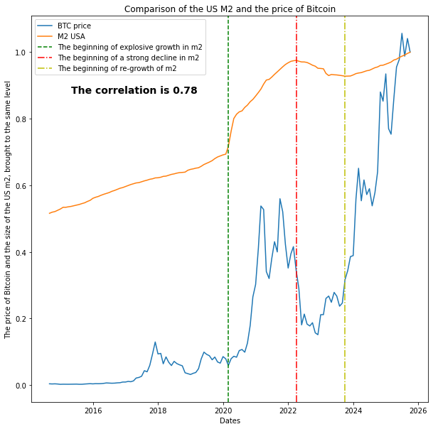

# Assignment 4

Before working on this assignment please read these instructions fully. In the submission area, you will notice that you can click the link to **Preview the Grading** for each step of the assignment. This is the criteria that will be used for peer grading. Please familiarize yourself with the criteria before beginning the assignment.

This assignment requires that you find **at least two datasets** on the web which are related, and that you visualize these datasets to answer the assignment question. You are free to utilize datasets with any location or domain, the usage of **Ann Arbor sports and athletics** datasets in the example is just a suggestion.

You are welcome to choose datasets at your discretion, but keep in mind **they will be shared with your peers**, so choose appropriate datasets. Sensitive, confidential, illicit, and proprietary materials are not good choices for datasets for this assignment. You are welcome to upload datasets of your own as well, and link to them using a third party repository such as github, pastebin, etc. Please be aware of the Coursera terms of service with respect to intellectual property.

Also, you are welcome to preserve data in its original language, but for the purposes of grading you should provide english translations. You are welcome to provide multiple visuals in different languages if you would like!

As this assignment is for the whole course, you must incorporate principles discussed in the first week, such as having as high data-ink ratio (Tufte) and aligning with Cairo’s principles of truth, beauty, function, and insight.

Here are the assignment instructions:

 * You must state a question you are seeking to answer with your visualizations.
 * You must provide at least two links to available datasets. These could be links to files such as CSV or Excel files, or links to websites which might have data in tabular form, such as Wikipedia pages.
 * You must upload an image which addresses the research question you stated. In addition to addressing the question, this visual should follow Cairo's principles of truthfulness, functionality, beauty, and insightfulness.
 * You must contribute a short (1-2 paragraph) written justification of how your visualization addresses your stated research question.

## Tips
* Wikipedia is an excellent source of data, and I strongly encourage you to explore it for new data sources.
* Many governments run open data initiatives at the city, region, and country levels, and these are wonderful resources for localized data sources.
* Several international agencies, such as the [United Nations](http://data.un.org/), the [World Bank](http://data.worldbank.org/), the [Global Open Data Index](http://index.okfn.org/place/) are other great places to look for data.
* This assignment requires you to convert and clean datafiles. Check out the discussion forums for tips on how to do this from various sources, and share your successes with your fellow students!

## Example
Looking for an example? Here's what our course assistant put together as an example! [Example Solution File](./readonly/Assignment4_example.pdf)


```python
import pandas as pd 
from bs4 import BeautifulSoup
import matplotlib.pyplot as plt
import numpy as np
#Statistics by m2 by month from the fed
m2 = pd.read_excel('M2SL.xlsx',sheet_name=1)
m2.head()
```


<div>
<style scoped>
    .dataframe tbody tr th:only-of-type {
        vertical-align: middle;
    }

    .dataframe tbody tr th {
        vertical-align: top;
    }

    .dataframe thead th {
        text-align: right;
    }
</style>
<table border="1" class="dataframe">
  <thead>
    <tr style="text-align: right;">
      <th></th>
      <th>observation_date</th>
      <th>M2SL</th>
    </tr>
  </thead>
  <tbody>
    <tr>
      <th>0</th>
      <td>2014-01-01</td>
      <td>11116.6</td>
    </tr>
    <tr>
      <th>1</th>
      <td>2014-02-01</td>
      <td>11182.3</td>
    </tr>
    <tr>
      <th>2</th>
      <td>2014-03-01</td>
      <td>11218.2</td>
    </tr>
    <tr>
      <th>3</th>
      <td>2014-04-01</td>
      <td>11263.1</td>
    </tr>
    <tr>
      <th>4</th>
      <td>2014-05-01</td>
      <td>11327.6</td>
    </tr>
  </tbody>
</table>
</div>


```python
#BTC price since 2014 in HTML format
html = """<table class="table yf-1mr6o9m noDl hideOnPrint"><thead class="yf-1mr6o9m"><tr class="yf-1mr6o9m"><th class="yf-1mr6o9m">Date  </th><th class="yf-1mr6o9m">Open  </th><th class="yf-1mr6o9m">High  </th><th class="yf-1mr6o9m">Low  </th><th class="yf-1mr6o9m">Close <span class="container yf-17ug8v2"><div aria-hidden="true" class="icon fin-icon primary-icn sz-medium tw-align-text-top yf-sv6wwp"><svg xmlns="http://www.w3.org/2000/svg" viewBox="0 0 24 24"><path d="M11 7h2v2h-2zm0 4h2v6h-2zm1-9C6.48 2 2 6.48 2 12s4.48 10 10 10 10-4.48 10-10S17.52 2 12 2m0 18c-4.41 0-8-3.59-8-8s3.59-8 8-8 8 3.59 8 8-3.59 8-8 8"></path></svg></div> <div class="tooltip al-bottom   yf-17ug8v2" role="tooltip"><div class="arrow yf-17ug8v2"></div>   <span class="toolTipContent yf-1mr6o9m" slot="content">Close price adjusted for splits.</span></div></span> </th><th class="yf-1mr6o9m">Adj Close <span class="container yf-17ug8v2"><div aria-hidden="true" class="icon fin-icon primary-icn sz-medium tw-align-text-top yf-sv6wwp"><svg xmlns="http://www.w3.org/2000/svg" viewBox="0 0 24 24"><path d="M11 7h2v2h-2zm0 4h2v6h-2zm1-9C6.48 2 2 6.48 2 12s4.48 10 10 10 10-4.48 10-10S17.52 2 12 2m0 18c-4.41 0-8-3.59-8-8s3.59-8 8-8 8 3.59 8 8-3.59 8-8 8"></path></svg></div> <div class="tooltip al-bottom   yf-17ug8v2" role="tooltip"><div class="arrow yf-17ug8v2"></div>   <span class="toolTipContent yf-1mr6o9m" slot="content">Adjusted close price adjusted for splits and dividend and/or capital gain distributions.</span></div></span> </th><th class="yf-1mr6o9m">Volume  </th></tr></thead> <tbody><tr class="yf-1mr6o9m"><td class="yf-1mr6o9m">Dec 7, 2025</td><td class="yf-1mr6o9m">89,235.89</td><td class="yf-1mr6o9m">89,767.55</td><td class="yf-1mr6o9m">89,235.89</td><td class="yf-1mr6o9m">89,370.95</td><td class="yf-1mr6o9m">89,370.95</td><td class="yf-1mr6o9m">35,813,191,680</td>  </tr><tr class="yf-1mr6o9m"><td class="yf-1mr6o9m">Dec 1, 2025</td><td class="yf-1mr6o9m">90,389.11</td><td class="yf-1mr6o9m">94,060.77</td><td class="yf-1mr6o9m">83,862.25</td><td class="yf-1mr6o9m">89,387.76</td><td class="yf-1mr6o9m">89,387.76</td><td class="yf-1mr6o9m">371,954,698,935</td>  </tr><tr class="yf-1mr6o9m"><td class="yf-1mr6o9m">Nov 1, 2025</td><td class="yf-1mr6o9m">109,558.63</td><td class="yf-1mr6o9m">111,167.31</td><td class="yf-1mr6o9m">80,659.81</td><td class="yf-1mr6o9m">90,394.31</td><td class="yf-1mr6o9m">90,394.31</td><td class="yf-1mr6o9m">2,121,328,523,236</td>  </tr><tr class="yf-1mr6o9m"><td class="yf-1mr6o9m">Oct 1, 2025</td><td class="yf-1mr6o9m">114,057.59</td><td class="yf-1mr6o9m">126,198.07</td><td class="yf-1mr6o9m">103,598.43</td><td class="yf-1mr6o9m">109,556.16</td><td class="yf-1mr6o9m">109,556.16</td><td class="yf-1mr6o9m">2,225,033,226,796</td>  </tr><tr class="yf-1mr6o9m"><td class="yf-1mr6o9m">Sep 1, 2025</td><td class="yf-1mr6o9m">108,228.75</td><td class="yf-1mr6o9m">117,911.79</td><td class="yf-1mr6o9m">107,271.18</td><td class="yf-1mr6o9m">114,056.09</td><td class="yf-1mr6o9m">114,056.09</td><td class="yf-1mr6o9m">1,450,418,370,470</td>  </tr><tr class="yf-1mr6o9m"><td class="yf-1mr6o9m">Aug 1, 2025</td><td class="yf-1mr6o9m">115,738.95</td><td class="yf-1mr6o9m">124,457.12</td><td class="yf-1mr6o9m">107,444.45</td><td class="yf-1mr6o9m">108,236.71</td><td class="yf-1mr6o9m">108,236.71</td><td class="yf-1mr6o9m">2,048,378,158,799</td>  </tr><tr class="yf-1mr6o9m"><td class="yf-1mr6o9m">Jul 1, 2025</td><td class="yf-1mr6o9m">107,144.38</td><td class="yf-1mr6o9m">123,091.61</td><td class="yf-1mr6o9m">105,157.40</td><td class="yf-1mr6o9m">115,758.20</td><td class="yf-1mr6o9m">115,758.20</td><td class="yf-1mr6o9m">2,061,338,304,539</td>  </tr><tr class="yf-1mr6o9m"><td class="yf-1mr6o9m">Jun 1, 2025</td><td class="yf-1mr6o9m">104,637.30</td><td class="yf-1mr6o9m">110,561.42</td><td class="yf-1mr6o9m">98,286.20</td><td class="yf-1mr6o9m">107,135.34</td><td class="yf-1mr6o9m">107,135.34</td><td class="yf-1mr6o9m">1,424,277,758,118</td>  </tr><tr class="yf-1mr6o9m"><td class="yf-1mr6o9m">May 1, 2025</td><td class="yf-1mr6o9m">94,212.86</td><td class="yf-1mr6o9m">111,970.17</td><td class="yf-1mr6o9m">93,399.86</td><td class="yf-1mr6o9m">104,638.09</td><td class="yf-1mr6o9m">104,638.09</td><td class="yf-1mr6o9m">1,496,397,538,233</td>  </tr><tr class="yf-1mr6o9m"><td class="yf-1mr6o9m">Apr 1, 2025</td><td class="yf-1mr6o9m">82,551.92</td><td class="yf-1mr6o9m">95,768.39</td><td class="yf-1mr6o9m">74,436.68</td><td class="yf-1mr6o9m">94,207.31</td><td class="yf-1mr6o9m">94,207.31</td><td class="yf-1mr6o9m">1,060,974,068,310</td>  </tr><tr class="yf-1mr6o9m"><td class="yf-1mr6o9m">Mar 1, 2025</td><td class="yf-1mr6o9m">84,373.87</td><td class="yf-1mr6o9m">95,043.44</td><td class="yf-1mr6o9m">76,624.25</td><td class="yf-1mr6o9m">82,548.91</td><td class="yf-1mr6o9m">82,548.91</td><td class="yf-1mr6o9m">1,049,435,373,908</td>  </tr><tr class="yf-1mr6o9m"><td class="yf-1mr6o9m">Feb 1, 2025</td><td class="yf-1mr6o9m">102,402.80</td><td class="yf-1mr6o9m">102,755.73</td><td class="yf-1mr6o9m">78,248.91</td><td class="yf-1mr6o9m">84,373.01</td><td class="yf-1mr6o9m">84,373.01</td><td class="yf-1mr6o9m">1,257,276,788,562</td>  </tr><tr class="yf-1mr6o9m"><td class="yf-1mr6o9m">Jan 1, 2025</td><td class="yf-1mr6o9m">93,425.10</td><td class="yf-1mr6o9m">109,114.88</td><td class="yf-1mr6o9m">89,260.10</td><td class="yf-1mr6o9m">102,405.02</td><td class="yf-1mr6o9m">102,405.02</td><td class="yf-1mr6o9m">1,668,843,382,017</td>  </tr><tr class="yf-1mr6o9m"><td class="yf-1mr6o9m">Dec 1, 2024</td><td class="yf-1mr6o9m">96,461.34</td><td class="yf-1mr6o9m">108,268.45</td><td class="yf-1mr6o9m">91,317.13</td><td class="yf-1mr6o9m">93,429.20</td><td class="yf-1mr6o9m">93,429.20</td><td class="yf-1mr6o9m">2,057,355,570,135</td>  </tr><tr class="yf-1mr6o9m"><td class="yf-1mr6o9m">Nov 1, 2024</td><td class="yf-1mr6o9m">70,216.90</td><td class="yf-1mr6o9m">99,655.50</td><td class="yf-1mr6o9m">66,803.65</td><td class="yf-1mr6o9m">96,449.05</td><td class="yf-1mr6o9m">96,449.05</td><td class="yf-1mr6o9m">2,055,808,875,264</td>  </tr><tr class="yf-1mr6o9m"><td class="yf-1mr6o9m">Oct 1, 2024</td><td class="yf-1mr6o9m">63,335.61</td><td class="yf-1mr6o9m">73,577.21</td><td class="yf-1mr6o9m">58,895.21</td><td class="yf-1mr6o9m">70,215.19</td><td class="yf-1mr6o9m">70,215.19</td><td class="yf-1mr6o9m">993,732,418,048</td>  </tr><tr class="yf-1mr6o9m"><td class="yf-1mr6o9m">Sep 1, 2024</td><td class="yf-1mr6o9m">58,969.80</td><td class="yf-1mr6o9m">66,480.70</td><td class="yf-1mr6o9m">52,598.70</td><td class="yf-1mr6o9m">63,329.50</td><td class="yf-1mr6o9m">63,329.50</td><td class="yf-1mr6o9m">879,117,914,822</td>  </tr><tr class="yf-1mr6o9m"><td class="yf-1mr6o9m">Aug 1, 2024</td><td class="yf-1mr6o9m">64,625.84</td><td class="yf-1mr6o9m">65,593.24</td><td class="yf-1mr6o9m">49,121.24</td><td class="yf-1mr6o9m">58,969.90</td><td class="yf-1mr6o9m">58,969.90</td><td class="yf-1mr6o9m">1,043,105,485,208</td>  </tr><tr class="yf-1mr6o9m"><td class="yf-1mr6o9m">Jul 1, 2024</td><td class="yf-1mr6o9m">62,673.61</td><td class="yf-1mr6o9m">69,987.54</td><td class="yf-1mr6o9m">53,717.38</td><td class="yf-1mr6o9m">64,619.25</td><td class="yf-1mr6o9m">64,619.25</td><td class="yf-1mr6o9m">953,395,573,307</td>  </tr><tr class="yf-1mr6o9m"><td class="yf-1mr6o9m">Jun 1, 2024</td><td class="yf-1mr6o9m">67,489.61</td><td class="yf-1mr6o9m">71,907.85</td><td class="yf-1mr6o9m">58,601.70</td><td class="yf-1mr6o9m">62,678.29</td><td class="yf-1mr6o9m">62,678.29</td><td class="yf-1mr6o9m">726,773,965,644</td>  </tr><tr class="yf-1mr6o9m"><td class="yf-1mr6o9m">May 1, 2024</td><td class="yf-1mr6o9m">60,609.50</td><td class="yf-1mr6o9m">71,946.46</td><td class="yf-1mr6o9m">56,555.29</td><td class="yf-1mr6o9m">67,491.41</td><td class="yf-1mr6o9m">67,491.41</td><td class="yf-1mr6o9m">874,291,509,757</td>  </tr><tr class="yf-1mr6o9m"><td class="yf-1mr6o9m">Apr 1, 2024</td><td class="yf-1mr6o9m">71,333.48</td><td class="yf-1mr6o9m">72,715.36</td><td class="yf-1mr6o9m">59,120.07</td><td class="yf-1mr6o9m">60,636.86</td><td class="yf-1mr6o9m">60,636.86</td><td class="yf-1mr6o9m">1,016,068,331,704</td>  </tr><tr class="yf-1mr6o9m"><td class="yf-1mr6o9m">Mar 1, 2024</td><td class="yf-1mr6o9m">61,168.06</td><td class="yf-1mr6o9m">73,750.07</td><td class="yf-1mr6o9m">59,323.91</td><td class="yf-1mr6o9m">71,333.65</td><td class="yf-1mr6o9m">71,333.65</td><td class="yf-1mr6o9m">1,446,417,844,950</td>  </tr><tr class="yf-1mr6o9m"><td class="yf-1mr6o9m">Feb 1, 2024</td><td class="yf-1mr6o9m">42,569.76</td><td class="yf-1mr6o9m">63,913.13</td><td class="yf-1mr6o9m">41,879.19</td><td class="yf-1mr6o9m">61,198.38</td><td class="yf-1mr6o9m">61,198.38</td><td class="yf-1mr6o9m">830,721,862,621</td>  </tr><tr class="yf-1mr6o9m"><td class="yf-1mr6o9m">Jan 1, 2024</td><td class="yf-1mr6o9m">42,280.23</td><td class="yf-1mr6o9m">48,969.37</td><td class="yf-1mr6o9m">38,521.89</td><td class="yf-1mr6o9m">42,582.61</td><td class="yf-1mr6o9m">42,582.61</td><td class="yf-1mr6o9m">825,918,941,347</td>  </tr><tr class="yf-1mr6o9m"><td class="yf-1mr6o9m">Dec 1, 2023</td><td class="yf-1mr6o9m">37,718.01</td><td class="yf-1mr6o9m">44,705.52</td><td class="yf-1mr6o9m">37,629.36</td><td class="yf-1mr6o9m">42,265.19</td><td class="yf-1mr6o9m">42,265.19</td><td class="yf-1mr6o9m">721,704,910,480</td>  </tr><tr class="yf-1mr6o9m"><td class="yf-1mr6o9m">Nov 1, 2023</td><td class="yf-1mr6o9m">34,657.27</td><td class="yf-1mr6o9m">38,415.34</td><td class="yf-1mr6o9m">34,133.44</td><td class="yf-1mr6o9m">37,712.75</td><td class="yf-1mr6o9m">37,712.75</td><td class="yf-1mr6o9m">570,863,267,380</td>  </tr><tr class="yf-1mr6o9m"><td class="yf-1mr6o9m">Oct 1, 2023</td><td class="yf-1mr6o9m">26,967.40</td><td class="yf-1mr6o9m">35,150.43</td><td class="yf-1mr6o9m">26,558.32</td><td class="yf-1mr6o9m">34,667.78</td><td class="yf-1mr6o9m">34,667.78</td><td class="yf-1mr6o9m">476,425,634,860</td>  </tr><tr class="yf-1mr6o9m"><td class="yf-1mr6o9m">Sep 1, 2023</td><td class="yf-1mr6o9m">25,934.02</td><td class="yf-1mr6o9m">27,488.76</td><td class="yf-1mr6o9m">24,930.30</td><td class="yf-1mr6o9m">26,967.92</td><td class="yf-1mr6o9m">26,967.92</td><td class="yf-1mr6o9m">337,637,313,742</td>  </tr><tr class="yf-1mr6o9m"><td class="yf-1mr6o9m">Aug 1, 2023</td><td class="yf-1mr6o9m">29,230.87</td><td class="yf-1mr6o9m">30,176.80</td><td class="yf-1mr6o9m">25,409.11</td><td class="yf-1mr6o9m">25,931.47</td><td class="yf-1mr6o9m">25,931.47</td><td class="yf-1mr6o9m">437,724,169,499</td>  </tr><tr class="yf-1mr6o9m"><td class="yf-1mr6o9m">Jul 1, 2023</td><td class="yf-1mr6o9m">30,471.85</td><td class="yf-1mr6o9m">31,814.52</td><td class="yf-1mr6o9m">28,934.29</td><td class="yf-1mr6o9m">29,230.11</td><td class="yf-1mr6o9m">29,230.11</td><td class="yf-1mr6o9m">382,224,489,090</td>  </tr><tr class="yf-1mr6o9m"><td class="yf-1mr6o9m">Jun 1, 2023</td><td class="yf-1mr6o9m">27,218.41</td><td class="yf-1mr6o9m">31,389.54</td><td class="yf-1mr6o9m">24,797.17</td><td class="yf-1mr6o9m">30,477.25</td><td class="yf-1mr6o9m">30,477.25</td><td class="yf-1mr6o9m">481,734,214,225</td>  </tr><tr class="yf-1mr6o9m"><td class="yf-1mr6o9m">May 1, 2023</td><td class="yf-1mr6o9m">29,227.10</td><td class="yf-1mr6o9m">29,820.13</td><td class="yf-1mr6o9m">25,878.43</td><td class="yf-1mr6o9m">27,219.66</td><td class="yf-1mr6o9m">27,219.66</td><td class="yf-1mr6o9m">443,473,015,479</td>  </tr><tr class="yf-1mr6o9m"><td class="yf-1mr6o9m">Apr 1, 2023</td><td class="yf-1mr6o9m">28,473.33</td><td class="yf-1mr6o9m">31,005.61</td><td class="yf-1mr6o9m">27,070.85</td><td class="yf-1mr6o9m">29,268.81</td><td class="yf-1mr6o9m">29,268.81</td><td class="yf-1mr6o9m">511,540,319,004</td>  </tr><tr class="yf-1mr6o9m"><td class="yf-1mr6o9m">Mar 1, 2023</td><td class="yf-1mr6o9m">23,150.93</td><td class="yf-1mr6o9m">29,159.90</td><td class="yf-1mr6o9m">19,628.25</td><td class="yf-1mr6o9m">28,478.48</td><td class="yf-1mr6o9m">28,478.48</td><td class="yf-1mr6o9m">883,299,703,608</td>  </tr><tr class="yf-1mr6o9m"><td class="yf-1mr6o9m">Feb 1, 2023</td><td class="yf-1mr6o9m">23,137.84</td><td class="yf-1mr6o9m">25,134.12</td><td class="yf-1mr6o9m">21,460.09</td><td class="yf-1mr6o9m">23,147.35</td><td class="yf-1mr6o9m">23,147.35</td><td class="yf-1mr6o9m">723,968,574,897</td>  </tr><tr class="yf-1mr6o9m"><td class="yf-1mr6o9m">Jan 1, 2023</td><td class="yf-1mr6o9m">16,547.91</td><td class="yf-1mr6o9m">23,919.89</td><td class="yf-1mr6o9m">16,521.23</td><td class="yf-1mr6o9m">23,139.28</td><td class="yf-1mr6o9m">23,139.28</td><td class="yf-1mr6o9m">690,994,018,045</td>  </tr><tr class="yf-1mr6o9m"><td class="yf-1mr6o9m">Dec 1, 2022</td><td class="yf-1mr6o9m">17,168.00</td><td class="yf-1mr6o9m">18,318.53</td><td class="yf-1mr6o9m">16,398.14</td><td class="yf-1mr6o9m">16,547.50</td><td class="yf-1mr6o9m">16,547.50</td><td class="yf-1mr6o9m">541,356,716,034</td>  </tr><tr class="yf-1mr6o9m"><td class="yf-1mr6o9m">Nov 1, 2022</td><td class="yf-1mr6o9m">20,494.90</td><td class="yf-1mr6o9m">21,446.89</td><td class="yf-1mr6o9m">15,599.05</td><td class="yf-1mr6o9m">17,168.57</td><td class="yf-1mr6o9m">17,168.57</td><td class="yf-1mr6o9m">1,224,531,549,126</td>  </tr><tr class="yf-1mr6o9m"><td class="yf-1mr6o9m">Oct 1, 2022</td><td class="yf-1mr6o9m">19,431.11</td><td class="yf-1mr6o9m">20,988.39</td><td class="yf-1mr6o9m">18,319.82</td><td class="yf-1mr6o9m">20,495.77</td><td class="yf-1mr6o9m">20,495.77</td><td class="yf-1mr6o9m">957,903,424,925</td>  </tr><tr class="yf-1mr6o9m"><td class="yf-1mr6o9m">Sep 1, 2022</td><td class="yf-1mr6o9m">20,050.50</td><td class="yf-1mr6o9m">22,673.82</td><td class="yf-1mr6o9m">18,290.31</td><td class="yf-1mr6o9m">19,431.79</td><td class="yf-1mr6o9m">19,431.79</td><td class="yf-1mr6o9m">1,123,272,250,385</td>  </tr><tr class="yf-1mr6o9m"><td class="yf-1mr6o9m">Aug 1, 2022</td><td class="yf-1mr6o9m">23,336.72</td><td class="yf-1mr6o9m">25,135.59</td><td class="yf-1mr6o9m">19,600.79</td><td class="yf-1mr6o9m">20,049.76</td><td class="yf-1mr6o9m">20,049.76</td><td class="yf-1mr6o9m">894,192,654,543</td>  </tr><tr class="yf-1mr6o9m"><td class="yf-1mr6o9m">Jul 1, 2022</td><td class="yf-1mr6o9m">19,820.47</td><td class="yf-1mr6o9m">24,572.58</td><td class="yf-1mr6o9m">18,966.95</td><td class="yf-1mr6o9m">23,336.90</td><td class="yf-1mr6o9m">23,336.90</td><td class="yf-1mr6o9m">927,582,363,389</td>  </tr><tr class="yf-1mr6o9m"><td class="yf-1mr6o9m">Jun 1, 2022</td><td class="yf-1mr6o9m">31,792.55</td><td class="yf-1mr6o9m">31,957.29</td><td class="yf-1mr6o9m">17,708.62</td><td class="yf-1mr6o9m">19,784.73</td><td class="yf-1mr6o9m">19,784.73</td><td class="yf-1mr6o9m">923,939,211,678</td>  </tr><tr class="yf-1mr6o9m"><td class="yf-1mr6o9m">May 1, 2022</td><td class="yf-1mr6o9m">37,713.27</td><td class="yf-1mr6o9m">39,902.95</td><td class="yf-1mr6o9m">26,350.49</td><td class="yf-1mr6o9m">31,792.31</td><td class="yf-1mr6o9m">31,792.31</td><td class="yf-1mr6o9m">1,105,689,315,990</td>  </tr><tr class="yf-1mr6o9m"><td class="yf-1mr6o9m">Apr 1, 2022</td><td class="yf-1mr6o9m">45,554.16</td><td class="yf-1mr6o9m">47,313.48</td><td class="yf-1mr6o9m">37,697.94</td><td class="yf-1mr6o9m">37,714.88</td><td class="yf-1mr6o9m">37,714.88</td><td class="yf-1mr6o9m">830,115,888,649</td>  </tr><tr class="yf-1mr6o9m"><td class="yf-1mr6o9m">Mar 1, 2022</td><td class="yf-1mr6o9m">43,194.50</td><td class="yf-1mr6o9m">48,086.84</td><td class="yf-1mr6o9m">37,260.20</td><td class="yf-1mr6o9m">45,538.68</td><td class="yf-1mr6o9m">45,538.68</td><td class="yf-1mr6o9m">830,943,838,435</td>  </tr><tr class="yf-1mr6o9m"><td class="yf-1mr6o9m">Feb 1, 2022</td><td class="yf-1mr6o9m">38,481.77</td><td class="yf-1mr6o9m">45,661.17</td><td class="yf-1mr6o9m">34,459.22</td><td class="yf-1mr6o9m">43,193.23</td><td class="yf-1mr6o9m">43,193.23</td><td class="yf-1mr6o9m">671,335,993,325</td>  </tr><tr class="yf-1mr6o9m"><td class="yf-1mr6o9m">Jan 1, 2022</td><td class="yf-1mr6o9m">46,311.75</td><td class="yf-1mr6o9m">47,881.41</td><td class="yf-1mr6o9m">33,184.06</td><td class="yf-1mr6o9m">38,483.13</td><td class="yf-1mr6o9m">38,483.13</td><td class="yf-1mr6o9m">923,979,037,681</td>  </tr><tr class="yf-1mr6o9m"><td class="yf-1mr6o9m">Dec 1, 2021</td><td class="yf-1mr6o9m">56,907.96</td><td class="yf-1mr6o9m">59,041.68</td><td class="yf-1mr6o9m">42,874.62</td><td class="yf-1mr6o9m">46,306.45</td><td class="yf-1mr6o9m">46,306.45</td><td class="yf-1mr6o9m">957,047,184,722</td>  </tr><tr class="yf-1mr6o9m"><td class="yf-1mr6o9m">Nov 1, 2021</td><td class="yf-1mr6o9m">61,320.45</td><td class="yf-1mr6o9m">68,789.63</td><td class="yf-1mr6o9m">53,569.77</td><td class="yf-1mr6o9m">57,005.43</td><td class="yf-1mr6o9m">57,005.43</td><td class="yf-1mr6o9m">1,053,270,271,383</td>  </tr><tr class="yf-1mr6o9m"><td class="yf-1mr6o9m">Oct 1, 2021</td><td class="yf-1mr6o9m">43,816.74</td><td class="yf-1mr6o9m">66,930.39</td><td class="yf-1mr6o9m">43,320.02</td><td class="yf-1mr6o9m">61,318.96</td><td class="yf-1mr6o9m">61,318.96</td><td class="yf-1mr6o9m">1,153,077,903,534</td>  </tr><tr class="yf-1mr6o9m"><td class="yf-1mr6o9m">Sep 1, 2021</td><td class="yf-1mr6o9m">47,099.77</td><td class="yf-1mr6o9m">52,853.77</td><td class="yf-1mr6o9m">39,787.61</td><td class="yf-1mr6o9m">43,790.89</td><td class="yf-1mr6o9m">43,790.89</td><td class="yf-1mr6o9m">1,102,139,678,824</td>  </tr><tr class="yf-1mr6o9m"><td class="yf-1mr6o9m">Aug 1, 2021</td><td class="yf-1mr6o9m">41,460.84</td><td class="yf-1mr6o9m">50,482.08</td><td class="yf-1mr6o9m">37,458.00</td><td class="yf-1mr6o9m">47,166.69</td><td class="yf-1mr6o9m">47,166.69</td><td class="yf-1mr6o9m">1,014,674,184,428</td>  </tr><tr class="yf-1mr6o9m"><td class="yf-1mr6o9m">Jul 1, 2021</td><td class="yf-1mr6o9m">35,035.98</td><td class="yf-1mr6o9m">42,235.55</td><td class="yf-1mr6o9m">29,360.96</td><td class="yf-1mr6o9m">41,626.20</td><td class="yf-1mr6o9m">41,626.20</td><td class="yf-1mr6o9m">819,103,381,204</td>  </tr><tr class="yf-1mr6o9m"><td class="yf-1mr6o9m">Jun 1, 2021</td><td class="yf-1mr6o9m">37,293.79</td><td class="yf-1mr6o9m">41,295.27</td><td class="yf-1mr6o9m">28,893.62</td><td class="yf-1mr6o9m">35,040.84</td><td class="yf-1mr6o9m">35,040.84</td><td class="yf-1mr6o9m">1,189,647,451,707</td>  </tr><tr class="yf-1mr6o9m"><td class="yf-1mr6o9m">May 1, 2021</td><td class="yf-1mr6o9m">57,714.66</td><td class="yf-1mr6o9m">59,519.36</td><td class="yf-1mr6o9m">30,681.50</td><td class="yf-1mr6o9m">37,332.86</td><td class="yf-1mr6o9m">37,332.86</td><td class="yf-1mr6o9m">1,976,593,438,572</td>  </tr><tr class="yf-1mr6o9m"><td class="yf-1mr6o9m">Apr 1, 2021</td><td class="yf-1mr6o9m">58,926.56</td><td class="yf-1mr6o9m">64,863.10</td><td class="yf-1mr6o9m">47,159.48</td><td class="yf-1mr6o9m">57,750.18</td><td class="yf-1mr6o9m">57,750.18</td><td class="yf-1mr6o9m">1,844,481,772,417</td>  </tr><tr class="yf-1mr6o9m"><td class="yf-1mr6o9m">Mar 1, 2021</td><td class="yf-1mr6o9m">45,159.50</td><td class="yf-1mr6o9m">61,683.86</td><td class="yf-1mr6o9m">45,115.09</td><td class="yf-1mr6o9m">58,918.83</td><td class="yf-1mr6o9m">58,918.83</td><td class="yf-1mr6o9m">1,681,184,264,687</td>  </tr><tr class="yf-1mr6o9m"><td class="yf-1mr6o9m">Feb 1, 2021</td><td class="yf-1mr6o9m">33,114.58</td><td class="yf-1mr6o9m">58,330.57</td><td class="yf-1mr6o9m">32,384.23</td><td class="yf-1mr6o9m">45,137.77</td><td class="yf-1mr6o9m">45,137.77</td><td class="yf-1mr6o9m">2,267,152,936,675</td>  </tr><tr class="yf-1mr6o9m"><td class="yf-1mr6o9m">Jan 1, 2021</td><td class="yf-1mr6o9m">28,994.01</td><td class="yf-1mr6o9m">41,946.74</td><td class="yf-1mr6o9m">28,722.76</td><td class="yf-1mr6o9m">33,114.36</td><td class="yf-1mr6o9m">33,114.36</td><td class="yf-1mr6o9m">2,153,473,433,571</td>  </tr><tr class="yf-1mr6o9m"><td class="yf-1mr6o9m">Dec 1, 2020</td><td class="yf-1mr6o9m">19,633.77</td><td class="yf-1mr6o9m">29,244.88</td><td class="yf-1mr6o9m">17,619.53</td><td class="yf-1mr6o9m">29,001.72</td><td class="yf-1mr6o9m">29,001.72</td><td class="yf-1mr6o9m">1,212,259,707,946</td>  </tr><tr class="yf-1mr6o9m"><td class="yf-1mr6o9m">Nov 1, 2020</td><td class="yf-1mr6o9m">13,781.00</td><td class="yf-1mr6o9m">19,749.26</td><td class="yf-1mr6o9m">13,243.16</td><td class="yf-1mr6o9m">19,625.84</td><td class="yf-1mr6o9m">19,625.84</td><td class="yf-1mr6o9m">1,093,144,913,227</td>  </tr><tr class="yf-1mr6o9m"><td class="yf-1mr6o9m">Oct 1, 2020</td><td class="yf-1mr6o9m">10,795.25</td><td class="yf-1mr6o9m">14,028.21</td><td class="yf-1mr6o9m">10,416.69</td><td class="yf-1mr6o9m">13,781.00</td><td class="yf-1mr6o9m">13,781.00</td><td class="yf-1mr6o9m">1,050,874,546,086</td>  </tr><tr class="yf-1mr6o9m"><td class="yf-1mr6o9m">Sep 1, 2020</td><td class="yf-1mr6o9m">11,679.32</td><td class="yf-1mr6o9m">12,067.08</td><td class="yf-1mr6o9m">9,916.49</td><td class="yf-1mr6o9m">10,784.49</td><td class="yf-1mr6o9m">10,784.49</td><td class="yf-1mr6o9m">1,075,949,438,431</td>  </tr><tr class="yf-1mr6o9m"><td class="yf-1mr6o9m">Aug 1, 2020</td><td class="yf-1mr6o9m">11,322.57</td><td class="yf-1mr6o9m">12,359.06</td><td class="yf-1mr6o9m">11,012.42</td><td class="yf-1mr6o9m">11,680.82</td><td class="yf-1mr6o9m">11,680.82</td><td class="yf-1mr6o9m">708,377,092,130</td>  </tr><tr class="yf-1mr6o9m"><td class="yf-1mr6o9m">Jul 1, 2020</td><td class="yf-1mr6o9m">9,145.99</td><td class="yf-1mr6o9m">11,415.86</td><td class="yf-1mr6o9m">8,977.02</td><td class="yf-1mr6o9m">11,323.47</td><td class="yf-1mr6o9m">11,323.47</td><td class="yf-1mr6o9m">545,813,339,109</td>  </tr><tr class="yf-1mr6o9m"><td class="yf-1mr6o9m">Jun 1, 2020</td><td class="yf-1mr6o9m">9,463.61</td><td class="yf-1mr6o9m">10,199.57</td><td class="yf-1mr6o9m">8,975.53</td><td class="yf-1mr6o9m">9,137.99</td><td class="yf-1mr6o9m">9,137.99</td><td class="yf-1mr6o9m">650,913,318,680</td>  </tr><tr class="yf-1mr6o9m"><td class="yf-1mr6o9m">May 1, 2020</td><td class="yf-1mr6o9m">8,672.78</td><td class="yf-1mr6o9m">9,996.74</td><td class="yf-1mr6o9m">8,374.32</td><td class="yf-1mr6o9m">9,461.06</td><td class="yf-1mr6o9m">9,461.06</td><td class="yf-1mr6o9m">1,286,368,141,507</td>  </tr><tr class="yf-1mr6o9m"><td class="yf-1mr6o9m">Apr 1, 2020</td><td class="yf-1mr6o9m">6,437.32</td><td class="yf-1mr6o9m">9,440.65</td><td class="yf-1mr6o9m">6,202.37</td><td class="yf-1mr6o9m">8,658.55</td><td class="yf-1mr6o9m">8,658.55</td><td class="yf-1mr6o9m">1,156,127,164,831</td>  </tr><tr class="yf-1mr6o9m"><td class="yf-1mr6o9m">Mar 1, 2020</td><td class="yf-1mr6o9m">8,599.76</td><td class="yf-1mr6o9m">9,167.70</td><td class="yf-1mr6o9m">4,106.98</td><td class="yf-1mr6o9m">6,438.64</td><td class="yf-1mr6o9m">6,438.64</td><td class="yf-1mr6o9m">1,290,442,059,648</td>  </tr><tr class="yf-1mr6o9m"><td class="yf-1mr6o9m">Feb 1, 2020</td><td class="yf-1mr6o9m">9,346.36</td><td class="yf-1mr6o9m">10,457.63</td><td class="yf-1mr6o9m">8,492.93</td><td class="yf-1mr6o9m">8,599.51</td><td class="yf-1mr6o9m">8,599.51</td><td class="yf-1mr6o9m">1,163,376,492,768</td>  </tr><tr class="yf-1mr6o9m"><td class="yf-1mr6o9m">Jan 1, 2020</td><td class="yf-1mr6o9m">7,194.89</td><td class="yf-1mr6o9m">9,553.13</td><td class="yf-1mr6o9m">6,915.00</td><td class="yf-1mr6o9m">9,350.53</td><td class="yf-1mr6o9m">9,350.53</td><td class="yf-1mr6o9m">852,872,174,496</td>  </tr><tr class="yf-1mr6o9m"><td class="yf-1mr6o9m">Dec 1, 2019</td><td class="yf-1mr6o9m">7,571.62</td><td class="yf-1mr6o9m">7,743.43</td><td class="yf-1mr6o9m">6,540.05</td><td class="yf-1mr6o9m">7,193.60</td><td class="yf-1mr6o9m">7,193.60</td><td class="yf-1mr6o9m">633,790,373,416</td>  </tr><tr class="yf-1mr6o9m"><td class="yf-1mr6o9m">Nov 1, 2019</td><td class="yf-1mr6o9m">9,193.99</td><td class="yf-1mr6o9m">9,505.05</td><td class="yf-1mr6o9m">6,617.17</td><td class="yf-1mr6o9m">7,569.63</td><td class="yf-1mr6o9m">7,569.63</td><td class="yf-1mr6o9m">676,919,523,650</td>  </tr><tr class="yf-1mr6o9m"><td class="yf-1mr6o9m">Oct 1, 2019</td><td class="yf-1mr6o9m">8,299.72</td><td class="yf-1mr6o9m">10,021.74</td><td class="yf-1mr6o9m">7,446.99</td><td class="yf-1mr6o9m">9,199.58</td><td class="yf-1mr6o9m">9,199.58</td><td class="yf-1mr6o9m">595,205,134,748</td>  </tr><tr class="yf-1mr6o9m"><td class="yf-1mr6o9m">Sep 1, 2019</td><td class="yf-1mr6o9m">9,630.59</td><td class="yf-1mr6o9m">10,898.76</td><td class="yf-1mr6o9m">7,830.76</td><td class="yf-1mr6o9m">8,293.87</td><td class="yf-1mr6o9m">8,293.87</td><td class="yf-1mr6o9m">480,544,963,230</td>  </tr><tr class="yf-1mr6o9m"><td class="yf-1mr6o9m">Aug 1, 2019</td><td class="yf-1mr6o9m">10,077.44</td><td class="yf-1mr6o9m">12,273.82</td><td class="yf-1mr6o9m">9,421.63</td><td class="yf-1mr6o9m">9,630.66</td><td class="yf-1mr6o9m">9,630.66</td><td class="yf-1mr6o9m">533,984,971,734</td>  </tr><tr class="yf-1mr6o9m"><td class="yf-1mr6o9m">Jul 1, 2019</td><td class="yf-1mr6o9m">10,796.93</td><td class="yf-1mr6o9m">13,129.53</td><td class="yf-1mr6o9m">9,163.13</td><td class="yf-1mr6o9m">10,085.63</td><td class="yf-1mr6o9m">10,085.63</td><td class="yf-1mr6o9m">676,416,326,705</td>  </tr><tr class="yf-1mr6o9m"><td class="yf-1mr6o9m">Jun 1, 2019</td><td class="yf-1mr6o9m">8,573.84</td><td class="yf-1mr6o9m">13,796.49</td><td class="yf-1mr6o9m">7,564.49</td><td class="yf-1mr6o9m">10,817.16</td><td class="yf-1mr6o9m">10,817.16</td><td class="yf-1mr6o9m">675,855,385,074</td>  </tr><tr class="yf-1mr6o9m"><td class="yf-1mr6o9m">May 1, 2019</td><td class="yf-1mr6o9m">5,350.91</td><td class="yf-1mr6o9m">9,008.31</td><td class="yf-1mr6o9m">5,347.65</td><td class="yf-1mr6o9m">8,574.50</td><td class="yf-1mr6o9m">8,574.50</td><td class="yf-1mr6o9m">724,157,870,864</td>  </tr><tr class="yf-1mr6o9m"><td class="yf-1mr6o9m">Apr 1, 2019</td><td class="yf-1mr6o9m">4,105.36</td><td class="yf-1mr6o9m">5,642.04</td><td class="yf-1mr6o9m">4,096.90</td><td class="yf-1mr6o9m">5,350.73</td><td class="yf-1mr6o9m">5,350.73</td><td class="yf-1mr6o9m">445,364,556,718</td>  </tr><tr class="yf-1mr6o9m"><td class="yf-1mr6o9m">Mar 1, 2019</td><td class="yf-1mr6o9m">3,853.76</td><td class="yf-1mr6o9m">4,296.81</td><td class="yf-1mr6o9m">3,733.75</td><td class="yf-1mr6o9m">4,105.40</td><td class="yf-1mr6o9m">4,105.40</td><td class="yf-1mr6o9m">297,952,790,260</td>  </tr><tr class="yf-1mr6o9m"><td class="yf-1mr6o9m">Feb 1, 2019</td><td class="yf-1mr6o9m">3,460.55</td><td class="yf-1mr6o9m">4,210.64</td><td class="yf-1mr6o9m">3,391.02</td><td class="yf-1mr6o9m">3,854.79</td><td class="yf-1mr6o9m">3,854.79</td><td class="yf-1mr6o9m">199,100,675,597</td>  </tr><tr class="yf-1mr6o9m"><td class="yf-1mr6o9m">Jan 1, 2019</td><td class="yf-1mr6o9m">3,746.71</td><td class="yf-1mr6o9m">4,109.02</td><td class="yf-1mr6o9m">3,400.82</td><td class="yf-1mr6o9m">3,457.79</td><td class="yf-1mr6o9m">3,457.79</td><td class="yf-1mr6o9m">167,335,706,864</td>  </tr><tr class="yf-1mr6o9m"><td class="yf-1mr6o9m">Dec 1, 2018</td><td class="yf-1mr6o9m">4,024.46</td><td class="yf-1mr6o9m">4,309.38</td><td class="yf-1mr6o9m">3,191.30</td><td class="yf-1mr6o9m">3,742.70</td><td class="yf-1mr6o9m">3,742.70</td><td class="yf-1mr6o9m">168,826,809,069</td>  </tr><tr class="yf-1mr6o9m"><td class="yf-1mr6o9m">Nov 1, 2018</td><td class="yf-1mr6o9m">6,318.14</td><td class="yf-1mr6o9m">6,552.16</td><td class="yf-1mr6o9m">3,585.06</td><td class="yf-1mr6o9m">4,017.27</td><td class="yf-1mr6o9m">4,017.27</td><td class="yf-1mr6o9m">158,359,524,484</td>  </tr><tr class="yf-1mr6o9m"><td class="yf-1mr6o9m">Oct 1, 2018</td><td class="yf-1mr6o9m">6,619.85</td><td class="yf-1mr6o9m">6,965.06</td><td class="yf-1mr6o9m">6,236.47</td><td class="yf-1mr6o9m">6,317.61</td><td class="yf-1mr6o9m">6,317.61</td><td class="yf-1mr6o9m">118,436,880,000</td>  </tr><tr class="yf-1mr6o9m"><td class="yf-1mr6o9m">Sep 1, 2018</td><td class="yf-1mr6o9m">7,044.81</td><td class="yf-1mr6o9m">7,388.43</td><td class="yf-1mr6o9m">6,197.52</td><td class="yf-1mr6o9m">6,625.56</td><td class="yf-1mr6o9m">6,625.56</td><td class="yf-1mr6o9m">129,745,370,000</td>  </tr><tr class="yf-1mr6o9m"><td class="yf-1mr6o9m">Aug 1, 2018</td><td class="yf-1mr6o9m">7,769.04</td><td class="yf-1mr6o9m">7,769.04</td><td class="yf-1mr6o9m">5,971.05</td><td class="yf-1mr6o9m">7,037.58</td><td class="yf-1mr6o9m">7,037.58</td><td class="yf-1mr6o9m">132,292,770,000</td>  </tr><tr class="yf-1mr6o9m"><td class="yf-1mr6o9m">Jul 1, 2018</td><td class="yf-1mr6o9m">6,411.68</td><td class="yf-1mr6o9m">8,424.27</td><td class="yf-1mr6o9m">6,136.42</td><td class="yf-1mr6o9m">7,780.44</td><td class="yf-1mr6o9m">7,780.44</td><td class="yf-1mr6o9m">141,441,939,792</td>  </tr><tr class="yf-1mr6o9m"><td class="yf-1mr6o9m">Jun 1, 2018</td><td class="yf-1mr6o9m">7,500.70</td><td class="yf-1mr6o9m">7,754.89</td><td class="yf-1mr6o9m">5,826.41</td><td class="yf-1mr6o9m">6,404.00</td><td class="yf-1mr6o9m">6,404.00</td><td class="yf-1mr6o9m">130,214,179,584</td>  </tr><tr class="yf-1mr6o9m"><td class="yf-1mr6o9m">May 1, 2018</td><td class="yf-1mr6o9m">9,251.47</td><td class="yf-1mr6o9m">9,964.50</td><td class="yf-1mr6o9m">7,090.68</td><td class="yf-1mr6o9m">7,494.17</td><td class="yf-1mr6o9m">7,494.17</td><td class="yf-1mr6o9m">197,611,709,696</td>  </tr><tr class="yf-1mr6o9m"><td class="yf-1mr6o9m">Apr 1, 2018</td><td class="yf-1mr6o9m">7,003.06</td><td class="yf-1mr6o9m">9,745.32</td><td class="yf-1mr6o9m">6,526.87</td><td class="yf-1mr6o9m">9,240.55</td><td class="yf-1mr6o9m">9,240.55</td><td class="yf-1mr6o9m">196,550,010,624</td>  </tr><tr class="yf-1mr6o9m"><td class="yf-1mr6o9m">Mar 1, 2018</td><td class="yf-1mr6o9m">10,385.00</td><td class="yf-1mr6o9m">11,704.10</td><td class="yf-1mr6o9m">6,683.93</td><td class="yf-1mr6o9m">6,973.53</td><td class="yf-1mr6o9m">6,973.53</td><td class="yf-1mr6o9m">193,751,709,184</td>  </tr><tr class="yf-1mr6o9m"><td class="yf-1mr6o9m">Feb 1, 2018</td><td class="yf-1mr6o9m">10,237.30</td><td class="yf-1mr6o9m">11,958.50</td><td class="yf-1mr6o9m">6,048.26</td><td class="yf-1mr6o9m">10,397.90</td><td class="yf-1mr6o9m">10,397.90</td><td class="yf-1mr6o9m">229,717,780,480</td>  </tr><tr class="yf-1mr6o9m"><td class="yf-1mr6o9m">Jan 1, 2018</td><td class="yf-1mr6o9m">14,112.20</td><td class="yf-1mr6o9m">17,712.40</td><td class="yf-1mr6o9m">9,402.29</td><td class="yf-1mr6o9m">10,221.10</td><td class="yf-1mr6o9m">10,221.10</td><td class="yf-1mr6o9m">416,247,858,176</td>  </tr><tr class="yf-1mr6o9m"><td class="yf-1mr6o9m">Dec 1, 2017</td><td class="yf-1mr6o9m">10,198.60</td><td class="yf-1mr6o9m">20,089.00</td><td class="yf-1mr6o9m">9,694.65</td><td class="yf-1mr6o9m">14,156.40</td><td class="yf-1mr6o9m">14,156.40</td><td class="yf-1mr6o9m">410,336,495,104</td>  </tr><tr class="yf-1mr6o9m"><td class="yf-1mr6o9m">Nov 1, 2017</td><td class="yf-1mr6o9m">6,440.97</td><td class="yf-1mr6o9m">11,517.40</td><td class="yf-1mr6o9m">5,519.01</td><td class="yf-1mr6o9m">10,233.60</td><td class="yf-1mr6o9m">10,233.60</td><td class="yf-1mr6o9m">140,735,010,304</td>  </tr><tr class="yf-1mr6o9m"><td class="yf-1mr6o9m">Oct 1, 2017</td><td class="yf-1mr6o9m">4,341.05</td><td class="yf-1mr6o9m">6,470.43</td><td class="yf-1mr6o9m">4,164.05</td><td class="yf-1mr6o9m">6,468.40</td><td class="yf-1mr6o9m">6,468.40</td><td class="yf-1mr6o9m">58,009,357,952</td>  </tr><tr class="yf-1mr6o9m"><td class="yf-1mr6o9m">Sep 1, 2017</td><td class="yf-1mr6o9m">4,701.76</td><td class="yf-1mr6o9m">4,975.04</td><td class="yf-1mr6o9m">2,946.62</td><td class="yf-1mr6o9m">4,338.71</td><td class="yf-1mr6o9m">4,338.71</td><td class="yf-1mr6o9m">55,700,949,056</td>  </tr><tr class="yf-1mr6o9m"><td class="yf-1mr6o9m">Aug 1, 2017</td><td class="yf-1mr6o9m">2,871.30</td><td class="yf-1mr6o9m">4,736.05</td><td class="yf-1mr6o9m">2,668.59</td><td class="yf-1mr6o9m">4,703.39</td><td class="yf-1mr6o9m">4,703.39</td><td class="yf-1mr6o9m">63,548,016,640</td>  </tr><tr class="yf-1mr6o9m"><td class="yf-1mr6o9m">Jul 1, 2017</td><td class="yf-1mr6o9m">2,492.60</td><td class="yf-1mr6o9m">2,916.14</td><td class="yf-1mr6o9m">1,843.03</td><td class="yf-1mr6o9m">2,875.34</td><td class="yf-1mr6o9m">2,875.34</td><td class="yf-1mr6o9m">32,619,956,992</td>  </tr><tr class="yf-1mr6o9m"><td class="yf-1mr6o9m">Jun 1, 2017</td><td class="yf-1mr6o9m">2,288.33</td><td class="yf-1mr6o9m">2,999.91</td><td class="yf-1mr6o9m">2,212.96</td><td class="yf-1mr6o9m">2,480.84</td><td class="yf-1mr6o9m">2,480.84</td><td class="yf-1mr6o9m">44,478,140,928</td>  </tr><tr class="yf-1mr6o9m"><td class="yf-1mr6o9m">May 1, 2017</td><td class="yf-1mr6o9m">1,348.30</td><td class="yf-1mr6o9m">2,763.71</td><td class="yf-1mr6o9m">1,348.30</td><td class="yf-1mr6o9m">2,286.41</td><td class="yf-1mr6o9m">2,286.41</td><td class="yf-1mr6o9m">34,261,856,864</td>  </tr><tr class="yf-1mr6o9m"><td class="yf-1mr6o9m">Apr 1, 2017</td><td class="yf-1mr6o9m">1,071.71</td><td class="yf-1mr6o9m">1,347.91</td><td class="yf-1mr6o9m">1,061.09</td><td class="yf-1mr6o9m">1,347.89</td><td class="yf-1mr6o9m">1,347.89</td><td class="yf-1mr6o9m">9,757,448,112</td>  </tr><tr class="yf-1mr6o9m"><td class="yf-1mr6o9m">Mar 1, 2017</td><td class="yf-1mr6o9m">1,180.04</td><td class="yf-1mr6o9m">1,280.31</td><td class="yf-1mr6o9m">903.71</td><td class="yf-1mr6o9m">1,071.79</td><td class="yf-1mr6o9m">1,071.79</td><td class="yf-1mr6o9m">10,872,455,960</td>  </tr><tr class="yf-1mr6o9m"><td class="yf-1mr6o9m">Feb 1, 2017</td><td class="yf-1mr6o9m">970.94</td><td class="yf-1mr6o9m">1,200.39</td><td class="yf-1mr6o9m">946.69</td><td class="yf-1mr6o9m">1,179.97</td><td class="yf-1mr6o9m">1,179.97</td><td class="yf-1mr6o9m">4,282,761,200</td>  </tr><tr class="yf-1mr6o9m"><td class="yf-1mr6o9m">Jan 1, 2017</td><td class="yf-1mr6o9m">963.66</td><td class="yf-1mr6o9m">1,191.10</td><td class="yf-1mr6o9m">755.76</td><td class="yf-1mr6o9m">970.40</td><td class="yf-1mr6o9m">970.40</td><td class="yf-1mr6o9m">5,143,971,692</td>  </tr><tr class="yf-1mr6o9m"><td class="yf-1mr6o9m">Dec 1, 2016</td><td class="yf-1mr6o9m">746.05</td><td class="yf-1mr6o9m">979.40</td><td class="yf-1mr6o9m">746.05</td><td class="yf-1mr6o9m">963.74</td><td class="yf-1mr6o9m">963.74</td><td class="yf-1mr6o9m">3,556,763,800</td>  </tr><tr class="yf-1mr6o9m"><td class="yf-1mr6o9m">Nov 1, 2016</td><td class="yf-1mr6o9m">701.34</td><td class="yf-1mr6o9m">756.24</td><td class="yf-1mr6o9m">678.16</td><td class="yf-1mr6o9m">745.69</td><td class="yf-1mr6o9m">745.69</td><td class="yf-1mr6o9m">2,635,773,092</td>  </tr><tr class="yf-1mr6o9m"><td class="yf-1mr6o9m">Oct 1, 2016</td><td class="yf-1mr6o9m">609.93</td><td class="yf-1mr6o9m">720.40</td><td class="yf-1mr6o9m">609.48</td><td class="yf-1mr6o9m">700.97</td><td class="yf-1mr6o9m">700.97</td><td class="yf-1mr6o9m">2,115,443,796</td>  </tr><tr class="yf-1mr6o9m"><td class="yf-1mr6o9m">Sep 1, 2016</td><td class="yf-1mr6o9m">575.55</td><td class="yf-1mr6o9m">628.82</td><td class="yf-1mr6o9m">570.81</td><td class="yf-1mr6o9m">609.73</td><td class="yf-1mr6o9m">609.73</td><td class="yf-1mr6o9m">2,004,401,400</td>  </tr><tr class="yf-1mr6o9m"><td class="yf-1mr6o9m">Aug 1, 2016</td><td class="yf-1mr6o9m">624.60</td><td class="yf-1mr6o9m">626.12</td><td class="yf-1mr6o9m">531.33</td><td class="yf-1mr6o9m">575.47</td><td class="yf-1mr6o9m">575.47</td><td class="yf-1mr6o9m">2,686,220,180</td>  </tr><tr class="yf-1mr6o9m"><td class="yf-1mr6o9m">Jul 1, 2016</td><td class="yf-1mr6o9m">672.52</td><td class="yf-1mr6o9m">704.97</td><td class="yf-1mr6o9m">611.83</td><td class="yf-1mr6o9m">624.68</td><td class="yf-1mr6o9m">624.68</td><td class="yf-1mr6o9m">3,454,186,204</td>  </tr><tr class="yf-1mr6o9m"><td class="yf-1mr6o9m">Jun 1, 2016</td><td class="yf-1mr6o9m">531.11</td><td class="yf-1mr6o9m">777.99</td><td class="yf-1mr6o9m">525.64</td><td class="yf-1mr6o9m">673.34</td><td class="yf-1mr6o9m">673.34</td><td class="yf-1mr6o9m">4,749,702,740</td>  </tr><tr class="yf-1mr6o9m"><td class="yf-1mr6o9m">May 1, 2016</td><td class="yf-1mr6o9m">448.48</td><td class="yf-1mr6o9m">553.96</td><td class="yf-1mr6o9m">437.39</td><td class="yf-1mr6o9m">531.39</td><td class="yf-1mr6o9m">531.39</td><td class="yf-1mr6o9m">2,234,432,796</td>  </tr><tr class="yf-1mr6o9m"><td class="yf-1mr6o9m">Apr 1, 2016</td><td class="yf-1mr6o9m">416.76</td><td class="yf-1mr6o9m">467.96</td><td class="yf-1mr6o9m">415.83</td><td class="yf-1mr6o9m">448.32</td><td class="yf-1mr6o9m">448.32</td><td class="yf-1mr6o9m">1,811,475,204</td>  </tr><tr class="yf-1mr6o9m"><td class="yf-1mr6o9m">Mar 1, 2016</td><td class="yf-1mr6o9m">437.92</td><td class="yf-1mr6o9m">439.65</td><td class="yf-1mr6o9m">394.04</td><td class="yf-1mr6o9m">416.73</td><td class="yf-1mr6o9m">416.73</td><td class="yf-1mr6o9m">2,332,852,776</td>  </tr><tr class="yf-1mr6o9m"><td class="yf-1mr6o9m">Feb 1, 2016</td><td class="yf-1mr6o9m">369.35</td><td class="yf-1mr6o9m">448.05</td><td class="yf-1mr6o9m">367.96</td><td class="yf-1mr6o9m">437.70</td><td class="yf-1mr6o9m">437.70</td><td class="yf-1mr6o9m">1,876,238,692</td>  </tr><tr class="yf-1mr6o9m"><td class="yf-1mr6o9m">Jan 1, 2016</td><td class="yf-1mr6o9m">430.72</td><td class="yf-1mr6o9m">462.93</td><td class="yf-1mr6o9m">354.91</td><td class="yf-1mr6o9m">368.77</td><td class="yf-1mr6o9m">368.77</td><td class="yf-1mr6o9m">1,990,880,304</td>  </tr><tr class="yf-1mr6o9m"><td class="yf-1mr6o9m">Dec 1, 2015</td><td class="yf-1mr6o9m">377.41</td><td class="yf-1mr6o9m">469.10</td><td class="yf-1mr6o9m">349.46</td><td class="yf-1mr6o9m">430.57</td><td class="yf-1mr6o9m">430.57</td><td class="yf-1mr6o9m">2,096,250,000</td>  </tr><tr class="yf-1mr6o9m"><td class="yf-1mr6o9m">Nov 1, 2015</td><td class="yf-1mr6o9m">315.01</td><td class="yf-1mr6o9m">495.56</td><td class="yf-1mr6o9m">301.00</td><td class="yf-1mr6o9m">377.32</td><td class="yf-1mr6o9m">377.32</td><td class="yf-1mr6o9m">2,177,623,396</td>  </tr><tr class="yf-1mr6o9m"><td class="yf-1mr6o9m">Oct 1, 2015</td><td class="yf-1mr6o9m">236.00</td><td class="yf-1mr6o9m">334.17</td><td class="yf-1mr6o9m">235.62</td><td class="yf-1mr6o9m">314.17</td><td class="yf-1mr6o9m">314.17</td><td class="yf-1mr6o9m">953,279,500</td>  </tr><tr class="yf-1mr6o9m"><td class="yf-1mr6o9m">Sep 1, 2015</td><td class="yf-1mr6o9m">230.26</td><td class="yf-1mr6o9m">259.18</td><td class="yf-1mr6o9m">225.12</td><td class="yf-1mr6o9m">236.06</td><td class="yf-1mr6o9m">236.06</td><td class="yf-1mr6o9m">603,623,900</td>  </tr><tr class="yf-1mr6o9m"><td class="yf-1mr6o9m">Aug 1, 2015</td><td class="yf-1mr6o9m">284.69</td><td class="yf-1mr6o9m">285.71</td><td class="yf-1mr6o9m">199.57</td><td class="yf-1mr6o9m">230.06</td><td class="yf-1mr6o9m">230.06</td><td class="yf-1mr6o9m">905,192,300</td>  </tr><tr class="yf-1mr6o9m"><td class="yf-1mr6o9m">Jul 1, 2015</td><td class="yf-1mr6o9m">263.35</td><td class="yf-1mr6o9m">314.39</td><td class="yf-1mr6o9m">253.51</td><td class="yf-1mr6o9m">284.65</td><td class="yf-1mr6o9m">284.65</td><td class="yf-1mr6o9m">999,892,200</td>  </tr><tr class="yf-1mr6o9m"><td class="yf-1mr6o9m">Jun 1, 2015</td><td class="yf-1mr6o9m">230.23</td><td class="yf-1mr6o9m">267.87</td><td class="yf-1mr6o9m">221.30</td><td class="yf-1mr6o9m">263.07</td><td class="yf-1mr6o9m">263.07</td><td class="yf-1mr6o9m">629,780,200</td>  </tr><tr class="yf-1mr6o9m"><td class="yf-1mr6o9m">May 1, 2015</td><td class="yf-1mr6o9m">235.94</td><td class="yf-1mr6o9m">247.80</td><td class="yf-1mr6o9m">228.57</td><td class="yf-1mr6o9m">230.19</td><td class="yf-1mr6o9m">230.19</td><td class="yf-1mr6o9m">568,122,600</td>  </tr><tr class="yf-1mr6o9m"><td class="yf-1mr6o9m">Apr 1, 2015</td><td class="yf-1mr6o9m">244.22</td><td class="yf-1mr6o9m">261.80</td><td class="yf-1mr6o9m">214.87</td><td class="yf-1mr6o9m">236.15</td><td class="yf-1mr6o9m">236.15</td><td class="yf-1mr6o9m">672,338,700</td>  </tr><tr class="yf-1mr6o9m"><td class="yf-1mr6o9m">Mar 1, 2015</td><td class="yf-1mr6o9m">254.28</td><td class="yf-1mr6o9m">300.04</td><td class="yf-1mr6o9m">236.51</td><td class="yf-1mr6o9m">244.22</td><td class="yf-1mr6o9m">244.22</td><td class="yf-1mr6o9m">959,098,300</td>  </tr><tr class="yf-1mr6o9m"><td class="yf-1mr6o9m">Feb 1, 2015</td><td class="yf-1mr6o9m">216.87</td><td class="yf-1mr6o9m">265.61</td><td class="yf-1mr6o9m">212.01</td><td class="yf-1mr6o9m">254.26</td><td class="yf-1mr6o9m">254.26</td><td class="yf-1mr6o9m">711,518,700</td>  </tr><tr class="yf-1mr6o9m"><td class="yf-1mr6o9m">Jan 1, 2015</td><td class="yf-1mr6o9m">320.43</td><td class="yf-1mr6o9m">320.43</td><td class="yf-1mr6o9m">171.51</td><td class="yf-1mr6o9m">217.46</td><td class="yf-1mr6o9m">217.46</td><td class="yf-1mr6o9m">1,098,811,912</td>  </tr><tr class="yf-1mr6o9m"><td class="yf-1mr6o9m">Dec 1, 2014</td><td class="yf-1mr6o9m">378.25</td><td class="yf-1mr6o9m">384.04</td><td class="yf-1mr6o9m">304.23</td><td class="yf-1mr6o9m">320.19</td><td class="yf-1mr6o9m">320.19</td><td class="yf-1mr6o9m">553,102,310</td>  </tr><tr class="yf-1mr6o9m"><td class="yf-1mr6o9m">Nov 1, 2014</td><td class="yf-1mr6o9m">338.65</td><td class="yf-1mr6o9m">457.09</td><td class="yf-1mr6o9m">320.63</td><td class="yf-1mr6o9m">378.05</td><td class="yf-1mr6o9m">378.05</td><td class="yf-1mr6o9m">659,733,360</td>  </tr><tr class="yf-1mr6o9m"><td class="yf-1mr6o9m">Oct 1, 2014</td><td class="yf-1mr6o9m">387.43</td><td class="yf-1mr6o9m">411.70</td><td class="yf-1mr6o9m">289.30</td><td class="yf-1mr6o9m">338.32</td><td class="yf-1mr6o9m">338.32</td><td class="yf-1mr6o9m">902,994,450</td>  </tr><tr class="yf-1mr6o9m"><td class="yf-1mr6o9m">Sep 1, 2014</td><td class="yf-1mr6o9m">465.86</td><td class="yf-1mr6o9m">468.17</td><td class="yf-1mr6o9m">372.24</td><td class="yf-1mr6o9m">386.94</td><td class="yf-1mr6o9m">386.94</td><td class="yf-1mr6o9m">410,881,000</td>  </tr></tbody></table>
"""
```


```python
#parsing
soup = BeautifulSoup(html, "html.parser")
table = soup.find("table")
btc = pd.read_html(str(table))[0]
btc = btc[['Date','Close Close price adjusted for splits.']]
btc.columns = ['Date', 'Price']
```


```python
btc.head()
```


<div>
<style scoped>
    .dataframe tbody tr th:only-of-type {
        vertical-align: middle;
    }

    .dataframe tbody tr th {
        vertical-align: top;
    }

    .dataframe thead th {
        text-align: right;
    }
</style>
<table border="1" class="dataframe">
  <thead>
    <tr style="text-align: right;">
      <th></th>
      <th>Date</th>
      <th>Price</th>
    </tr>
  </thead>
  <tbody>
    <tr>
      <th>0</th>
      <td>Dec 7, 2025</td>
      <td>89370.95</td>
    </tr>
    <tr>
      <th>1</th>
      <td>Dec 1, 2025</td>
      <td>89387.76</td>
    </tr>
    <tr>
      <th>2</th>
      <td>Nov 1, 2025</td>
      <td>90394.31</td>
    </tr>
    <tr>
      <th>3</th>
      <td>Oct 1, 2025</td>
      <td>109556.16</td>
    </tr>
    <tr>
      <th>4</th>
      <td>Sep 1, 2025</td>
      <td>114056.09</td>
    </tr>
  </tbody>
</table>
</div>


```python
# Processing dates
m2['observation_date'] = pd.to_datetime(m2['observation_date'])
m2.columns  = ['Date', 'M2SL']
```


```python
m2.head()
```


<div>
<style scoped>
    .dataframe tbody tr th:only-of-type {
        vertical-align: middle;
    }

    .dataframe tbody tr th {
        vertical-align: top;
    }

    .dataframe thead th {
        text-align: right;
    }
</style>
<table border="1" class="dataframe">
  <thead>
    <tr style="text-align: right;">
      <th></th>
      <th>Date</th>
      <th>M2SL</th>
    </tr>
  </thead>
  <tbody>
    <tr>
      <th>0</th>
      <td>2014-01-01</td>
      <td>11116.6</td>
    </tr>
    <tr>
      <th>1</th>
      <td>2014-02-01</td>
      <td>11182.3</td>
    </tr>
    <tr>
      <th>2</th>
      <td>2014-03-01</td>
      <td>11218.2</td>
    </tr>
    <tr>
      <th>3</th>
      <td>2014-04-01</td>
      <td>11263.1</td>
    </tr>
    <tr>
      <th>4</th>
      <td>2014-05-01</td>
      <td>11327.6</td>
    </tr>
  </tbody>
</table>
</div>


```python
# Processing dates
btc['Date'] = pd.to_datetime(btc['Date'])
btc.head()
```


<div>
<style scoped>
    .dataframe tbody tr th:only-of-type {
        vertical-align: middle;
    }

    .dataframe tbody tr th {
        vertical-align: top;
    }

    .dataframe thead th {
        text-align: right;
    }
</style>
<table border="1" class="dataframe">
  <thead>
    <tr style="text-align: right;">
      <th></th>
      <th>Date</th>
      <th>Price</th>
    </tr>
  </thead>
  <tbody>
    <tr>
      <th>0</th>
      <td>2025-12-07</td>
      <td>89370.95</td>
    </tr>
    <tr>
      <th>1</th>
      <td>2025-12-01</td>
      <td>89387.76</td>
    </tr>
    <tr>
      <th>2</th>
      <td>2025-11-01</td>
      <td>90394.31</td>
    </tr>
    <tr>
      <th>3</th>
      <td>2025-10-01</td>
      <td>109556.16</td>
    </tr>
    <tr>
      <th>4</th>
      <td>2025-09-01</td>
      <td>114056.09</td>
    </tr>
  </tbody>
</table>
</div>


```python
# merge datasets by date
new_df = pd.merge(btc, m2, how='inner', on='Date')
new_df.head()
```


<div>
<style scoped>
    .dataframe tbody tr th:only-of-type {
        vertical-align: middle;
    }

    .dataframe tbody tr th {
        vertical-align: top;
    }

    .dataframe thead th {
        text-align: right;
    }
</style>
<table border="1" class="dataframe">
  <thead>
    <tr style="text-align: right;">
      <th></th>
      <th>Date</th>
      <th>Price</th>
      <th>M2SL</th>
    </tr>
  </thead>
  <tbody>
    <tr>
      <th>0</th>
      <td>2025-10-01</td>
      <td>109556.16</td>
      <td>22298.1</td>
    </tr>
    <tr>
      <th>1</th>
      <td>2025-09-01</td>
      <td>114056.09</td>
      <td>22212.5</td>
    </tr>
    <tr>
      <th>2</th>
      <td>2025-08-01</td>
      <td>108236.71</td>
      <td>22108.4</td>
    </tr>
    <tr>
      <th>3</th>
      <td>2025-07-01</td>
      <td>115758.20</td>
      <td>22028.8</td>
    </tr>
    <tr>
      <th>4</th>
      <td>2025-06-01</td>
      <td>107135.34</td>
      <td>21942.4</td>
    </tr>
  </tbody>
</table>
</div>


```python
# Very high correlation. As m2 grows, so does BTC.
new_df.corr()
```


<div>
<style scoped>
    .dataframe tbody tr th:only-of-type {
        vertical-align: middle;
    }

    .dataframe tbody tr th {
        vertical-align: top;
    }

    .dataframe thead th {
        text-align: right;
    }
</style>
<table border="1" class="dataframe">
  <thead>
    <tr style="text-align: right;">
      <th></th>
      <th>Price</th>
      <th>M2SL</th>
    </tr>
  </thead>
  <tbody>
    <tr>
      <th>Price</th>
      <td>1.000000</td>
      <td>0.784916</td>
    </tr>
    <tr>
      <th>M2SL</th>
      <td>0.784916</td>
      <td>1.000000</td>
    </tr>
  </tbody>
</table>
</div>


```python
plt.figure(figsize=(10,10))
#Each observation is divided by the value of the first observation so that the data have approximately the same scale
plt.plot(new_df['Date'],new_df['Price']/new_df['Price'].iloc[0],label='BTC price')
plt.plot(new_df['Date'], new_df['M2SL']/new_df['M2SL'].iloc[0], label='M2 USA')
plt.axvline(x=pd.to_datetime('2020-03-01'), color='g', linestyle='--', label='The beginning of explosive growth in m2')
plt.axvline(x=pd.to_datetime('2022-04-01'), color='r', linestyle='-.', label='The beginning of a strong decline in m2')
plt.axvline(x=pd.to_datetime('2023-10-01'), color='y', linestyle='-.', label='The beginning of re-growth of m2')
ax = plt.gca()
plt.text(0.1, 0.8, 'The correlation is 0.78',transform=ax.transAxes,
         fontsize=14,weight='bold',)
plt.xlabel('Dates')
plt.ylabel('The price of Bitcoin and the size of the US m2, brought to the same level')
plt.title('Comparison of the US M2 and the price of Bitcoin')
plt.legend();
```


    

    


## 1. Region and Domain
State the region and the domain category that your data sets are about.
- US M2, Federal Reserve.
- Bitcoin price

## 2. Research Question
You must state a question about the domain category and region that you identified as being
interesting
- How does the US M2 affect the price of Bitcoin?

## 3. Links
You must provide at least two links to publicly accessible datasets. These could be links to
files such as CSV or Excel files, or links to websites which might have data in tabular form,
such as Wikipedia pages.
- https://fred.stlouisfed.org/series/M2SL
- https://finance.yahoo.com/quote/BTC-USD/history/

## 4 Image
You must upload an image which addresses the research question you stated. In addition to addressing the question, this visual should follow Cairo’s principles of truthfulness, functionality,beauty, and insightfulness.

## 5 Discussion
You must contribute a short (1-2 paragraph) written justification of how your visualization
addresses your stated research question.

The presented visualization clearly addresses the research question, "How does the US M2 affect the price of Bitcoin?"

The chart demonstrates that the strength of the correlation ($r=0.78$) is highly dependent on the period selected:The Pre-2020 Period (Stable M2 Growth):
- Before March 2020, when M2 growth was stable and moderate (reflecting standard Fed Quantitative Tightening), the correlation between M2 and BTC was low or insignificant. During this time, the BTC price was driven by its own market cycles (e.g., the 2017 surge), independent of the macro M2 trend.The 2020 – 2023 Period (Extreme M2 Changes): The strong positive relationship is fundamentally established in this window. 
- The explosive growth of M2 (after March 2020, marked by the green line) coincided with the start of an unprecedented BTC bull market. When M2 peaked and began to contract (red line, April 2022), the BTC price followed suit, confirming a strong dependence on liquidity.The Post-2023-10-01 Period (M2 Contraction Bottom): 
- Since late 2023 (marked by the yellow line), after reaching a local bottom, M2 began to slowly recover and stabilize. At this point, the BTC price sharply decoupled from M2, initiating a strong rally that does not match the moderate M2 recovery. This suggests that while M2 contraction drove the BTC correction, the BTC recovery in 2024 is likely driven by new, M2-independent factors (e.g., spot ETF approvals or its own halving cycle), thereby decreasing the current correlation.

Thus, the chart convincingly illustrates that sharp changes in the Fed's M2 supply were a key, yet temporary, factor determining major BTC price trends between 2020 and 2023.


```python

```
