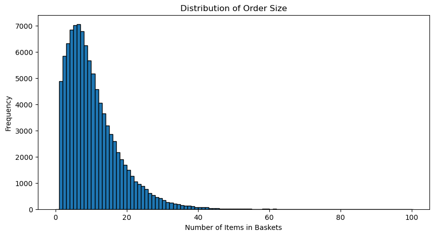

# Assignment 2: Mining Itemsets (Part I)


Starting from this week, you will get your hands wet by playing with real-world data with your freshly learned data mining techniques.  To test your understanding of the concepts, you will be asked to implement some of these techniques by your own, for which you can only call from a restricted set of APIs.  In your own projects, of course, you are encouraged to use as many packages and APIs as you may. 

For this assignment, **we collected 10,000 orders from Instacart, a grocery ordering and delivery app**. You will represent this dataset as a collection of itemsets and practice what we learned in class -- mining and evaluating frequent itemsets, and calculating the similarity of itemsets. 

**Disclaimer**: The data are collected from the real world. As you step into the *wild*, things might not always be nice and clean. Although we, the instructing team, have tried our best effort to filter out data containing poisonous vocabularies and etc. It is still possible that you will encouter offensive contents. 

In this assignment, you will:

- Represent the dataset as a collection of itemsets and mine frequent patterns from it.
- Get familiar with a set of metrics for measuring the importance of patterns (support, frequency, lift, chi-square, mutual information).
- Calculate Jaccard similarity and find the top $k$ similar itemsets to a given itemset.
- Understand Apriori and implement a part of the algorithm.

Have fun and cheers!🍻

Now Part I begins. We will represent the dataset as a collection of itemsets and conduct some descriptive analysis. The purpose is to get you familiar with the data. You do not need to change any of the code blocks, but just execute all of them and examine the output. Please read through the text descriptions and the code blocks carefully. After you are done, feel free to further explore the dataset in your own ways. 

First, let's import the packages and dependencies that will be used later.


```python
import pandas as pd
import matplotlib.pyplot as plt
from sklearn.preprocessing import MultiLabelBinarizer
```

## 1. Data Preprocessing

Let's start by loading the dataset and preview its first few lines. In this assignment, we will load two data files:
1. `orders.csv.zip`: This file contains the order information, whose columns are order ID and product ID.
2. `products.csv.zip`: This file contains the product information, which maps from product ID to its name.


```python
orders = pd.read_csv("assets/orders.csv.zip")
products = pd.read_csv("assets/products.csv.zip")
```


```python
orders = orders[["order_id", "product_id"]]
orders.head()
```


<div>
<style scoped>
    .dataframe tbody tr th:only-of-type {
        vertical-align: middle;
    }

    .dataframe tbody tr th {
        vertical-align: top;
    }

    .dataframe thead th {
        text-align: right;
    }
</style>
<table border="1" class="dataframe">
  <thead>
    <tr style="text-align: right;">
      <th></th>
      <th>order_id</th>
      <th>product_id</th>
    </tr>
  </thead>
  <tbody>
    <tr>
      <th>0</th>
      <td>2</td>
      <td>33120</td>
    </tr>
    <tr>
      <th>1</th>
      <td>2</td>
      <td>28985</td>
    </tr>
    <tr>
      <th>2</th>
      <td>2</td>
      <td>9327</td>
    </tr>
    <tr>
      <th>3</th>
      <td>2</td>
      <td>45918</td>
    </tr>
    <tr>
      <th>4</th>
      <td>2</td>
      <td>30035</td>
    </tr>
  </tbody>
</table>
</div>


You should find each line of the data is a specific product but the product name is missing. And, obviously, an order may contain multiple products. Now, let's define a dictionary to map product ID to its name so that we can check what products do users buy.


```python
products = products[["product_id", "product_name"]]
products.head()
```


<div>
<style scoped>
    .dataframe tbody tr th:only-of-type {
        vertical-align: middle;
    }

    .dataframe tbody tr th {
        vertical-align: top;
    }

    .dataframe thead th {
        text-align: right;
    }
</style>
<table border="1" class="dataframe">
  <thead>
    <tr style="text-align: right;">
      <th></th>
      <th>product_id</th>
      <th>product_name</th>
    </tr>
  </thead>
  <tbody>
    <tr>
      <th>0</th>
      <td>1</td>
      <td>Chocolate Sandwich Cookies</td>
    </tr>
    <tr>
      <th>1</th>
      <td>2</td>
      <td>All-Seasons Salt</td>
    </tr>
    <tr>
      <th>2</th>
      <td>3</td>
      <td>Robust Golden Unsweetened Oolong Tea</td>
    </tr>
    <tr>
      <th>3</th>
      <td>4</td>
      <td>Smart Ones Classic Favorites Mini Rigatoni Wit...</td>
    </tr>
    <tr>
      <th>4</th>
      <td>5</td>
      <td>Green Chile Anytime Sauce</td>
    </tr>
  </tbody>
</table>
</div>


```python
product_name_map = dict(zip(products["product_id"], products["product_name"]))
```

Now, we have all the information we need: the orders data and the products data. We can merge the products in the same order into a list.


```python
# Group orders by order id and merge them into a list.
order_baskets = orders.groupby("order_id")["product_id"].apply(list)

# Convert the above pandas Series to a pandas DataFrame.
order_baskets = order_baskets.to_frame(name="products_id")

# Create a new column called size that denotes the order sizes.
order_baskets["size"] = order_baskets["products_id"].apply(len)

# Let's have a look at our processed data!
order_baskets.head()
```


<div>
<style scoped>
    .dataframe tbody tr th:only-of-type {
        vertical-align: middle;
    }

    .dataframe tbody tr th {
        vertical-align: top;
    }

    .dataframe thead th {
        text-align: right;
    }
</style>
<table border="1" class="dataframe">
  <thead>
    <tr style="text-align: right;">
      <th></th>
      <th>products_id</th>
      <th>size</th>
    </tr>
    <tr>
      <th>order_id</th>
      <th></th>
      <th></th>
    </tr>
  </thead>
  <tbody>
    <tr>
      <th>2</th>
      <td>[33120, 28985, 9327, 45918, 30035, 17794, 4014...</td>
      <td>9</td>
    </tr>
    <tr>
      <th>3</th>
      <td>[33754, 24838, 17704, 21903, 17668, 46667, 174...</td>
      <td>8</td>
    </tr>
    <tr>
      <th>4</th>
      <td>[46842, 26434, 39758, 27761, 10054, 21351, 225...</td>
      <td>13</td>
    </tr>
    <tr>
      <th>5</th>
      <td>[13176, 15005, 47329, 27966, 23909, 48370, 132...</td>
      <td>26</td>
    </tr>
    <tr>
      <th>6</th>
      <td>[40462, 15873, 41897]</td>
      <td>3</td>
    </tr>
  </tbody>
</table>
</div>


We can use the `product_name_map` we created just now to figure out what products any given order contain. For example, order 42.


```python
order_42 = order_baskets.loc[42]["products_id"]
for product_id in order_42:
    print(product_name_map[product_id])
```

    Unsweetened Vanilla Almond Breeze
    Pure Irish Butter
    Bag of Organic Bananas


## 2. Summary Statistics

Before we jump into analyzing a dataset, it is always wise to take a look at some summary statistics first. 

Let's examine how many products are added in an order(`order_baskets.size`). We can plot its distribution.


```python
fig, ax = plt.subplots(figsize=(10,5))
ax.set_xlabel("Number of Items in Baskets")
ax.set_ylabel("Frequency")
ax.set_title("Distribution of Order Size")
ax.hist(order_baskets["size"], bins=200, range=(0,100), width=1, edgecolor="black")
plt.show()
```


    

    


The length of orders follow a log-normal distribution, which is consistent to [many other human behaviors](https://en.wikipedia.org/wiki/Log-normal_distribution#Occurrence_and_applications). For example, the length of comments posted in internet discussion forums, or even the length of chess games.

Next, we are now going to use the `mlxtend` for frequent itemset mining. This package requires that the itemsets be transformed into a matrix before being passed to its APIs, where each row represents an itemset and each column represents an item. Each cell encodes whether an item is in an itemset or not. You should know what this transformation does after doing the first assignment. Here we implement this transformation with the `MultiLabelBinarizer` in scikit-learn(`sklearn`).


```python
mlb = MultiLabelBinarizer(sparse_output=True)
prod_matrix = pd.DataFrame.sparse.from_spmatrix(data=mlb.fit_transform(order_baskets["products_id"]), index=order_baskets.index, columns=mlb.classes_)
prod_matrix.head()
```


<div>
<style scoped>
    .dataframe tbody tr th:only-of-type {
        vertical-align: middle;
    }

    .dataframe tbody tr th {
        vertical-align: top;
    }

    .dataframe thead th {
        text-align: right;
    }
</style>
<table border="1" class="dataframe">
  <thead>
    <tr style="text-align: right;">
      <th></th>
      <th>1</th>
      <th>2</th>
      <th>3</th>
      <th>4</th>
      <th>8</th>
      <th>9</th>
      <th>10</th>
      <th>12</th>
      <th>14</th>
      <th>15</th>
      <th>...</th>
      <th>49676</th>
      <th>49677</th>
      <th>49678</th>
      <th>49679</th>
      <th>49680</th>
      <th>49681</th>
      <th>49683</th>
      <th>49685</th>
      <th>49686</th>
      <th>49688</th>
    </tr>
    <tr>
      <th>order_id</th>
      <th></th>
      <th></th>
      <th></th>
      <th></th>
      <th></th>
      <th></th>
      <th></th>
      <th></th>
      <th></th>
      <th></th>
      <th></th>
      <th></th>
      <th></th>
      <th></th>
      <th></th>
      <th></th>
      <th></th>
      <th></th>
      <th></th>
      <th></th>
      <th></th>
    </tr>
  </thead>
  <tbody>
    <tr>
      <th>2</th>
      <td>0</td>
      <td>0</td>
      <td>0</td>
      <td>0</td>
      <td>0</td>
      <td>0</td>
      <td>0</td>
      <td>0</td>
      <td>0</td>
      <td>0</td>
      <td>...</td>
      <td>0</td>
      <td>0</td>
      <td>0</td>
      <td>0</td>
      <td>0</td>
      <td>0</td>
      <td>0</td>
      <td>0</td>
      <td>0</td>
      <td>0</td>
    </tr>
    <tr>
      <th>3</th>
      <td>0</td>
      <td>0</td>
      <td>0</td>
      <td>0</td>
      <td>0</td>
      <td>0</td>
      <td>0</td>
      <td>0</td>
      <td>0</td>
      <td>0</td>
      <td>...</td>
      <td>0</td>
      <td>0</td>
      <td>0</td>
      <td>0</td>
      <td>0</td>
      <td>0</td>
      <td>0</td>
      <td>0</td>
      <td>0</td>
      <td>0</td>
    </tr>
    <tr>
      <th>4</th>
      <td>0</td>
      <td>0</td>
      <td>0</td>
      <td>0</td>
      <td>0</td>
      <td>0</td>
      <td>0</td>
      <td>0</td>
      <td>0</td>
      <td>0</td>
      <td>...</td>
      <td>0</td>
      <td>0</td>
      <td>0</td>
      <td>0</td>
      <td>0</td>
      <td>0</td>
      <td>0</td>
      <td>0</td>
      <td>0</td>
      <td>0</td>
    </tr>
    <tr>
      <th>5</th>
      <td>0</td>
      <td>0</td>
      <td>0</td>
      <td>0</td>
      <td>0</td>
      <td>0</td>
      <td>0</td>
      <td>0</td>
      <td>0</td>
      <td>0</td>
      <td>...</td>
      <td>0</td>
      <td>0</td>
      <td>0</td>
      <td>0</td>
      <td>0</td>
      <td>0</td>
      <td>0</td>
      <td>0</td>
      <td>0</td>
      <td>0</td>
    </tr>
    <tr>
      <th>6</th>
      <td>0</td>
      <td>0</td>
      <td>0</td>
      <td>0</td>
      <td>0</td>
      <td>0</td>
      <td>0</td>
      <td>0</td>
      <td>0</td>
      <td>0</td>
      <td>...</td>
      <td>0</td>
      <td>0</td>
      <td>0</td>
      <td>0</td>
      <td>0</td>
      <td>0</td>
      <td>0</td>
      <td>0</td>
      <td>0</td>
      <td>0</td>
    </tr>
  </tbody>
</table>
<p>5 rows × 35098 columns</p>
</div>


```python
# Print the sparsity of the matrix
print("Sparsity: {:.2f}%".format(100 * prod_matrix.sparse.density))
```

    Sparsity: 0.03%


*As you may expect, the matrix is very sparse. Only 0.03% of the cells are
non-zero. In reality, we may want to use a more efficient data structure to
represent the dataset. But for now, let's just use the matrix.*

Now, let's examine the popularity of individual products, that is, the counts and the distribution of single items (products). The number of orders containing a given product can be calculated as the sum of the column in the product matrix.


```python
prod_popularity = prod_matrix.sum(axis=0)

for prod_id, prod_freq in prod_popularity.head().items():
    print(f"{product_name_map[prod_id]} - {prod_freq}")
```

    Chocolate Sandwich Cookies - 59
    All-Seasons Salt - 3
    Robust Golden Unsweetened Oolong Tea - 3
    Smart Ones Classic Favorites Mini Rigatoni With Vodka Cream Sauce - 10
    Cut Russet Potatoes Steam N' Mash - 2


### Task 1. Find the most popular products (5 pts)
Please compete the `top_n_products` function below, which should return a list of the $n$ most popular products based on the `prod_popularity` DataFrame.

Guide:

Below, we define most_popular_indices, a series of $n$ index and value pairs, where the index is the product ID and the value is the number of times the product has been ordered.

To obtain the names of the $n$ most popular products, simply loop through each index in `most_popular_indices.index`. For each index, you can use `product_name_map[index]` to obtain the name of the product, and use the `.append` function to append that product name to the end of the `most_popular_products` list.


```python
def top_n_products(n):
    most_popular_indices = prod_popularity.nlargest(n, keep='first')
    
    most_popular_products = []

    for i in most_popular_indices.index:

        most_popular_products.append(product_name_map[i])

    
    return most_popular_products
```


```python
stu_top_products = top_n_products(2)

assert isinstance(stu_top_products, list), f"Your function should return a list."

assert all(isinstance(product, str) for product in stu_top_products), f" All elements in the returned list should be strings."

```


```python
print(f"Two most popular products: {top_n_products(2)}")
```

    Two most popular products: ['Banana', 'Bag of Organic Bananas']


The most popular products turn out to be banana and organic bananas! Is it a surprise? 🍌
