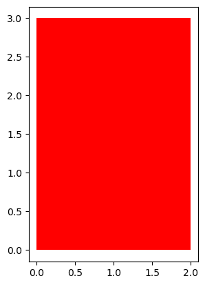

```python
2 + 3 * 4 / 2
```


    8.0


```python
data = 'data science basics'
```


```python
data.capitalize()
```


    'Data science basics'


```python
data.upper()
```


    'DATA SCIENCE BASICS'


```python
code = 'ABC-12345-XYZ'
```


```python
code[4:9]
```


    '12345'


```python
A = [1,2,3]
A[:]
```


    [1, 2, 3]


```python
inventory = {"shirt":45, "pants":20, "shoes":15, "hat":5}
```


```python
inventory.values()
```


    dict_values([45, 20, 15, 5])


```python
visitors = {'user123', 'user456'}
```


```python
visitors.add('user789')
```


```python
visitors
```


    {'user123', 'user456', 'user789'}


```python
A={1,2,3}
B = {4,5,6}
```


```python
A.union(B)
```


    {1, 2, 3, 4, 5, 6}


```python
total_budget = 1000 
def calculate_remaining(spent): 
    total_budget = 500 
    return total_budget - spent 
print(calculate_remaining(200))
```

    300
    


```python
import numpy as np
a=np.array([-1,1]) 
b=np.array([1,1])
np.dot(a,b)
```


    0


```python
X=np.array([[1,0,1],[2,2,2]]) 
out=X[0:2,2]
out
```


    array([1, 2])


```python
24//5
```


    4


```python
class Rectangle(object): 

    def __init__(self,width=2,height =3,color='r'):

        self.height=height 

        self.width=width 

        self.color=color 

    def drawRectangle(self): 

        import matplotlib.pyplot as plt 

        plt.gca().add_patch(plt.Rectangle((0, 0),self.width, self.height ,fc=self.color)) 

        plt.axis('scaled') 
        plt.show()
```


```python
my_obj = Rectangle()
my_obj.drawRectangle()
```


    

    


```python

```
