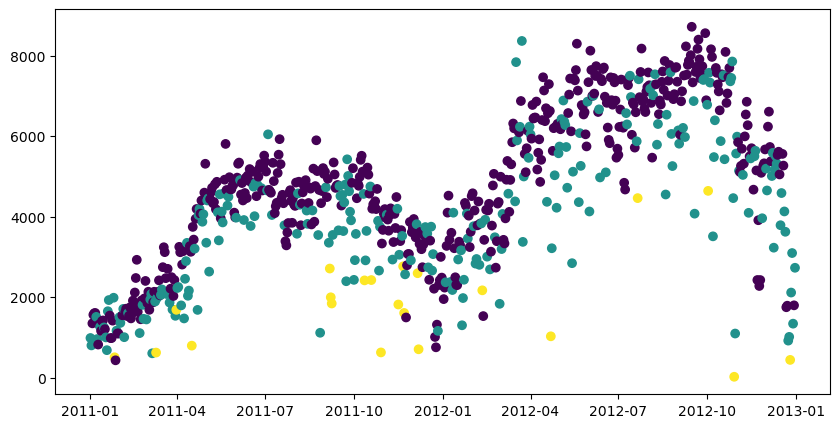
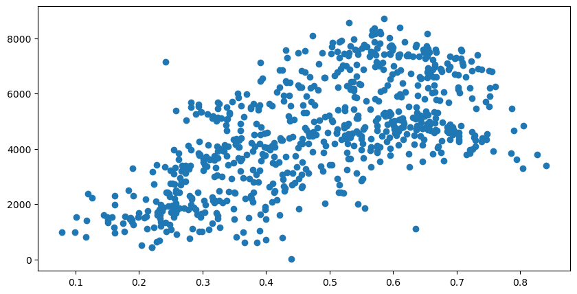
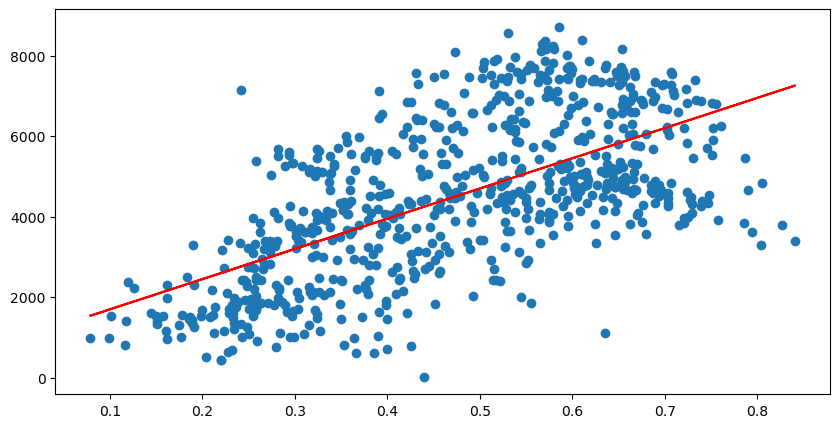
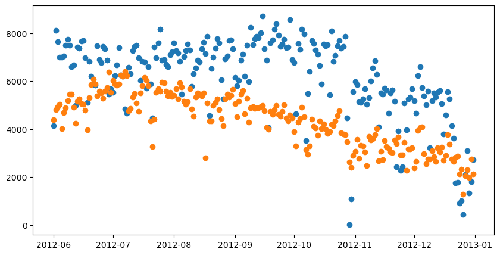
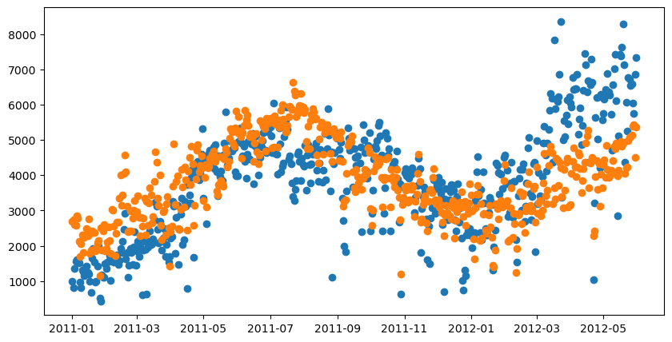
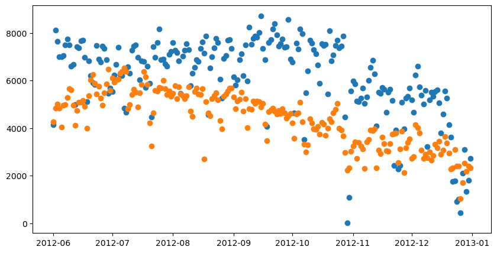
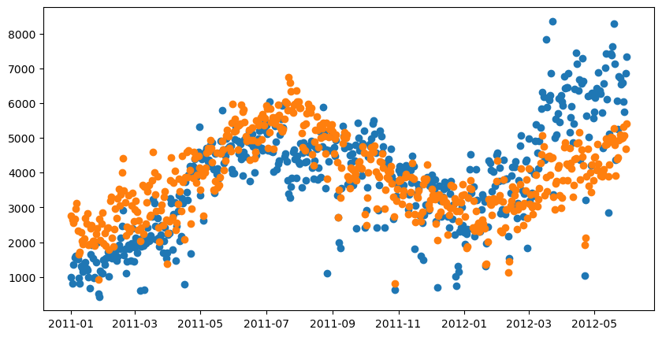
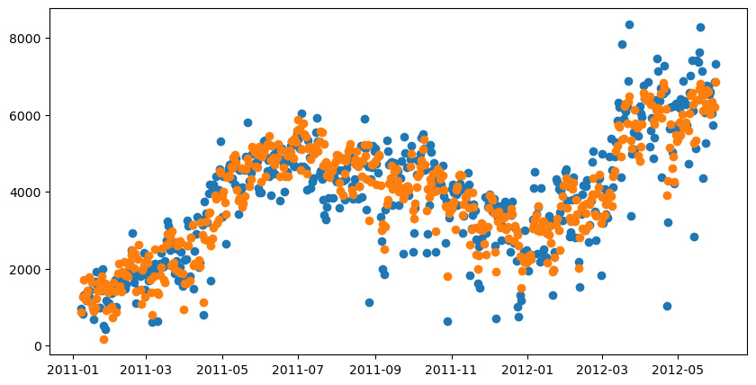

```python
import pandas as pd
import matplotlib.pyplot as plt
import numpy as np
plt.rcParams['figure.figsize'] = [10, 5]
```


```python
df = pd.read_csv("day.csv")
df['date'] = pd.to_datetime(df['dteday'])
df
```


<div>
<style scoped>
    .dataframe tbody tr th:only-of-type {
        vertical-align: middle;
    }

    .dataframe tbody tr th {
        vertical-align: top;
    }

    .dataframe thead th {
        text-align: right;
    }
</style>
<table border="1" class="dataframe">
  <thead>
    <tr style="text-align: right;">
      <th></th>
      <th>instant</th>
      <th>dteday</th>
      <th>season</th>
      <th>yr</th>
      <th>mnth</th>
      <th>holiday</th>
      <th>weekday</th>
      <th>workingday</th>
      <th>weathersit</th>
      <th>temp</th>
      <th>atemp</th>
      <th>hum</th>
      <th>windspeed</th>
      <th>casual</th>
      <th>registered</th>
      <th>cnt</th>
      <th>date</th>
    </tr>
  </thead>
  <tbody>
    <tr>
      <th>0</th>
      <td>1</td>
      <td>2011-01-01</td>
      <td>1</td>
      <td>0</td>
      <td>1</td>
      <td>0</td>
      <td>6</td>
      <td>0</td>
      <td>2</td>
      <td>0.344167</td>
      <td>0.363625</td>
      <td>0.805833</td>
      <td>0.160446</td>
      <td>331</td>
      <td>654</td>
      <td>985</td>
      <td>2011-01-01</td>
    </tr>
    <tr>
      <th>1</th>
      <td>2</td>
      <td>2011-01-02</td>
      <td>1</td>
      <td>0</td>
      <td>1</td>
      <td>0</td>
      <td>0</td>
      <td>0</td>
      <td>2</td>
      <td>0.363478</td>
      <td>0.353739</td>
      <td>0.696087</td>
      <td>0.248539</td>
      <td>131</td>
      <td>670</td>
      <td>801</td>
      <td>2011-01-02</td>
    </tr>
    <tr>
      <th>2</th>
      <td>3</td>
      <td>2011-01-03</td>
      <td>1</td>
      <td>0</td>
      <td>1</td>
      <td>0</td>
      <td>1</td>
      <td>1</td>
      <td>1</td>
      <td>0.196364</td>
      <td>0.189405</td>
      <td>0.437273</td>
      <td>0.248309</td>
      <td>120</td>
      <td>1229</td>
      <td>1349</td>
      <td>2011-01-03</td>
    </tr>
    <tr>
      <th>3</th>
      <td>4</td>
      <td>2011-01-04</td>
      <td>1</td>
      <td>0</td>
      <td>1</td>
      <td>0</td>
      <td>2</td>
      <td>1</td>
      <td>1</td>
      <td>0.200000</td>
      <td>0.212122</td>
      <td>0.590435</td>
      <td>0.160296</td>
      <td>108</td>
      <td>1454</td>
      <td>1562</td>
      <td>2011-01-04</td>
    </tr>
    <tr>
      <th>4</th>
      <td>5</td>
      <td>2011-01-05</td>
      <td>1</td>
      <td>0</td>
      <td>1</td>
      <td>0</td>
      <td>3</td>
      <td>1</td>
      <td>1</td>
      <td>0.226957</td>
      <td>0.229270</td>
      <td>0.436957</td>
      <td>0.186900</td>
      <td>82</td>
      <td>1518</td>
      <td>1600</td>
      <td>2011-01-05</td>
    </tr>
    <tr>
      <th>...</th>
      <td>...</td>
      <td>...</td>
      <td>...</td>
      <td>...</td>
      <td>...</td>
      <td>...</td>
      <td>...</td>
      <td>...</td>
      <td>...</td>
      <td>...</td>
      <td>...</td>
      <td>...</td>
      <td>...</td>
      <td>...</td>
      <td>...</td>
      <td>...</td>
      <td>...</td>
    </tr>
    <tr>
      <th>726</th>
      <td>727</td>
      <td>2012-12-27</td>
      <td>1</td>
      <td>1</td>
      <td>12</td>
      <td>0</td>
      <td>4</td>
      <td>1</td>
      <td>2</td>
      <td>0.254167</td>
      <td>0.226642</td>
      <td>0.652917</td>
      <td>0.350133</td>
      <td>247</td>
      <td>1867</td>
      <td>2114</td>
      <td>2012-12-27</td>
    </tr>
    <tr>
      <th>727</th>
      <td>728</td>
      <td>2012-12-28</td>
      <td>1</td>
      <td>1</td>
      <td>12</td>
      <td>0</td>
      <td>5</td>
      <td>1</td>
      <td>2</td>
      <td>0.253333</td>
      <td>0.255046</td>
      <td>0.590000</td>
      <td>0.155471</td>
      <td>644</td>
      <td>2451</td>
      <td>3095</td>
      <td>2012-12-28</td>
    </tr>
    <tr>
      <th>728</th>
      <td>729</td>
      <td>2012-12-29</td>
      <td>1</td>
      <td>1</td>
      <td>12</td>
      <td>0</td>
      <td>6</td>
      <td>0</td>
      <td>2</td>
      <td>0.253333</td>
      <td>0.242400</td>
      <td>0.752917</td>
      <td>0.124383</td>
      <td>159</td>
      <td>1182</td>
      <td>1341</td>
      <td>2012-12-29</td>
    </tr>
    <tr>
      <th>729</th>
      <td>730</td>
      <td>2012-12-30</td>
      <td>1</td>
      <td>1</td>
      <td>12</td>
      <td>0</td>
      <td>0</td>
      <td>0</td>
      <td>1</td>
      <td>0.255833</td>
      <td>0.231700</td>
      <td>0.483333</td>
      <td>0.350754</td>
      <td>364</td>
      <td>1432</td>
      <td>1796</td>
      <td>2012-12-30</td>
    </tr>
    <tr>
      <th>730</th>
      <td>731</td>
      <td>2012-12-31</td>
      <td>1</td>
      <td>1</td>
      <td>12</td>
      <td>0</td>
      <td>1</td>
      <td>1</td>
      <td>2</td>
      <td>0.215833</td>
      <td>0.223487</td>
      <td>0.577500</td>
      <td>0.154846</td>
      <td>439</td>
      <td>2290</td>
      <td>2729</td>
      <td>2012-12-31</td>
    </tr>
  </tbody>
</table>
<p>731 rows × 17 columns</p>
</div>


```python
# df.plot.scatter(x='dteday', y='cnt')
plt.scatter(df['date'], df['cnt'], c = df['weathersit'])
```


    <matplotlib.collections.PathCollection at 0x124ee493ef0>


    

    


```python
df[df['weathersit']==1]['cnt'].mean()
```


    4876.7861771058315


```python
df[df['weathersit']==2]['cnt'].mean()
```


    4035.862348178138


```python
df[df['weathersit']==3]['cnt'].mean()
```


    1803.2857142857142


```python
plt.scatter(df['atemp'], df['cnt'])
```


    <matplotlib.collections.PathCollection at 0x124ee4ed130>


    

    


```python
df[['cnt', 'atemp']].corr()
```


<div>
<style scoped>
    .dataframe tbody tr th:only-of-type {
        vertical-align: middle;
    }

    .dataframe tbody tr th {
        vertical-align: top;
    }

    .dataframe thead th {
        text-align: right;
    }
</style>
<table border="1" class="dataframe">
  <thead>
    <tr style="text-align: right;">
      <th></th>
      <th>cnt</th>
      <th>atemp</th>
    </tr>
  </thead>
  <tbody>
    <tr>
      <th>cnt</th>
      <td>1.000000</td>
      <td>0.631066</td>
    </tr>
    <tr>
      <th>atemp</th>
      <td>0.631066</td>
      <td>1.000000</td>
    </tr>
  </tbody>
</table>
</div>


```python
df[['cnt', 'temp']].corr()
```


<div>
<style scoped>
    .dataframe tbody tr th:only-of-type {
        vertical-align: middle;
    }

    .dataframe tbody tr th {
        vertical-align: top;
    }

    .dataframe thead th {
        text-align: right;
    }
</style>
<table border="1" class="dataframe">
  <thead>
    <tr style="text-align: right;">
      <th></th>
      <th>cnt</th>
      <th>temp</th>
    </tr>
  </thead>
  <tbody>
    <tr>
      <th>cnt</th>
      <td>1.000000</td>
      <td>0.627494</td>
    </tr>
    <tr>
      <th>temp</th>
      <td>0.627494</td>
      <td>1.000000</td>
    </tr>
  </tbody>
</table>
</div>


```python
df[['cnt', 'atemp', 'temp', 'hum', 'windspeed', 'weathersit']].corr()
```


<div>
<style scoped>
    .dataframe tbody tr th:only-of-type {
        vertical-align: middle;
    }

    .dataframe tbody tr th {
        vertical-align: top;
    }

    .dataframe thead th {
        text-align: right;
    }
</style>
<table border="1" class="dataframe">
  <thead>
    <tr style="text-align: right;">
      <th></th>
      <th>cnt</th>
      <th>atemp</th>
      <th>temp</th>
      <th>hum</th>
      <th>windspeed</th>
      <th>weathersit</th>
    </tr>
  </thead>
  <tbody>
    <tr>
      <th>cnt</th>
      <td>1.000000</td>
      <td>0.631066</td>
      <td>0.627494</td>
      <td>-0.100659</td>
      <td>-0.234545</td>
      <td>-0.297391</td>
    </tr>
    <tr>
      <th>atemp</th>
      <td>0.631066</td>
      <td>1.000000</td>
      <td>0.991702</td>
      <td>0.139988</td>
      <td>-0.183643</td>
      <td>-0.121583</td>
    </tr>
    <tr>
      <th>temp</th>
      <td>0.627494</td>
      <td>0.991702</td>
      <td>1.000000</td>
      <td>0.126963</td>
      <td>-0.157944</td>
      <td>-0.120602</td>
    </tr>
    <tr>
      <th>hum</th>
      <td>-0.100659</td>
      <td>0.139988</td>
      <td>0.126963</td>
      <td>1.000000</td>
      <td>-0.248489</td>
      <td>0.591045</td>
    </tr>
    <tr>
      <th>windspeed</th>
      <td>-0.234545</td>
      <td>-0.183643</td>
      <td>-0.157944</td>
      <td>-0.248489</td>
      <td>1.000000</td>
      <td>0.039511</td>
    </tr>
    <tr>
      <th>weathersit</th>
      <td>-0.297391</td>
      <td>-0.121583</td>
      <td>-0.120602</td>
      <td>0.591045</td>
      <td>0.039511</td>
      <td>1.000000</td>
    </tr>
  </tbody>
</table>
</div>


```python
from sklearn.linear_model import LinearRegression
```


```python
lr = LinearRegression()
lr.fit(df['atemp'].values.reshape(-1,1), df['cnt'].values.reshape(-1,1))
```


<style>#sk-container-id-1 {
  /* Definition of color scheme common for light and dark mode */
  --sklearn-color-text: black;
  --sklearn-color-line: gray;
  /* Definition of color scheme for unfitted estimators */
  --sklearn-color-unfitted-level-0: #fff5e6;
  --sklearn-color-unfitted-level-1: #f6e4d2;
  --sklearn-color-unfitted-level-2: #ffe0b3;
  --sklearn-color-unfitted-level-3: chocolate;
  /* Definition of color scheme for fitted estimators */
  --sklearn-color-fitted-level-0: #f0f8ff;
  --sklearn-color-fitted-level-1: #d4ebff;
  --sklearn-color-fitted-level-2: #b3dbfd;
  --sklearn-color-fitted-level-3: cornflowerblue;

  /* Specific color for light theme */
  --sklearn-color-text-on-default-background: var(--sg-text-color, var(--theme-code-foreground, var(--jp-content-font-color1, black)));
  --sklearn-color-background: var(--sg-background-color, var(--theme-background, var(--jp-layout-color0, white)));
  --sklearn-color-border-box: var(--sg-text-color, var(--theme-code-foreground, var(--jp-content-font-color1, black)));
  --sklearn-color-icon: #696969;

  @media (prefers-color-scheme: dark) {
    /* Redefinition of color scheme for dark theme */
    --sklearn-color-text-on-default-background: var(--sg-text-color, var(--theme-code-foreground, var(--jp-content-font-color1, white)));
    --sklearn-color-background: var(--sg-background-color, var(--theme-background, var(--jp-layout-color0, #111)));
    --sklearn-color-border-box: var(--sg-text-color, var(--theme-code-foreground, var(--jp-content-font-color1, white)));
    --sklearn-color-icon: #878787;
  }
}

#sk-container-id-1 {
  color: var(--sklearn-color-text);
}

#sk-container-id-1 pre {
  padding: 0;
}

#sk-container-id-1 input.sk-hidden--visually {
  border: 0;
  clip: rect(1px 1px 1px 1px);
  clip: rect(1px, 1px, 1px, 1px);
  height: 1px;
  margin: -1px;
  overflow: hidden;
  padding: 0;
  position: absolute;
  width: 1px;
}

#sk-container-id-1 div.sk-dashed-wrapped {
  border: 1px dashed var(--sklearn-color-line);
  margin: 0 0.4em 0.5em 0.4em;
  box-sizing: border-box;
  padding-bottom: 0.4em;
  background-color: var(--sklearn-color-background);
}

#sk-container-id-1 div.sk-container {
  /* jupyter's `normalize.less` sets `[hidden] { display: none; }`
     but bootstrap.min.css set `[hidden] { display: none !important; }`
     so we also need the `!important` here to be able to override the
     default hidden behavior on the sphinx rendered scikit-learn.org.
     See: https://github.com/scikit-learn/scikit-learn/issues/21755 */
  display: inline-block !important;
  position: relative;
}

#sk-container-id-1 div.sk-text-repr-fallback {
  display: none;
}

div.sk-parallel-item,
div.sk-serial,
div.sk-item {
  /* draw centered vertical line to link estimators */
  background-image: linear-gradient(var(--sklearn-color-text-on-default-background), var(--sklearn-color-text-on-default-background));
  background-size: 2px 100%;
  background-repeat: no-repeat;
  background-position: center center;
}

/* Parallel-specific style estimator block */

#sk-container-id-1 div.sk-parallel-item::after {
  content: "";
  width: 100%;
  border-bottom: 2px solid var(--sklearn-color-text-on-default-background);
  flex-grow: 1;
}

#sk-container-id-1 div.sk-parallel {
  display: flex;
  align-items: stretch;
  justify-content: center;
  background-color: var(--sklearn-color-background);
  position: relative;
}

#sk-container-id-1 div.sk-parallel-item {
  display: flex;
  flex-direction: column;
}

#sk-container-id-1 div.sk-parallel-item:first-child::after {
  align-self: flex-end;
  width: 50%;
}

#sk-container-id-1 div.sk-parallel-item:last-child::after {
  align-self: flex-start;
  width: 50%;
}

#sk-container-id-1 div.sk-parallel-item:only-child::after {
  width: 0;
}

/* Serial-specific style estimator block */

#sk-container-id-1 div.sk-serial {
  display: flex;
  flex-direction: column;
  align-items: center;
  background-color: var(--sklearn-color-background);
  padding-right: 1em;
  padding-left: 1em;
}


/* Toggleable style: style used for estimator/Pipeline/ColumnTransformer box that is
clickable and can be expanded/collapsed.
- Pipeline and ColumnTransformer use this feature and define the default style
- Estimators will overwrite some part of the style using the `sk-estimator` class
*/

/* Pipeline and ColumnTransformer style (default) */

#sk-container-id-1 div.sk-toggleable {
  /* Default theme specific background. It is overwritten whether we have a
  specific estimator or a Pipeline/ColumnTransformer */
  background-color: var(--sklearn-color-background);
}

/* Toggleable label */
#sk-container-id-1 label.sk-toggleable__label {
  cursor: pointer;
  display: block;
  width: 100%;
  margin-bottom: 0;
  padding: 0.5em;
  box-sizing: border-box;
  text-align: center;
}

#sk-container-id-1 label.sk-toggleable__label-arrow:before {
  /* Arrow on the left of the label */
  content: "▸";
  float: left;
  margin-right: 0.25em;
  color: var(--sklearn-color-icon);
}

#sk-container-id-1 label.sk-toggleable__label-arrow:hover:before {
  color: var(--sklearn-color-text);
}

/* Toggleable content - dropdown */

#sk-container-id-1 div.sk-toggleable__content {
  max-height: 0;
  max-width: 0;
  overflow: hidden;
  text-align: left;
  /* unfitted */
  background-color: var(--sklearn-color-unfitted-level-0);
}

#sk-container-id-1 div.sk-toggleable__content.fitted {
  /* fitted */
  background-color: var(--sklearn-color-fitted-level-0);
}

#sk-container-id-1 div.sk-toggleable__content pre {
  margin: 0.2em;
  border-radius: 0.25em;
  color: var(--sklearn-color-text);
  /* unfitted */
  background-color: var(--sklearn-color-unfitted-level-0);
}

#sk-container-id-1 div.sk-toggleable__content.fitted pre {
  /* unfitted */
  background-color: var(--sklearn-color-fitted-level-0);
}

#sk-container-id-1 input.sk-toggleable__control:checked~div.sk-toggleable__content {
  /* Expand drop-down */
  max-height: 200px;
  max-width: 100%;
  overflow: auto;
}

#sk-container-id-1 input.sk-toggleable__control:checked~label.sk-toggleable__label-arrow:before {
  content: "▾";
}

/* Pipeline/ColumnTransformer-specific style */

#sk-container-id-1 div.sk-label input.sk-toggleable__control:checked~label.sk-toggleable__label {
  color: var(--sklearn-color-text);
  background-color: var(--sklearn-color-unfitted-level-2);
}

#sk-container-id-1 div.sk-label.fitted input.sk-toggleable__control:checked~label.sk-toggleable__label {
  background-color: var(--sklearn-color-fitted-level-2);
}

/* Estimator-specific style */

/* Colorize estimator box */
#sk-container-id-1 div.sk-estimator input.sk-toggleable__control:checked~label.sk-toggleable__label {
  /* unfitted */
  background-color: var(--sklearn-color-unfitted-level-2);
}

#sk-container-id-1 div.sk-estimator.fitted input.sk-toggleable__control:checked~label.sk-toggleable__label {
  /* fitted */
  background-color: var(--sklearn-color-fitted-level-2);
}

#sk-container-id-1 div.sk-label label.sk-toggleable__label,
#sk-container-id-1 div.sk-label label {
  /* The background is the default theme color */
  color: var(--sklearn-color-text-on-default-background);
}

/* On hover, darken the color of the background */
#sk-container-id-1 div.sk-label:hover label.sk-toggleable__label {
  color: var(--sklearn-color-text);
  background-color: var(--sklearn-color-unfitted-level-2);
}

/* Label box, darken color on hover, fitted */
#sk-container-id-1 div.sk-label.fitted:hover label.sk-toggleable__label.fitted {
  color: var(--sklearn-color-text);
  background-color: var(--sklearn-color-fitted-level-2);
}

/* Estimator label */

#sk-container-id-1 div.sk-label label {
  font-family: monospace;
  font-weight: bold;
  display: inline-block;
  line-height: 1.2em;
}

#sk-container-id-1 div.sk-label-container {
  text-align: center;
}

/* Estimator-specific */
#sk-container-id-1 div.sk-estimator {
  font-family: monospace;
  border: 1px dotted var(--sklearn-color-border-box);
  border-radius: 0.25em;
  box-sizing: border-box;
  margin-bottom: 0.5em;
  /* unfitted */
  background-color: var(--sklearn-color-unfitted-level-0);
}

#sk-container-id-1 div.sk-estimator.fitted {
  /* fitted */
  background-color: var(--sklearn-color-fitted-level-0);
}

/* on hover */
#sk-container-id-1 div.sk-estimator:hover {
  /* unfitted */
  background-color: var(--sklearn-color-unfitted-level-2);
}

#sk-container-id-1 div.sk-estimator.fitted:hover {
  /* fitted */
  background-color: var(--sklearn-color-fitted-level-2);
}

/* Specification for estimator info (e.g. "i" and "?") */

/* Common style for "i" and "?" */

.sk-estimator-doc-link,
a:link.sk-estimator-doc-link,
a:visited.sk-estimator-doc-link {
  float: right;
  font-size: smaller;
  line-height: 1em;
  font-family: monospace;
  background-color: var(--sklearn-color-background);
  border-radius: 1em;
  height: 1em;
  width: 1em;
  text-decoration: none !important;
  margin-left: 1ex;
  /* unfitted */
  border: var(--sklearn-color-unfitted-level-1) 1pt solid;
  color: var(--sklearn-color-unfitted-level-1);
}

.sk-estimator-doc-link.fitted,
a:link.sk-estimator-doc-link.fitted,
a:visited.sk-estimator-doc-link.fitted {
  /* fitted */
  border: var(--sklearn-color-fitted-level-1) 1pt solid;
  color: var(--sklearn-color-fitted-level-1);
}

/* On hover */
div.sk-estimator:hover .sk-estimator-doc-link:hover,
.sk-estimator-doc-link:hover,
div.sk-label-container:hover .sk-estimator-doc-link:hover,
.sk-estimator-doc-link:hover {
  /* unfitted */
  background-color: var(--sklearn-color-unfitted-level-3);
  color: var(--sklearn-color-background);
  text-decoration: none;
}

div.sk-estimator.fitted:hover .sk-estimator-doc-link.fitted:hover,
.sk-estimator-doc-link.fitted:hover,
div.sk-label-container:hover .sk-estimator-doc-link.fitted:hover,
.sk-estimator-doc-link.fitted:hover {
  /* fitted */
  background-color: var(--sklearn-color-fitted-level-3);
  color: var(--sklearn-color-background);
  text-decoration: none;
}

/* Span, style for the box shown on hovering the info icon */
.sk-estimator-doc-link span {
  display: none;
  z-index: 9999;
  position: relative;
  font-weight: normal;
  right: .2ex;
  padding: .5ex;
  margin: .5ex;
  width: min-content;
  min-width: 20ex;
  max-width: 50ex;
  color: var(--sklearn-color-text);
  box-shadow: 2pt 2pt 4pt #999;
  /* unfitted */
  background: var(--sklearn-color-unfitted-level-0);
  border: .5pt solid var(--sklearn-color-unfitted-level-3);
}

.sk-estimator-doc-link.fitted span {
  /* fitted */
  background: var(--sklearn-color-fitted-level-0);
  border: var(--sklearn-color-fitted-level-3);
}

.sk-estimator-doc-link:hover span {
  display: block;
}

/* "?"-specific style due to the `<a>` HTML tag */

#sk-container-id-1 a.estimator_doc_link {
  float: right;
  font-size: 1rem;
  line-height: 1em;
  font-family: monospace;
  background-color: var(--sklearn-color-background);
  border-radius: 1rem;
  height: 1rem;
  width: 1rem;
  text-decoration: none;
  /* unfitted */
  color: var(--sklearn-color-unfitted-level-1);
  border: var(--sklearn-color-unfitted-level-1) 1pt solid;
}

#sk-container-id-1 a.estimator_doc_link.fitted {
  /* fitted */
  border: var(--sklearn-color-fitted-level-1) 1pt solid;
  color: var(--sklearn-color-fitted-level-1);
}

/* On hover */
#sk-container-id-1 a.estimator_doc_link:hover {
  /* unfitted */
  background-color: var(--sklearn-color-unfitted-level-3);
  color: var(--sklearn-color-background);
  text-decoration: none;
}

#sk-container-id-1 a.estimator_doc_link.fitted:hover {
  /* fitted */
  background-color: var(--sklearn-color-fitted-level-3);
}
</style><div id="sk-container-id-1" class="sk-top-container"><div class="sk-text-repr-fallback"><pre>LinearRegression()</pre><b>In a Jupyter environment, please rerun this cell to show the HTML representation or trust the notebook. <br />On GitHub, the HTML representation is unable to render, please try loading this page with nbviewer.org.</b></div><div class="sk-container" hidden><div class="sk-item"><div class="sk-estimator fitted sk-toggleable"><input class="sk-toggleable__control sk-hidden--visually" id="sk-estimator-id-1" type="checkbox" checked><label for="sk-estimator-id-1" class="sk-toggleable__label fitted sk-toggleable__label-arrow fitted">&nbsp;&nbsp;LinearRegression<a class="sk-estimator-doc-link fitted" rel="noreferrer" target="_blank" href="https://scikit-learn.org/1.5/modules/generated/sklearn.linear_model.LinearRegression.html">?<span>Documentation for LinearRegression</span></a><span class="sk-estimator-doc-link fitted">i<span>Fitted</span></span></label><div class="sk-toggleable__content fitted"><pre>LinearRegression()</pre></div> </div></div></div></div>


```python
plt.scatter(df['atemp'], df['cnt'])
plt.plot(df['atemp'], lr.predict(df['atemp'].values.reshape(-1,1)), c='red')
```


    [<matplotlib.lines.Line2D at 0x124f136cd40>]


    

    


```python
training_set = df[df['date'] < '2012-06-01']
validation_set = df[df['date'] >= '2012-06-01']

training_inputs = training_set[['atemp', 'workingday', 'hum', 'weathersit']].values
training_outputs = training_set[['cnt']].values

validation_inputs = validation_set[['atemp', 'workingday', 'hum', 'weathersit']].values
validation_outputs = validation_set[['cnt']].values

lr = LinearRegression()
lr.fit(training_inputs, training_outputs)


# plt.scatter(lr.predict(validation_inputs), validation_outputs)
plt.scatter(validation_set['date'], validation_set['cnt'])
plt.scatter(validation_set['date'], lr.predict(validation_inputs))
plt.show()

plt.scatter(training_set['date'], training_set['cnt'])
plt.scatter(training_set['date'], lr.predict(training_inputs))
plt.show()

rmse = np.sqrt(((lr.predict(validation_inputs) - validation_outputs)**2).mean())
rmse
```


    

    


    

    


    2186.29050250861


```python
training_set = df[df['date'] < '2012-06-01']
validation_set = df[df['date'] >= '2012-06-01']

training_inputs = training_set[['atemp', 'workingday', 'hum', 'weathersit', 'windspeed']].values
training_outputs = training_set[['cnt']].values

validation_inputs = validation_set[['atemp', 'workingday', 'hum', 'weathersit', 'windspeed']].values
validation_outputs = validation_set[['cnt']].values

lr = LinearRegression()
lr.fit(training_inputs, training_outputs)


# plt.scatter(lr.predict(validation_inputs), validation_outputs)
plt.scatter(validation_set['date'], validation_set['cnt'])
plt.scatter(validation_set['date'], lr.predict(validation_inputs))
plt.show()

plt.scatter(training_set['date'], training_set['cnt'])
plt.scatter(training_set['date'], lr.predict(training_inputs))
plt.show()

rmse = np.sqrt(((lr.predict(validation_inputs) - validation_outputs)**2).mean())
rmse
```


    

    


    

    


    2139.2013624602364


```python
df['last_week']=(df['cnt'].cumsum() - df['cnt'].cumsum().shift(7))/7
df = df.dropna()
df
```


<div>
<style scoped>
    .dataframe tbody tr th:only-of-type {
        vertical-align: middle;
    }

    .dataframe tbody tr th {
        vertical-align: top;
    }

    .dataframe thead th {
        text-align: right;
    }
</style>
<table border="1" class="dataframe">
  <thead>
    <tr style="text-align: right;">
      <th></th>
      <th>instant</th>
      <th>dteday</th>
      <th>season</th>
      <th>yr</th>
      <th>mnth</th>
      <th>holiday</th>
      <th>weekday</th>
      <th>workingday</th>
      <th>weathersit</th>
      <th>temp</th>
      <th>atemp</th>
      <th>hum</th>
      <th>windspeed</th>
      <th>casual</th>
      <th>registered</th>
      <th>cnt</th>
      <th>date</th>
      <th>last_week</th>
    </tr>
  </thead>
  <tbody>
    <tr>
      <th>7</th>
      <td>8</td>
      <td>2011-01-08</td>
      <td>1</td>
      <td>0</td>
      <td>1</td>
      <td>0</td>
      <td>6</td>
      <td>0</td>
      <td>2</td>
      <td>0.165000</td>
      <td>0.162254</td>
      <td>0.535833</td>
      <td>0.266804</td>
      <td>68</td>
      <td>891</td>
      <td>959</td>
      <td>2011-01-08</td>
      <td>1341.000000</td>
    </tr>
    <tr>
      <th>8</th>
      <td>9</td>
      <td>2011-01-09</td>
      <td>1</td>
      <td>0</td>
      <td>1</td>
      <td>0</td>
      <td>0</td>
      <td>0</td>
      <td>1</td>
      <td>0.138333</td>
      <td>0.116175</td>
      <td>0.434167</td>
      <td>0.361950</td>
      <td>54</td>
      <td>768</td>
      <td>822</td>
      <td>2011-01-09</td>
      <td>1344.000000</td>
    </tr>
    <tr>
      <th>9</th>
      <td>10</td>
      <td>2011-01-10</td>
      <td>1</td>
      <td>0</td>
      <td>1</td>
      <td>0</td>
      <td>1</td>
      <td>1</td>
      <td>1</td>
      <td>0.150833</td>
      <td>0.150888</td>
      <td>0.482917</td>
      <td>0.223267</td>
      <td>41</td>
      <td>1280</td>
      <td>1321</td>
      <td>2011-01-10</td>
      <td>1340.000000</td>
    </tr>
    <tr>
      <th>10</th>
      <td>11</td>
      <td>2011-01-11</td>
      <td>1</td>
      <td>0</td>
      <td>1</td>
      <td>0</td>
      <td>2</td>
      <td>1</td>
      <td>2</td>
      <td>0.169091</td>
      <td>0.191464</td>
      <td>0.686364</td>
      <td>0.122132</td>
      <td>43</td>
      <td>1220</td>
      <td>1263</td>
      <td>2011-01-11</td>
      <td>1297.285714</td>
    </tr>
    <tr>
      <th>11</th>
      <td>12</td>
      <td>2011-01-12</td>
      <td>1</td>
      <td>0</td>
      <td>1</td>
      <td>0</td>
      <td>3</td>
      <td>1</td>
      <td>1</td>
      <td>0.172727</td>
      <td>0.160473</td>
      <td>0.599545</td>
      <td>0.304627</td>
      <td>25</td>
      <td>1137</td>
      <td>1162</td>
      <td>2011-01-12</td>
      <td>1234.714286</td>
    </tr>
    <tr>
      <th>...</th>
      <td>...</td>
      <td>...</td>
      <td>...</td>
      <td>...</td>
      <td>...</td>
      <td>...</td>
      <td>...</td>
      <td>...</td>
      <td>...</td>
      <td>...</td>
      <td>...</td>
      <td>...</td>
      <td>...</td>
      <td>...</td>
      <td>...</td>
      <td>...</td>
      <td>...</td>
      <td>...</td>
    </tr>
    <tr>
      <th>726</th>
      <td>727</td>
      <td>2012-12-27</td>
      <td>1</td>
      <td>1</td>
      <td>12</td>
      <td>0</td>
      <td>4</td>
      <td>1</td>
      <td>2</td>
      <td>0.254167</td>
      <td>0.226642</td>
      <td>0.652917</td>
      <td>0.350133</td>
      <td>247</td>
      <td>1867</td>
      <td>2114</td>
      <td>2012-12-27</td>
      <td>1663.857143</td>
    </tr>
    <tr>
      <th>727</th>
      <td>728</td>
      <td>2012-12-28</td>
      <td>1</td>
      <td>1</td>
      <td>12</td>
      <td>0</td>
      <td>5</td>
      <td>1</td>
      <td>2</td>
      <td>0.253333</td>
      <td>0.255046</td>
      <td>0.590000</td>
      <td>0.155471</td>
      <td>644</td>
      <td>2451</td>
      <td>3095</td>
      <td>2012-12-28</td>
      <td>1588.428571</td>
    </tr>
    <tr>
      <th>728</th>
      <td>729</td>
      <td>2012-12-29</td>
      <td>1</td>
      <td>1</td>
      <td>12</td>
      <td>0</td>
      <td>6</td>
      <td>0</td>
      <td>2</td>
      <td>0.253333</td>
      <td>0.242400</td>
      <td>0.752917</td>
      <td>0.124383</td>
      <td>159</td>
      <td>1182</td>
      <td>1341</td>
      <td>2012-12-29</td>
      <td>1530.142857</td>
    </tr>
    <tr>
      <th>729</th>
      <td>730</td>
      <td>2012-12-30</td>
      <td>1</td>
      <td>1</td>
      <td>12</td>
      <td>0</td>
      <td>0</td>
      <td>0</td>
      <td>1</td>
      <td>0.255833</td>
      <td>0.231700</td>
      <td>0.483333</td>
      <td>0.350754</td>
      <td>364</td>
      <td>1432</td>
      <td>1796</td>
      <td>2012-12-30</td>
      <td>1531.428571</td>
    </tr>
    <tr>
      <th>730</th>
      <td>731</td>
      <td>2012-12-31</td>
      <td>1</td>
      <td>1</td>
      <td>12</td>
      <td>0</td>
      <td>1</td>
      <td>1</td>
      <td>2</td>
      <td>0.215833</td>
      <td>0.223487</td>
      <td>0.577500</td>
      <td>0.154846</td>
      <td>439</td>
      <td>2290</td>
      <td>2729</td>
      <td>2012-12-31</td>
      <td>1789.857143</td>
    </tr>
  </tbody>
</table>
<p>724 rows × 18 columns</p>
</div>


```python
training_set = df[df['date'] < '2012-06-01']
validation_set = df[df['date'] >= '2012-06-01']

training_inputs = training_set[['atemp', 'workingday', 'hum', 'weathersit', 'last_week', 'windspeed']].values
training_outputs = training_set[['cnt']].values

validation_inputs = validation_set[['atemp', 'workingday', 'hum', 'weathersit', 'last_week', 'windspeed']].values
validation_outputs = validation_set[['cnt']].values

lr = LinearRegression()
lr.fit(training_inputs, training_outputs)

plt.scatter(training_set['date'], training_set['cnt'])
plt.scatter(training_set['date'], lr.predict(training_inputs))
plt.show()

# plt.scatter(lr.predict(validation_inputs), validation_outputs)
plt.scatter(validation_set['date'], validation_set['cnt'])
plt.scatter(validation_set['date'], lr.predict(validation_inputs))
plt.show()

rmse = np.sqrt(((lr.predict(validation_inputs) - validation_outputs)**2).mean())
rmse
```


    

    


    

    


    925.6635629822439


