# Exploratory Data Analysis (EDA)

## Objective
The goal of this analysis is to:
- Understand the dataset structure
- Identify key patterns and relationships
- Detect data quality issues (missing values, outliers)
- Generate hypotheses for further research

## Data Loading & Setup
We begin by importing necessary libraries and loading the dataset.


```python
import pandas as pd 
import numpy as np
import matplotlib.pyplot as plt 
import seaborn as sns
```


```python
df = pd.read_csv('../data/raw/telco_churn.csv')
```

## Dataset Overview
In this section, we explore the basic structure of the dataset, including the number of observations, features, and data types.


```python
# Display first rows of the dataset
df.head()
```


<div>
<style scoped>
    .dataframe tbody tr th:only-of-type {
        vertical-align: middle;
    }

    .dataframe tbody tr th {
        vertical-align: top;
    }

    .dataframe thead th {
        text-align: right;
    }
</style>
<table border="1" class="dataframe">
  <thead>
    <tr style="text-align: right;">
      <th></th>
      <th>customerID</th>
      <th>gender</th>
      <th>SeniorCitizen</th>
      <th>Partner</th>
      <th>Dependents</th>
      <th>tenure</th>
      <th>PhoneService</th>
      <th>MultipleLines</th>
      <th>InternetService</th>
      <th>OnlineSecurity</th>
      <th>...</th>
      <th>DeviceProtection</th>
      <th>TechSupport</th>
      <th>StreamingTV</th>
      <th>StreamingMovies</th>
      <th>Contract</th>
      <th>PaperlessBilling</th>
      <th>PaymentMethod</th>
      <th>MonthlyCharges</th>
      <th>TotalCharges</th>
      <th>Churn</th>
    </tr>
  </thead>
  <tbody>
    <tr>
      <th>0</th>
      <td>7590-VHVEG</td>
      <td>Female</td>
      <td>0</td>
      <td>Yes</td>
      <td>No</td>
      <td>1</td>
      <td>No</td>
      <td>No phone service</td>
      <td>DSL</td>
      <td>No</td>
      <td>...</td>
      <td>No</td>
      <td>No</td>
      <td>No</td>
      <td>No</td>
      <td>Month-to-month</td>
      <td>Yes</td>
      <td>Electronic check</td>
      <td>29.85</td>
      <td>29.85</td>
      <td>No</td>
    </tr>
    <tr>
      <th>1</th>
      <td>5575-GNVDE</td>
      <td>Male</td>
      <td>0</td>
      <td>No</td>
      <td>No</td>
      <td>34</td>
      <td>Yes</td>
      <td>No</td>
      <td>DSL</td>
      <td>Yes</td>
      <td>...</td>
      <td>Yes</td>
      <td>No</td>
      <td>No</td>
      <td>No</td>
      <td>One year</td>
      <td>No</td>
      <td>Mailed check</td>
      <td>56.95</td>
      <td>1889.5</td>
      <td>No</td>
    </tr>
    <tr>
      <th>2</th>
      <td>3668-QPYBK</td>
      <td>Male</td>
      <td>0</td>
      <td>No</td>
      <td>No</td>
      <td>2</td>
      <td>Yes</td>
      <td>No</td>
      <td>DSL</td>
      <td>Yes</td>
      <td>...</td>
      <td>No</td>
      <td>No</td>
      <td>No</td>
      <td>No</td>
      <td>Month-to-month</td>
      <td>Yes</td>
      <td>Mailed check</td>
      <td>53.85</td>
      <td>108.15</td>
      <td>Yes</td>
    </tr>
    <tr>
      <th>3</th>
      <td>7795-CFOCW</td>
      <td>Male</td>
      <td>0</td>
      <td>No</td>
      <td>No</td>
      <td>45</td>
      <td>No</td>
      <td>No phone service</td>
      <td>DSL</td>
      <td>Yes</td>
      <td>...</td>
      <td>Yes</td>
      <td>Yes</td>
      <td>No</td>
      <td>No</td>
      <td>One year</td>
      <td>No</td>
      <td>Bank transfer (automatic)</td>
      <td>42.30</td>
      <td>1840.75</td>
      <td>No</td>
    </tr>
    <tr>
      <th>4</th>
      <td>9237-HQITU</td>
      <td>Female</td>
      <td>0</td>
      <td>No</td>
      <td>No</td>
      <td>2</td>
      <td>Yes</td>
      <td>No</td>
      <td>Fiber optic</td>
      <td>No</td>
      <td>...</td>
      <td>No</td>
      <td>No</td>
      <td>No</td>
      <td>No</td>
      <td>Month-to-month</td>
      <td>Yes</td>
      <td>Electronic check</td>
      <td>70.70</td>
      <td>151.65</td>
      <td>Yes</td>
    </tr>
  </tbody>
</table>
<p>5 rows × 21 columns</p>
</div>


```python
# Shape of the dataset (rows, columns)
print("Dataset shape:", df.shape)
```

    Dataset shape: (7043, 21)
    


```python
# Column names
print("Columns:")
print(df.columns.tolist())
```

    Columns:
    ['customerID', 'gender', 'SeniorCitizen', 'Partner', 'Dependents', 'tenure', 'PhoneService', 'MultipleLines', 'InternetService', 'OnlineSecurity', 'OnlineBackup', 'DeviceProtection', 'TechSupport', 'StreamingTV', 'StreamingMovies', 'Contract', 'PaperlessBilling', 'PaymentMethod', 'MonthlyCharges', 'TotalCharges', 'Churn']
    


```python
# Data types and non-null counts
df.info()
```

    <class 'pandas.core.frame.DataFrame'>
    RangeIndex: 7043 entries, 0 to 7042
    Data columns (total 21 columns):
     #   Column            Non-Null Count  Dtype  
    ---  ------            --------------  -----  
     0   customerID        7043 non-null   object 
     1   gender            7043 non-null   object 
     2   SeniorCitizen     7043 non-null   int64  
     3   Partner           7043 non-null   object 
     4   Dependents        7043 non-null   object 
     5   tenure            7043 non-null   int64  
     6   PhoneService      7043 non-null   object 
     7   MultipleLines     7043 non-null   object 
     8   InternetService   7043 non-null   object 
     9   OnlineSecurity    7043 non-null   object 
     10  OnlineBackup      7043 non-null   object 
     11  DeviceProtection  7043 non-null   object 
     12  TechSupport       7043 non-null   object 
     13  StreamingTV       7043 non-null   object 
     14  StreamingMovies   7043 non-null   object 
     15  Contract          7043 non-null   object 
     16  PaperlessBilling  7043 non-null   object 
     17  PaymentMethod     7043 non-null   object 
     18  MonthlyCharges    7043 non-null   float64
     19  TotalCharges      7043 non-null   object 
     20  Churn             7043 non-null   object 
    dtypes: float64(1), int64(2), object(18)
    memory usage: 1.1+ MB
    


```python
# Summary statistics for numerical features
df.describe()
```


<div>
<style scoped>
    .dataframe tbody tr th:only-of-type {
        vertical-align: middle;
    }

    .dataframe tbody tr th {
        vertical-align: top;
    }

    .dataframe thead th {
        text-align: right;
    }
</style>
<table border="1" class="dataframe">
  <thead>
    <tr style="text-align: right;">
      <th></th>
      <th>SeniorCitizen</th>
      <th>tenure</th>
      <th>MonthlyCharges</th>
    </tr>
  </thead>
  <tbody>
    <tr>
      <th>count</th>
      <td>7043.000000</td>
      <td>7043.000000</td>
      <td>7043.000000</td>
    </tr>
    <tr>
      <th>mean</th>
      <td>0.162147</td>
      <td>32.371149</td>
      <td>64.761692</td>
    </tr>
    <tr>
      <th>std</th>
      <td>0.368612</td>
      <td>24.559481</td>
      <td>30.090047</td>
    </tr>
    <tr>
      <th>min</th>
      <td>0.000000</td>
      <td>0.000000</td>
      <td>18.250000</td>
    </tr>
    <tr>
      <th>25%</th>
      <td>0.000000</td>
      <td>9.000000</td>
      <td>35.500000</td>
    </tr>
    <tr>
      <th>50%</th>
      <td>0.000000</td>
      <td>29.000000</td>
      <td>70.350000</td>
    </tr>
    <tr>
      <th>75%</th>
      <td>0.000000</td>
      <td>55.000000</td>
      <td>89.850000</td>
    </tr>
    <tr>
      <th>max</th>
      <td>1.000000</td>
      <td>72.000000</td>
      <td>118.750000</td>
    </tr>
  </tbody>
</table>
</div>


```python
# Summary statistics for categorical features
df.describe(include=['object', 'category'])
```


<div>
<style scoped>
    .dataframe tbody tr th:only-of-type {
        vertical-align: middle;
    }

    .dataframe tbody tr th {
        vertical-align: top;
    }

    .dataframe thead th {
        text-align: right;
    }
</style>
<table border="1" class="dataframe">
  <thead>
    <tr style="text-align: right;">
      <th></th>
      <th>customerID</th>
      <th>gender</th>
      <th>Partner</th>
      <th>Dependents</th>
      <th>PhoneService</th>
      <th>MultipleLines</th>
      <th>InternetService</th>
      <th>OnlineSecurity</th>
      <th>OnlineBackup</th>
      <th>DeviceProtection</th>
      <th>TechSupport</th>
      <th>StreamingTV</th>
      <th>StreamingMovies</th>
      <th>Contract</th>
      <th>PaperlessBilling</th>
      <th>PaymentMethod</th>
      <th>TotalCharges</th>
      <th>Churn</th>
    </tr>
  </thead>
  <tbody>
    <tr>
      <th>count</th>
      <td>7043</td>
      <td>7043</td>
      <td>7043</td>
      <td>7043</td>
      <td>7043</td>
      <td>7043</td>
      <td>7043</td>
      <td>7043</td>
      <td>7043</td>
      <td>7043</td>
      <td>7043</td>
      <td>7043</td>
      <td>7043</td>
      <td>7043</td>
      <td>7043</td>
      <td>7043</td>
      <td>7043</td>
      <td>7043</td>
    </tr>
    <tr>
      <th>unique</th>
      <td>7043</td>
      <td>2</td>
      <td>2</td>
      <td>2</td>
      <td>2</td>
      <td>3</td>
      <td>3</td>
      <td>3</td>
      <td>3</td>
      <td>3</td>
      <td>3</td>
      <td>3</td>
      <td>3</td>
      <td>3</td>
      <td>2</td>
      <td>4</td>
      <td>6531</td>
      <td>2</td>
    </tr>
    <tr>
      <th>top</th>
      <td>7590-VHVEG</td>
      <td>Male</td>
      <td>No</td>
      <td>No</td>
      <td>Yes</td>
      <td>No</td>
      <td>Fiber optic</td>
      <td>No</td>
      <td>No</td>
      <td>No</td>
      <td>No</td>
      <td>No</td>
      <td>No</td>
      <td>Month-to-month</td>
      <td>Yes</td>
      <td>Electronic check</td>
      <td></td>
      <td>No</td>
    </tr>
    <tr>
      <th>freq</th>
      <td>1</td>
      <td>3555</td>
      <td>3641</td>
      <td>4933</td>
      <td>6361</td>
      <td>3390</td>
      <td>3096</td>
      <td>3498</td>
      <td>3088</td>
      <td>3095</td>
      <td>3473</td>
      <td>2810</td>
      <td>2785</td>
      <td>3875</td>
      <td>4171</td>
      <td>2365</td>
      <td>11</td>
      <td>5174</td>
    </tr>
  </tbody>
</table>
</div>


- The dataset contains 7043 rows and 21 columns  
- There are both numerical and categorical features  
- Columns don't contain missing values  

## Data Types & Feature Description
We examine the types of features (numerical and categorical) and provide a brief description of each variable.


```python
# Separate numerical and categorical columns
numerical_features = df.select_dtypes(include=['int64', 'float64']).columns.tolist()
categorical_features = df.select_dtypes(include=['object', 'category', 'bool']).columns.tolist()

print("Numerical features:", numerical_features)
print("Categorical features:", categorical_features)
```

    Numerical features: ['SeniorCitizen', 'tenure', 'MonthlyCharges']
    Categorical features: ['customerID', 'gender', 'Partner', 'Dependents', 'PhoneService', 'MultipleLines', 'InternetService', 'OnlineSecurity', 'OnlineBackup', 'DeviceProtection', 'TechSupport', 'StreamingTV', 'StreamingMovies', 'Contract', 'PaperlessBilling', 'PaymentMethod', 'TotalCharges', 'Churn']
    


```python
# Create a summary table with data types
feature_summary = pd.DataFrame({
    'Feature': df.columns,
    'Data Type': df.dtypes.values
})

feature_summary
```


<div>
<style scoped>
    .dataframe tbody tr th:only-of-type {
        vertical-align: middle;
    }

    .dataframe tbody tr th {
        vertical-align: top;
    }

    .dataframe thead th {
        text-align: right;
    }
</style>
<table border="1" class="dataframe">
  <thead>
    <tr style="text-align: right;">
      <th></th>
      <th>Feature</th>
      <th>Data Type</th>
    </tr>
  </thead>
  <tbody>
    <tr>
      <th>0</th>
      <td>customerID</td>
      <td>object</td>
    </tr>
    <tr>
      <th>1</th>
      <td>gender</td>
      <td>object</td>
    </tr>
    <tr>
      <th>2</th>
      <td>SeniorCitizen</td>
      <td>int64</td>
    </tr>
    <tr>
      <th>3</th>
      <td>Partner</td>
      <td>object</td>
    </tr>
    <tr>
      <th>4</th>
      <td>Dependents</td>
      <td>object</td>
    </tr>
    <tr>
      <th>5</th>
      <td>tenure</td>
      <td>int64</td>
    </tr>
    <tr>
      <th>6</th>
      <td>PhoneService</td>
      <td>object</td>
    </tr>
    <tr>
      <th>7</th>
      <td>MultipleLines</td>
      <td>object</td>
    </tr>
    <tr>
      <th>8</th>
      <td>InternetService</td>
      <td>object</td>
    </tr>
    <tr>
      <th>9</th>
      <td>OnlineSecurity</td>
      <td>object</td>
    </tr>
    <tr>
      <th>10</th>
      <td>OnlineBackup</td>
      <td>object</td>
    </tr>
    <tr>
      <th>11</th>
      <td>DeviceProtection</td>
      <td>object</td>
    </tr>
    <tr>
      <th>12</th>
      <td>TechSupport</td>
      <td>object</td>
    </tr>
    <tr>
      <th>13</th>
      <td>StreamingTV</td>
      <td>object</td>
    </tr>
    <tr>
      <th>14</th>
      <td>StreamingMovies</td>
      <td>object</td>
    </tr>
    <tr>
      <th>15</th>
      <td>Contract</td>
      <td>object</td>
    </tr>
    <tr>
      <th>16</th>
      <td>PaperlessBilling</td>
      <td>object</td>
    </tr>
    <tr>
      <th>17</th>
      <td>PaymentMethod</td>
      <td>object</td>
    </tr>
    <tr>
      <th>18</th>
      <td>MonthlyCharges</td>
      <td>float64</td>
    </tr>
    <tr>
      <th>19</th>
      <td>TotalCharges</td>
      <td>object</td>
    </tr>
    <tr>
      <th>20</th>
      <td>Churn</td>
      <td>object</td>
    </tr>
  </tbody>
</table>
</div>


```python
# Add number of unique values per feature
feature_summary['Unique Values'] = df.nunique().values

feature_summary
```


<div>
<style scoped>
    .dataframe tbody tr th:only-of-type {
        vertical-align: middle;
    }

    .dataframe tbody tr th {
        vertical-align: top;
    }

    .dataframe thead th {
        text-align: right;
    }
</style>
<table border="1" class="dataframe">
  <thead>
    <tr style="text-align: right;">
      <th></th>
      <th>Feature</th>
      <th>Data Type</th>
      <th>Unique Values</th>
    </tr>
  </thead>
  <tbody>
    <tr>
      <th>0</th>
      <td>customerID</td>
      <td>object</td>
      <td>7043</td>
    </tr>
    <tr>
      <th>1</th>
      <td>gender</td>
      <td>object</td>
      <td>2</td>
    </tr>
    <tr>
      <th>2</th>
      <td>SeniorCitizen</td>
      <td>int64</td>
      <td>2</td>
    </tr>
    <tr>
      <th>3</th>
      <td>Partner</td>
      <td>object</td>
      <td>2</td>
    </tr>
    <tr>
      <th>4</th>
      <td>Dependents</td>
      <td>object</td>
      <td>2</td>
    </tr>
    <tr>
      <th>5</th>
      <td>tenure</td>
      <td>int64</td>
      <td>73</td>
    </tr>
    <tr>
      <th>6</th>
      <td>PhoneService</td>
      <td>object</td>
      <td>2</td>
    </tr>
    <tr>
      <th>7</th>
      <td>MultipleLines</td>
      <td>object</td>
      <td>3</td>
    </tr>
    <tr>
      <th>8</th>
      <td>InternetService</td>
      <td>object</td>
      <td>3</td>
    </tr>
    <tr>
      <th>9</th>
      <td>OnlineSecurity</td>
      <td>object</td>
      <td>3</td>
    </tr>
    <tr>
      <th>10</th>
      <td>OnlineBackup</td>
      <td>object</td>
      <td>3</td>
    </tr>
    <tr>
      <th>11</th>
      <td>DeviceProtection</td>
      <td>object</td>
      <td>3</td>
    </tr>
    <tr>
      <th>12</th>
      <td>TechSupport</td>
      <td>object</td>
      <td>3</td>
    </tr>
    <tr>
      <th>13</th>
      <td>StreamingTV</td>
      <td>object</td>
      <td>3</td>
    </tr>
    <tr>
      <th>14</th>
      <td>StreamingMovies</td>
      <td>object</td>
      <td>3</td>
    </tr>
    <tr>
      <th>15</th>
      <td>Contract</td>
      <td>object</td>
      <td>3</td>
    </tr>
    <tr>
      <th>16</th>
      <td>PaperlessBilling</td>
      <td>object</td>
      <td>2</td>
    </tr>
    <tr>
      <th>17</th>
      <td>PaymentMethod</td>
      <td>object</td>
      <td>4</td>
    </tr>
    <tr>
      <th>18</th>
      <td>MonthlyCharges</td>
      <td>float64</td>
      <td>1585</td>
    </tr>
    <tr>
      <th>19</th>
      <td>TotalCharges</td>
      <td>object</td>
      <td>6531</td>
    </tr>
    <tr>
      <th>20</th>
      <td>Churn</td>
      <td>object</td>
      <td>2</td>
    </tr>
  </tbody>
</table>
</div>


```python
# 1. Convert TotalCharges to numeric, turning empty strings / spaces into NaN
df['TotalCharges'] = pd.to_numeric(df['TotalCharges'], errors='coerce')

# 2. Check how many missing values appeared after the conversion
print("Number of missing values in TotalCharges after conversion:", 
      df['TotalCharges'].isna().sum())
```

    Number of missing values in TotalCharges after conversion: 11
    

#### Numerical Features
- **SeniorCitizen** (`int64`)  
  Binary flag: 1 = customer is a senior citizen, 0 = not a senior citizen
- **tenure** (`int64`)  
  Number of months the customer has been with the company
- **MonthlyCharges** (`float64`)  
  Current monthly recurring charge (in currency units)
- **TotalCharges** (`object` → converted to `float64`)  
  Total amount billed to the customer since the start of the contract  
  *Note: This feature was originally read as string (`object`) due to some empty values stored as spaces (" "). It was converted to numeric using `pd.to_numeric(..., errors='coerce')`. As a result, **11 missing values (NaN)** appeared in the dataset. Handling of these missing values will be performed in the next section (Missing Values Analysis).*

#### Categorical Features
- **customerID** (`object`)  
  Unique identifier for each customer (not used for modeling)
- **gender** (`object`)  
  Customer's gender: Male / Female
- **Partner** (`object`)  
  Whether the customer has a partner: Yes / No
- **Dependents** (`object`)  
  Whether the customer has dependents: Yes / No
- **PhoneService** (`object`)  
  Whether the customer subscribes to home phone service: Yes / No
- **MultipleLines** (`object`)  
  Whether the customer has multiple phone lines: Yes / No / No phone service
- **InternetService** (`object`)  
  Type of internet service: DSL / Fiber optic / No
- **OnlineSecurity** (`object`)  
  Online security add-on: Yes / No / No internet service
- **OnlineBackup** (`object`)  
  Online backup add-on: Yes / No / No internet service
- **DeviceProtection** (`object`)  
  Device protection add-on: Yes / No / No internet service
- **TechSupport** (`object`)  
  Technical support add-on: Yes / No / No internet service
- **StreamingTV** (`object`)  
  TV streaming service add-on: Yes / No / No internet service
- **StreamingMovies** (`object`)  
  Movie streaming service add-on: Yes / No / No internet service
- **Contract** (`object`)  
  Contract duration: Month-to-month / One year / Two year
- **PaperlessBilling** (`object`)  
  Whether the customer uses paperless billing: Yes / No
- **PaymentMethod** (`object`)  
  Payment method used: Electronic check / Mailed check / Bank transfer (automatic) / Credit card (automatic)
- **Churn** (`object`)  
  **Target variable** — Whether the customer churned: Yes / No

## Target Variable Analysis
We analyze the distribution of the target variable to understand class balance and potential modeling challenges.


```python
# Value counts
df['Churn'].value_counts()
```


    Churn
    No     5174
    Yes    1869
    Name: count, dtype: int64


```python
# Value counts (normalized)
df['Churn'].value_counts(normalize=True)
```


    Churn
    No     0.73463
    Yes    0.26537
    Name: proportion, dtype: float64


```python
# Distribution of Target Variable 
sns.countplot(x='Churn', data=df)
plt.title("Distribution of Target Variable (Churn)")
plt.show()
```


    
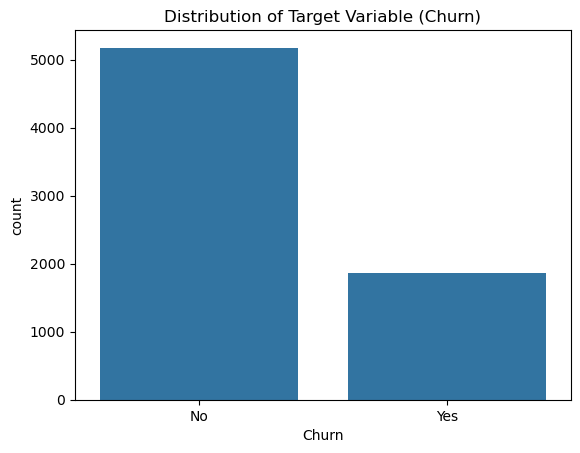
    


The dataset shows a moderate class imbalance (73% vs 27%), which makes accuracy an unreliable evaluation metric.

Instead, more appropriate metrics such as recall, F1-score, and ROC-AUC will be used, as they better reflect model performance on the minority class (churned customers).

## Missing Values Analysis
This section focuses on identifying missing values and understanding their distribution across the dataset.


```python
# Total number of missing values per column
missing_values = df.isnull().sum()

missing_values[missing_values > 0].sort_values(ascending=False)
```


    TotalCharges    11
    dtype: int64


```python
# Percentage of missing values
missing_percent = (df.isnull().sum() / len(df)) * 100

missing_percent[missing_percent > 0].sort_values(ascending=False)
```


    TotalCharges    0.156183
    dtype: float64


The dataset contains a small number of missing values.

- The TotalCharges column has 11 missing values after conversion to numeric format  
- These missing values account for a very small fraction of the dataset  

Overall, the amount of missing data is negligible and is unlikely to significantly impact the analysis.  
Missing values will be handled during the preprocessing stage.

## Numerical Features Analysis
We analyze numerical features to understand their distributions, detect outliers, and identify potential anomalies.


```python
# Select numerical features
numerical_features = df.select_dtypes(include=['int64', 'float64']).columns
numerical_features
```


    Index(['SeniorCitizen', 'tenure', 'MonthlyCharges', 'TotalCharges'], dtype='object')


```python
# Summary statistics
df[numerical_features].describe()
```


<div>
<style scoped>
    .dataframe tbody tr th:only-of-type {
        vertical-align: middle;
    }

    .dataframe tbody tr th {
        vertical-align: top;
    }

    .dataframe thead th {
        text-align: right;
    }
</style>
<table border="1" class="dataframe">
  <thead>
    <tr style="text-align: right;">
      <th></th>
      <th>SeniorCitizen</th>
      <th>tenure</th>
      <th>MonthlyCharges</th>
      <th>TotalCharges</th>
    </tr>
  </thead>
  <tbody>
    <tr>
      <th>count</th>
      <td>7043.000000</td>
      <td>7043.000000</td>
      <td>7043.000000</td>
      <td>7032.000000</td>
    </tr>
    <tr>
      <th>mean</th>
      <td>0.162147</td>
      <td>32.371149</td>
      <td>64.761692</td>
      <td>2283.300441</td>
    </tr>
    <tr>
      <th>std</th>
      <td>0.368612</td>
      <td>24.559481</td>
      <td>30.090047</td>
      <td>2266.771362</td>
    </tr>
    <tr>
      <th>min</th>
      <td>0.000000</td>
      <td>0.000000</td>
      <td>18.250000</td>
      <td>18.800000</td>
    </tr>
    <tr>
      <th>25%</th>
      <td>0.000000</td>
      <td>9.000000</td>
      <td>35.500000</td>
      <td>401.450000</td>
    </tr>
    <tr>
      <th>50%</th>
      <td>0.000000</td>
      <td>29.000000</td>
      <td>70.350000</td>
      <td>1397.475000</td>
    </tr>
    <tr>
      <th>75%</th>
      <td>0.000000</td>
      <td>55.000000</td>
      <td>89.850000</td>
      <td>3794.737500</td>
    </tr>
    <tr>
      <th>max</th>
      <td>1.000000</td>
      <td>72.000000</td>
      <td>118.750000</td>
      <td>8684.800000</td>
    </tr>
  </tbody>
</table>
</div>


**Key Takeaways:**

- **SeniorCitizen**: ~16% of customers  
- **tenure**: Avg ~32 months, slightly right-skewed  
- **MonthlyCharges**: Avg ~$65, moderate spread  
- **TotalCharges**: High variability; 11 missing values after conversion  


```python
# Histograms
df[numerical_features].hist(figsize=(12, 8), bins=20)
plt.tight_layout()
plt.show()
```


    
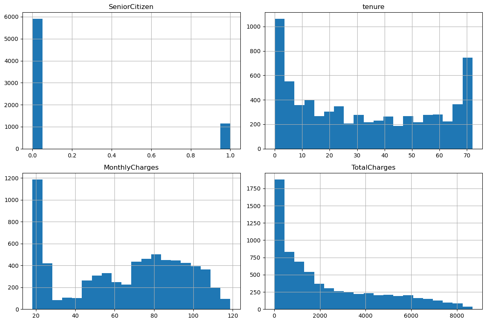
    


**Observations from Histograms:**

- **SeniorCitizen**: Highly imbalanced (mostly 0)  
- **tenure**: Right-skewed, many customers with low tenure → potential higher churn among new users  
- **MonthlyCharges**: Bimodal distribution (~20–25 and ~80–110)  
- **TotalCharges**: Strongly right-skewed with a long tail  


```python
# Boxplots for detecting outliers
for col in numerical_features:
    plt.figure()
    sns.boxplot(x=df[col])
    plt.title(f"Boxplot of {col}")
    plt.show()
```


    
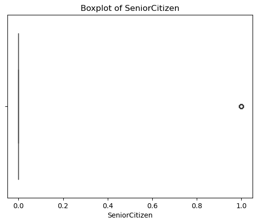
    


    
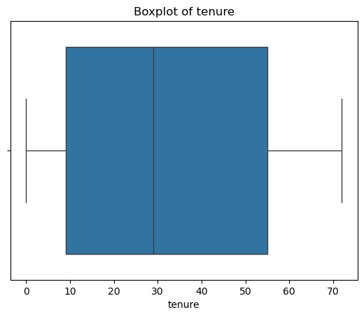
    


    
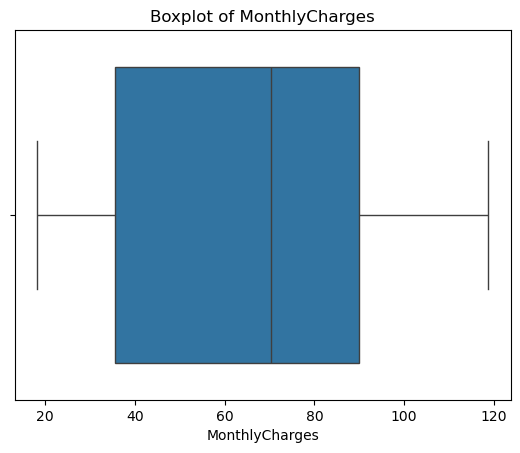
    


    
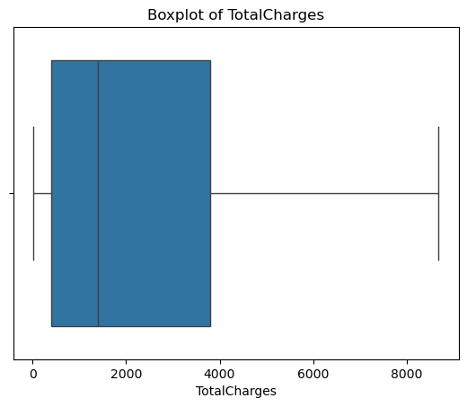
    


**Summary of Numerical Features**

Numerical features show meaningful distribution patterns without critical data issues.

- Several features (tenure, TotalCharges) are right-skewed, indicating many new customers and fewer long-term ones  
- No significant outliers were detected; extreme values appear to be valid  

Overall, numerical features are well-behaved and suitable for further analysis and modeling.

## Categorical Features Analysis
We explore categorical variables to understand their value distributions and identify dominant or rare categories.


```python
# Select categorical features
categorical_features = df.select_dtypes(include=['object', 'category', 'bool']).columns
categorical_features
```


    Index(['customerID', 'gender', 'Partner', 'Dependents', 'PhoneService',
           'MultipleLines', 'InternetService', 'OnlineSecurity', 'OnlineBackup',
           'DeviceProtection', 'TechSupport', 'StreamingTV', 'StreamingMovies',
           'Contract', 'PaperlessBilling', 'PaymentMethod', 'Churn'],
          dtype='object')


```python
# Normalized value counts (proportions)
for col in categorical_features:
    print(f"\nColumn: {col}")
    print(df[col].value_counts(normalize=True))
```

    
    Column: customerID
    customerID
    7590-VHVEG    0.000142
    3791-LGQCY    0.000142
    6008-NAIXK    0.000142
    5956-YHHRX    0.000142
    5365-LLFYV    0.000142
                    ...   
    9796-MVYXX    0.000142
    2637-FKFSY    0.000142
    1552-AAGRX    0.000142
    4304-TSPVK    0.000142
    3186-AJIEK    0.000142
    Name: proportion, Length: 7043, dtype: float64
    
    Column: gender
    gender
    Male      0.504756
    Female    0.495244
    Name: proportion, dtype: float64
    
    Column: Partner
    Partner
    No     0.516967
    Yes    0.483033
    Name: proportion, dtype: float64
    
    Column: Dependents
    Dependents
    No     0.700412
    Yes    0.299588
    Name: proportion, dtype: float64
    
    Column: PhoneService
    PhoneService
    Yes    0.903166
    No     0.096834
    Name: proportion, dtype: float64
    
    Column: MultipleLines
    MultipleLines
    No                  0.481329
    Yes                 0.421837
    No phone service    0.096834
    Name: proportion, dtype: float64
    
    Column: InternetService
    InternetService
    Fiber optic    0.439585
    DSL            0.343746
    No             0.216669
    Name: proportion, dtype: float64
    
    Column: OnlineSecurity
    OnlineSecurity
    No                     0.496663
    Yes                    0.286668
    No internet service    0.216669
    Name: proportion, dtype: float64
    
    Column: OnlineBackup
    OnlineBackup
    No                     0.438450
    Yes                    0.344881
    No internet service    0.216669
    Name: proportion, dtype: float64
    
    Column: DeviceProtection
    DeviceProtection
    No                     0.439443
    Yes                    0.343888
    No internet service    0.216669
    Name: proportion, dtype: float64
    
    Column: TechSupport
    TechSupport
    No                     0.493114
    Yes                    0.290217
    No internet service    0.216669
    Name: proportion, dtype: float64
    
    Column: StreamingTV
    StreamingTV
    No                     0.398978
    Yes                    0.384353
    No internet service    0.216669
    Name: proportion, dtype: float64
    
    Column: StreamingMovies
    StreamingMovies
    No                     0.395428
    Yes                    0.387903
    No internet service    0.216669
    Name: proportion, dtype: float64
    
    Column: Contract
    Contract
    Month-to-month    0.550192
    Two year          0.240664
    One year          0.209144
    Name: proportion, dtype: float64
    
    Column: PaperlessBilling
    PaperlessBilling
    Yes    0.592219
    No     0.407781
    Name: proportion, dtype: float64
    
    Column: PaymentMethod
    PaymentMethod
    Electronic check             0.335794
    Mailed check                 0.228880
    Bank transfer (automatic)    0.219225
    Credit card (automatic)      0.216101
    Name: proportion, dtype: float64
    
    Column: Churn
    Churn
    No     0.73463
    Yes    0.26537
    Name: proportion, dtype: float64
    

The table below shows the normalized value counts (proportions) for each categorical feature:

- **customerID**: 7043 unique values → each customer appears exactly once (0.0142% each). Used only as identifier, not for modeling.
- **gender**: Almost perfectly balanced  
  Male: 50.5% | Female: 49.5%
- **Partner**: Slightly more customers without partner  
  No: 51.7% | Yes: 48.3%
- **Dependents**: Strongly skewed — most customers have no dependents  
  No: 70.0% | Yes: 30.0%
- **PhoneService**: Very dominant — almost all customers have phone service  
  Yes: 90.3% | No: 9.7%
- **MultipleLines**: Among phone users, "No" and "Yes" are close; ~9.7% have no phone service  
  No: 48.1% | Yes: 42.2% | No phone service: 9.7%
- **InternetService**: Fiber optic is the most popular internet type  
  Fiber optic: 44.0% | DSL: 34.4% | No: 21.7%
- **OnlineSecurity / TechSupport**: "No" is dominant among internet users  
  No: ~49–50% | Yes: ~29% | No internet service: 21.7%
- **OnlineBackup / DeviceProtection**: More balanced, but "No" still leads slightly  
  No: ~43–44% | Yes: ~34–35% | No internet service: 21.7%
- **StreamingTV / StreamingMovies**: Very close to 50/50 split among internet users  
  No: ~39–40% | Yes: ~38–39% | No internet service: 21.7%
- **Contract**: Month-to-month dominates → high flexibility, but also high churn risk  
  Month-to-month: 55.0% | Two year: 24.1% | One year: 20.9%
- **PaperlessBilling**: Majority prefer paperless  
  Yes: 59.2% | No: 40.8%
- **PaymentMethod**: Electronic check is the most common (and often linked to higher churn)  
  Electronic check: 33.6% | Mailed check: 22.9% | Bank transfer (auto): 21.9% | Credit card (auto): 21.6%
- **Churn** (target): Moderate imbalance — typical for churn datasets  
  No (stayed): 73.5% | Yes (churned): 26.5%


```python
# Count plots
import matplotlib.pyplot as plt
import seaborn as sns

for col in categorical_features:
    plt.figure(figsize=(6, 3))
    sns.countplot(x=col, data=df)
    plt.title(f"Distribution of {col}")
    plt.xticks(rotation=45)
    plt.tight_layout()
    plt.show()
```


    
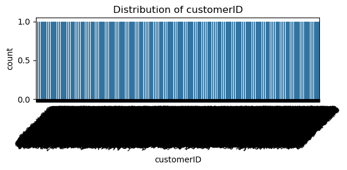
    


    
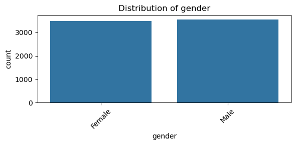
    


    
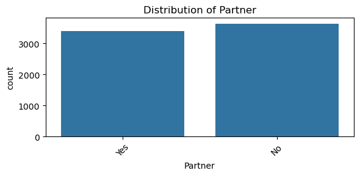
    


    
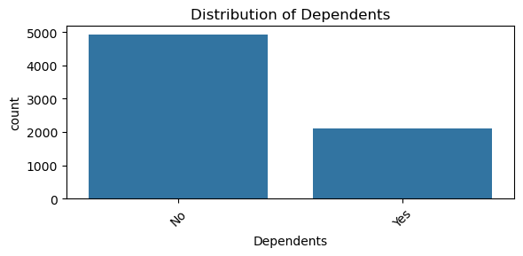
    


    
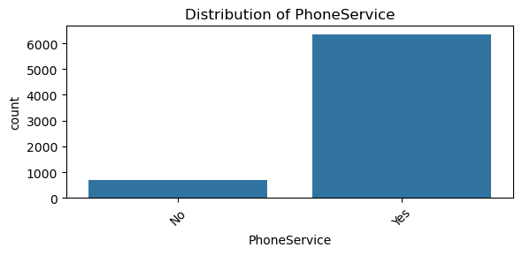
    


    
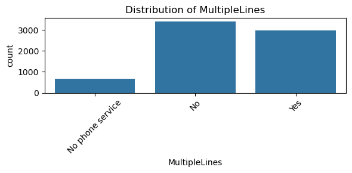
    


    
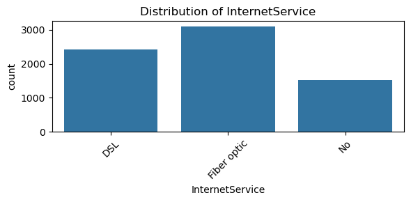
    


    
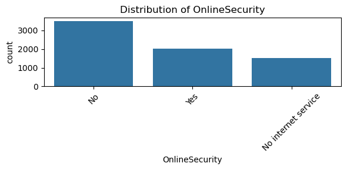
    


    
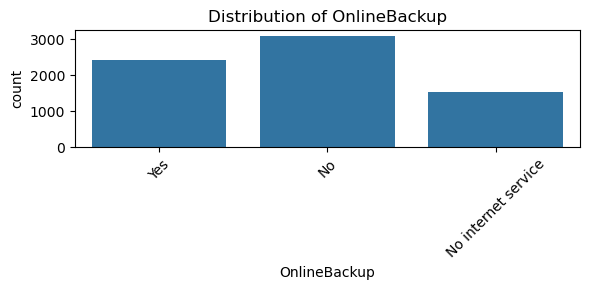
    


    
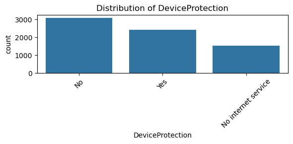
    


    

    


    
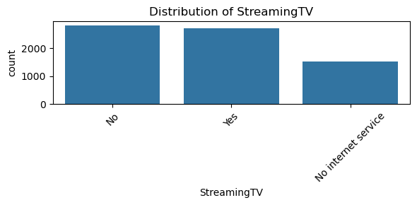
    


    
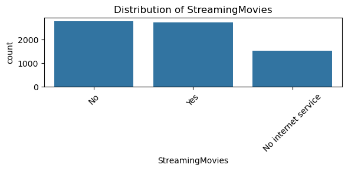
    


    
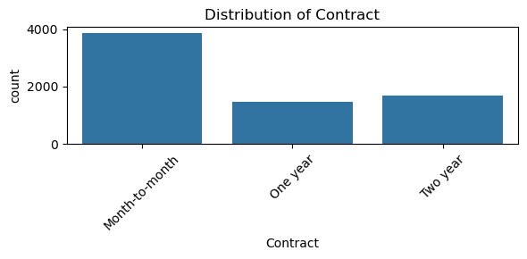
    


    
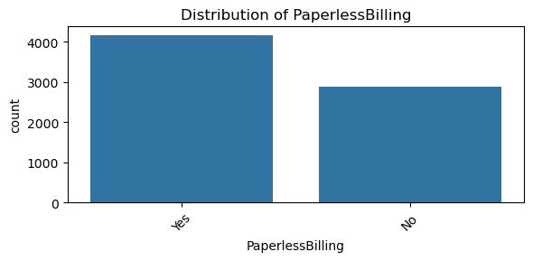
    


    
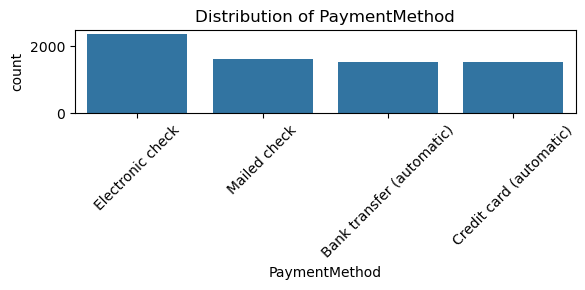
    


    
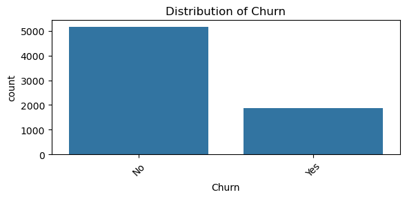
    


The count plots confirm the following patterns:

- **gender**, **Partner** — nearly balanced → no strong dominance.
- **Dependents**, **PhoneService** — highly skewed (most customers have no dependents and do have phone service).
- **InternetService** → Fiber optic slightly ahead of DSL; ~22% have no internet.
- **Add-on services** (OnlineSecurity, OnlineBackup, DeviceProtection, TechSupport) → "No" is the most frequent choice among internet users.
- **StreamingTV** and **StreamingMovies** → almost equal split between Yes/No (among those with internet).
- **Contract** → Month-to-month is by far the largest group (~55%).
- **PaperlessBilling** → clear majority uses paperless.
- **PaymentMethod** → Electronic check stands out as the single most popular method.
- **Churn** → ~73.5% of customers stayed (No), ~26.5% left (Yes) → class imbalance to consider during modeling.

**Summary**
- **High concentration in Month-to-month contracts** (55%) → these customers are usually at much higher churn risk.
- **Fiber optic** is the most popular internet type → often associated with higher monthly charges and potentially higher churn.
- **Low adoption of protective add-ons** (OnlineSecurity, TechSupport, DeviceProtection ~29%) → opportunity to increase uptake and reduce churn.
- **Streaming services** are adopted by roughly 38–39% of internet users → moderate penetration.
- **Electronic check** dominates payment methods (33.6%) → historically one of the strongest predictors of churn in this dataset.
- **Very few customers without phone service** (9.7%) → most are either phone-only or combined services.
- **Target variable Churn** shows moderate imbalance (73.5% / 26.5%) → we will use stratified splitting, class weights or resampling techniques in modeling.

**Next steps:**
- Encode categorical features (one-hot / target encoding / ordinal where appropriate).
- Proceed to bivariate analysis (churn vs each categorical feature).

## Feature Relationships
In this section, we investigate relationships between features and their impact on the target variable.

### Numerical Features Correlation


```python
# Select numerical features
numerical_features = df.select_dtypes(include=['int64', 'float64']).columns
```


```python
# Correlation matrix
corr_matrix = df[numerical_features].corr()
corr_matrix
```


<div>
<style scoped>
    .dataframe tbody tr th:only-of-type {
        vertical-align: middle;
    }

    .dataframe tbody tr th {
        vertical-align: top;
    }

    .dataframe thead th {
        text-align: right;
    }
</style>
<table border="1" class="dataframe">
  <thead>
    <tr style="text-align: right;">
      <th></th>
      <th>SeniorCitizen</th>
      <th>tenure</th>
      <th>MonthlyCharges</th>
      <th>TotalCharges</th>
    </tr>
  </thead>
  <tbody>
    <tr>
      <th>SeniorCitizen</th>
      <td>1.000000</td>
      <td>0.016567</td>
      <td>0.220173</td>
      <td>0.102411</td>
    </tr>
    <tr>
      <th>tenure</th>
      <td>0.016567</td>
      <td>1.000000</td>
      <td>0.247900</td>
      <td>0.825880</td>
    </tr>
    <tr>
      <th>MonthlyCharges</th>
      <td>0.220173</td>
      <td>0.247900</td>
      <td>1.000000</td>
      <td>0.651065</td>
    </tr>
    <tr>
      <th>TotalCharges</th>
      <td>0.102411</td>
      <td>0.825880</td>
      <td>0.651065</td>
      <td>1.000000</td>
    </tr>
  </tbody>
</table>
</div>


```python
# Heatmap of correlations
import seaborn as sns
import matplotlib.pyplot as plt

plt.figure(figsize=(8, 6))
sns.heatmap(corr_matrix, annot=True, cmap='coolwarm', fmt=".2f")
plt.title("Correlation Matrix of Numerical Features")
plt.show()
```


    
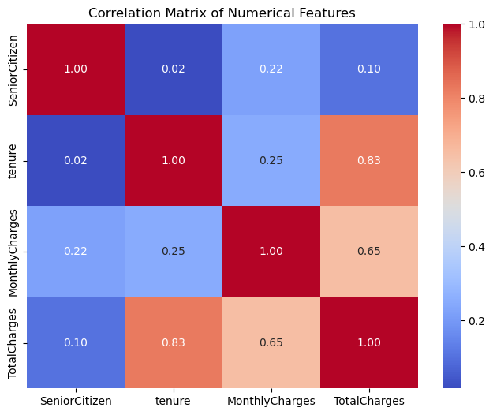
    


Key Observations from the Correlation Matrix

Very strong positive correlation between tenure and TotalCharges (r = 0.83)
- This is expected: the longer a customer stays, the more they accumulate in total charges.
- Implication: TotalCharges is largely redundant with tenure — we may consider dropping one of them or using only one in modeling to avoid multicollinearity.
Moderate positive correlation between MonthlyCharges and TotalCharges (r = 0.65)
- Higher monthly bills naturally lead to higher cumulative charges over time.
Moderate positive correlation between MonthlyCharges and tenure (r = 0.25)
- Slightly higher monthly charges are associated with longer-tenure customers (possibly due to more add-on services accumulated over time).
Weak positive correlation between SeniorCitizen and MonthlyCharges (r = 0.22)
- Senior citizens tend to have slightly higher monthly bills (possibly different service bundles or less price sensitivity).
Very weak correlations involving SeniorCitizen with tenure and TotalCharges (r ≈ 0.02–0.10)
- Being a senior citizen has almost no linear relationship with how long customers stay or how much they accumulate in charges.

Main Conclusions & Modeling Implications

High multicollinearity exists between tenure and TotalCharges (0.83).
- In linear models (Logistic Regression, etc.), this can cause instability in coefficients.
- Recommendation: keep tenure (more interpretable and direct) and consider dropping TotalCharges, or use feature selection / regularization (Lasso/Ridge).
MonthlyCharges shows moderate relationships with both tenure and total charges — it captures pricing behavior somewhat independently.
SeniorCitizen is relatively independent from the other numerical features → it can provide unique information when combined with categorical features.
These correlations only capture linear relationships among numerical features.

### Categorical Features vs Target


```python
# Select categorical features
categorical_features = df.select_dtypes(include=['object', 'category', 'bool']).columns
categorical_features = [col for col in categorical_features if col != 'Churn']
```


```python
# Count plots with target (Churn)
import matplotlib.pyplot as plt
import seaborn as sns

for col in categorical_features:
    plt.figure(figsize=(6, 3))
    sns.countplot(x=col, hue='Churn', data=df)
    plt.title(f"{col} vs Churn")
    plt.xticks(rotation=45)
    plt.tight_layout()
    plt.show()
```


    
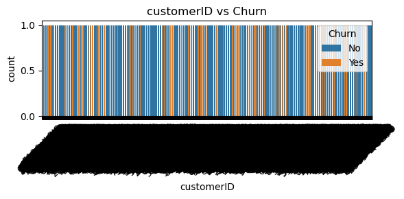
    


    
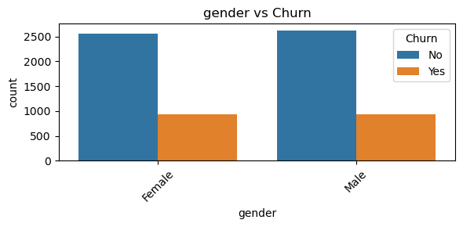
    


    
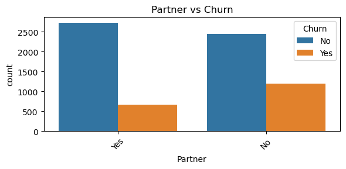
    


    
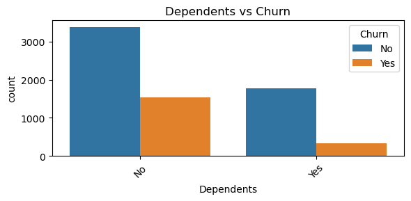
    


    
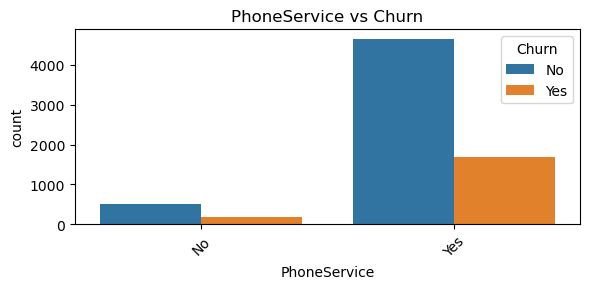
    


    
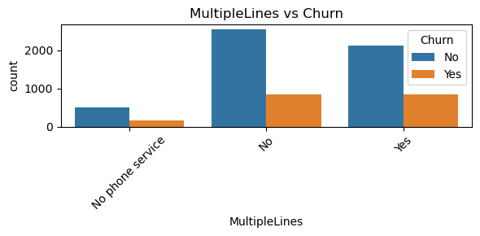
    


    
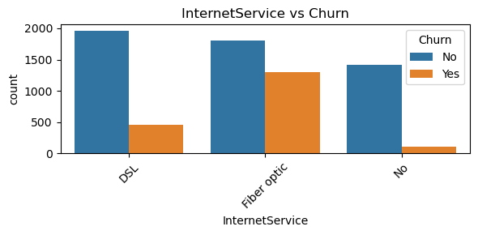
    


    
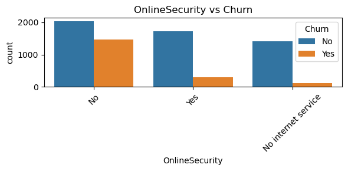
    


    
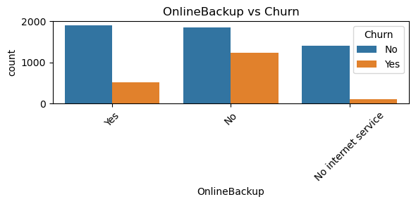
    


    
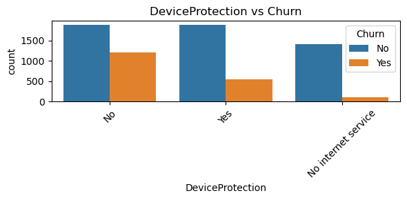
    


    

    


    
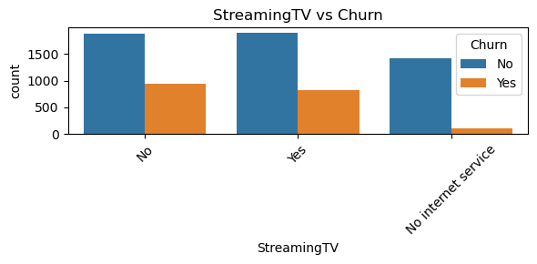
    


    
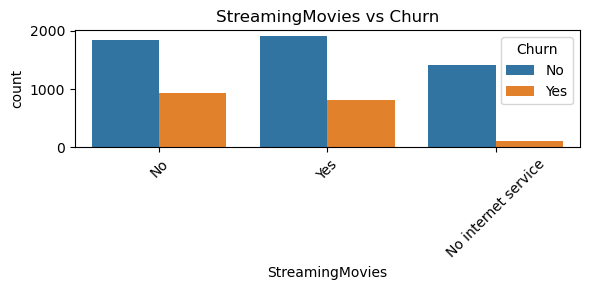
    


    
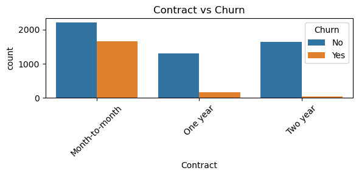
    


    
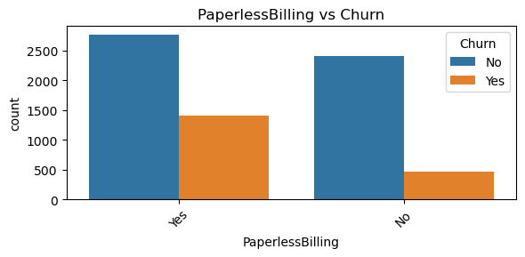
    


    
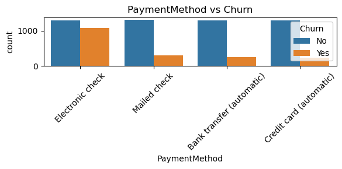
    


The following plots show the distribution of each categorical feature split by Churn (No = stayed, Yes = churned):

- **customerID** — uniform distribution (each ID unique), no meaningful pattern.
- **gender** — very similar churn rates between Male and Female (~26–27% in both groups) → gender has almost no predictive power.
- **Partner** — Customers **without a partner** (No) show noticeably higher churn than those with a partner (Yes).
- **Dependents** — Customers **without dependents** (No) have significantly higher churn than those with dependents (Yes).
- **PhoneService** — Customers with phone service (Yes) have higher absolute churn numbers (due to much larger group size), but churn rate is similar or slightly higher than No.
- **MultipleLines** — Among phone users, those with **MultipleLines = Yes** tend to churn slightly more than No; No phone service has very low churn.
- **InternetService** — **Fiber optic** users have the highest churn (both absolute and rate), DSL is moderate, **No internet service** has very low churn.
- **OnlineSecurity** — Customers with **OnlineSecurity = Yes** show dramatically lower churn; **No** has high churn; No internet service — very low.
- **OnlineBackup** — Similar pattern: **Yes** → much lower churn; **No** → high churn.
- **DeviceProtection** — **Yes** reduces churn noticeably; **No** increases it.
- **TechSupport** — One of the strongest protectors: **TechSupport = Yes** → very low churn; **No** → high churn.
- **StreamingTV / StreamingMovies** — Customers with these services (Yes) churn **slightly more** than No (among internet users); the difference is moderate.
- **Contract** — Extremely strong signal:  
  - **Month-to-month** → very high churn (~42–50%)  
  - **One year** → moderate  
  - **Two year** → extremely low churn (~3–5%)
- **PaperlessBilling** — Customers using **paperless billing (Yes)** churn more than those who don't.
- **PaymentMethod** — **Electronic check** has by far the highest churn rate; automatic payments (Bank transfer / Credit card) and Mailed check show much lower churn.


The plots reveal several clear patterns and strong predictors of churn:

1. **Contract type is the strongest single predictor**  
   Month-to-month contracts have dramatically higher churn than 1- or 2-year contracts.

2. **Add-on protection services strongly reduce churn**  
   - OnlineSecurity, TechSupport, DeviceProtection, OnlineBackup  
   → Customers who have these services are much less likely to leave.

3. **Internet service type matters a lot**  
   Fiber optic → highest churn (possibly due to higher price + expectations)  
   No internet service → very loyal customers.

4. **Demographic & family factors**  
   - No Partner / No Dependents → higher churn (customers may be more "footloose").  
   - Gender → no meaningful difference.

5. **Billing & payment behavior**  
   - PaperlessBilling = Yes → higher churn (possibly younger/more digital-savvy but less loyal).  
   - PaymentMethod = Electronic check → strongest churn signal among payment types (convenience but low commitment?).

6. **Streaming services have mixed / weak effect**  
   StreamingTV and StreamingMovies slightly increase churn (perhaps associated with higher bills or less essential).


- **Top predictors to prioritize**: Contract, InternetService, TechSupport, OnlineSecurity, PaymentMethod, Partner, Dependents.
- **Feature engineering ideas**:
  - Binary flags for having protection add-ons (OnlineSecurity + TechSupport + DeviceProtection + OnlineBackup).
  - Group PaymentMethod into "Automatic" vs "Manual".
  - Bin tenure (already numerical) and combine with Contract.
- **Business recommendations**:
  - Push customers toward longer contracts (1- or 2-year) with discounts/incentives.
  - Aggressively promote OnlineSecurity, TechSupport, and DeviceProtection bundles — they act as strong "retention anchors".
  - Reconsider incentives for Electronic check users or encourage switching to automatic payments.
  - Target new customers (low tenure + month-to-month + no add-ons) with proactive retention campaigns.


### Numerical Features vs Target


```python
# Select numerical features
numerical_features = df.select_dtypes(include=['int64', 'float64']).columns
```


```python
for col in numerical_features:
    plt.figure(figsize=(6, 3))
    sns.boxplot(x='Churn', y=col, data=df)
    plt.title(f"{col} vs Churn")
    plt.tight_layout()
    plt.show()
```


    
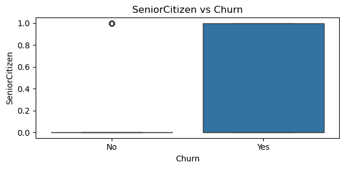
    


    
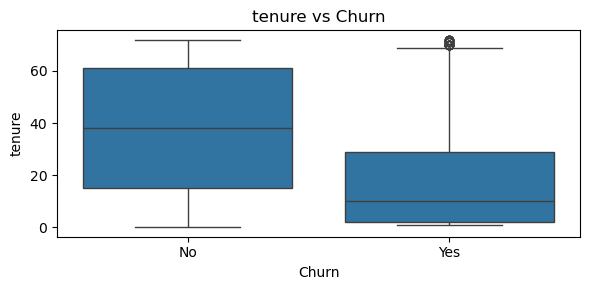
    


    
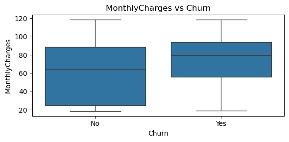
    


    
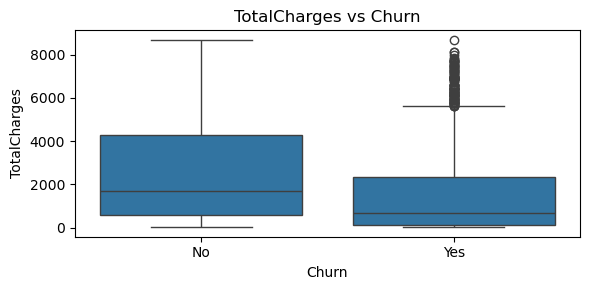
    


**Observations:**

- **SeniorCitizen**: Churn is higher among senior citizens, although the feature is binary and imbalanced  
- **tenure**: Customers with low tenure are significantly more likely to churn, while long-term customers tend to stay  
- **MonthlyCharges**: Higher monthly charges are associated with increased churn  
- **TotalCharges**: Customers with lower total charges tend to churn more, likely due to shorter tenure  

Overall, churn is strongly associated with newer customers and those paying higher monthly fees.

## Key Insights & Hypotheses

- The dataset shows a moderate class imbalance (73% vs 27%), which should be considered during modeling  
- Customer tenure is one of the strongest indicators of churn: new customers are significantly more likely to leave  
- Higher MonthlyCharges are associated with increased churn, suggesting price sensitivity  
- TotalCharges is strongly related to tenure and reflects customer lifetime value rather than independent behavior  
- Contract type and service-related features (e.g., internet services) are likely to be strong predictors of churn  
- Most categorical features are low-cardinality, making them suitable for encoding  

**Hypotheses:**

- Customers with short tenure have a higher probability of churn  
- Customers with higher monthly charges are more likely to churn  
- Long-term customers (high tenure, high total charges) are less likely to leave  
- Contract type (e.g., month-to-month) significantly influences churn behavior  


```python

```

## Summary

The dataset is well-structured and suitable for analysis and modeling.

- Missing values are minimal and limited to the TotalCharges feature  
- Numerical features show meaningful patterns, including skewness and customer segmentation  
- No significant outliers or data quality issues were identified  
- Categorical features exhibit clear distributions and potential relationships with the target variable  
- Several features (e.g., tenure, MonthlyCharges) show strong association with churn  

Overall, the dataset provides a solid foundation for building predictive models.

## Next Steps
Based on the EDA, the following preprocessing steps will be performed:
- Handling missing values
- Encoding categorical variables
- Treating outliers
- Feature scaling
- Feature engineering


```python

```
