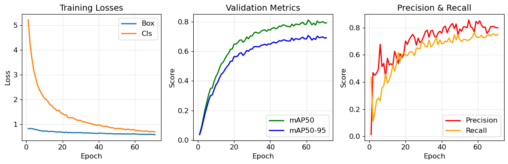
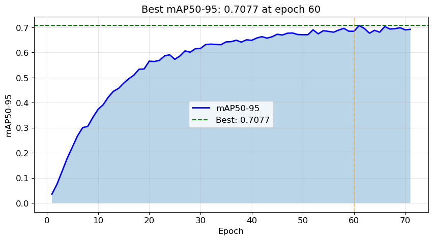
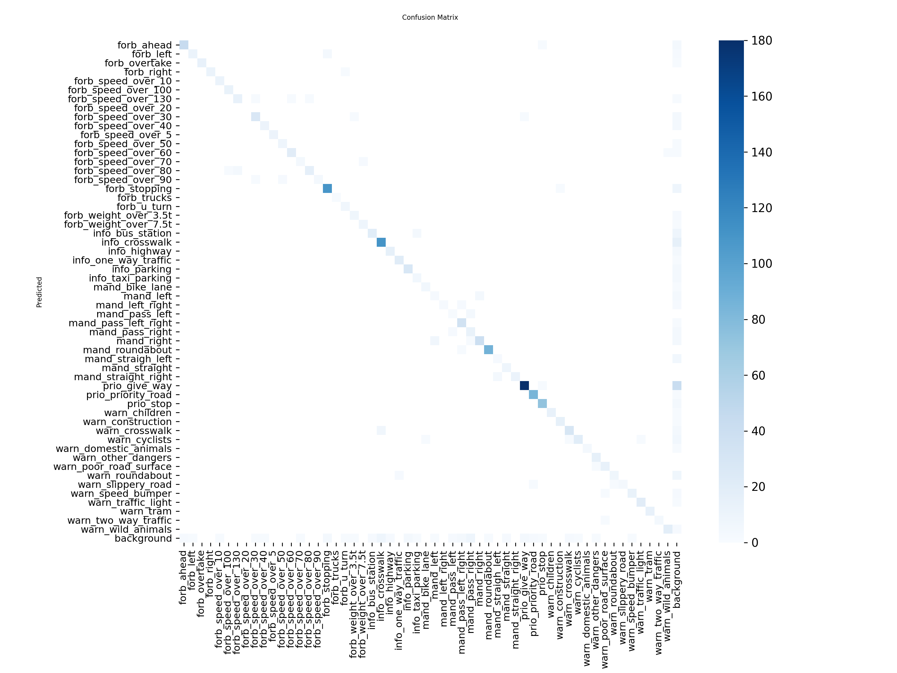

### Imports


```python
import os
os.environ["KMP_DUPLICATE_LIB_OK"] = "TRUE"

import yaml
from pathlib import Path
import torch
from ultralytics import YOLO, settings

```

### Paths


```python
DATASET_PATH = Path("../data/baseline.yaml")
OUTPUT_PATH = Path("../models/")
OUTPUT_PATH.mkdir(parents=True, exist_ok=True)
```

### Configure runs directory


```python
new_runs_dir = OUTPUT_PATH  
settings.update({'runs_dir': str(new_runs_dir)})
```

### Device selection


```python
device = 'cuda' if torch.cuda.is_available() else 'cpu'
print(f"Using device: {device}")
```

    Using device: cuda
    

### Load dataset configuration


```python
with open(DATASET_PATH, 'r') as f:
    data_config = yaml.safe_load(f)
print(f"Number of classes: {data_config['nc']}")
```

    Number of classes: 55
    

### Initialize model


```python
model = YOLO("yolo11n.pt")
```

### Train the model


```python
results = model.train(
    data=str(DATASET_PATH),      # Path to dataset YAML
    epochs=100,                   # Number of training epochs
    batch=-1,                     # Auto-batch size (optimizes GPU memory)
    imgsz=640,                    # Input image size
    device=device,                # GPU or CPU
    lr0=0.01,                     # Initial learning rate
    weight_decay=0.0005,          # L2 regularization
    momentum=0.937,               # SGD momentum
    workers=8,                    # Number of data loading workers
    patience=10,                  # Early stopping patience
    save=True,                    # Save checkpoints
    name="baseline_55class",      # Experiment name
    exist_ok=True,                # Overwrite existing folder
    verbose=True,                 # Print training logs
    seed=42                       # Random seed
)

print("Training completed!")
```

    Ultralytics 8.4.41  Python-3.12.12 torch-2.2.0+cu118 CUDA:0 (NVIDIA GeForce RTX 4070 Laptop GPU, 8188MiB)
    engine\trainer: agnostic_nms=False, amp=True, angle=1.0, augment=False, auto_augment=randaugment, batch=-1, bgr=0.0, box=7.5, cache=False, cfg=None, classes=None, close_mosaic=10, cls=0.5, cls_pw=0.0, compile=False, conf=None, copy_paste=0.0, copy_paste_mode=flip, cos_lr=False, cutmix=0.0, data=..\data\baseline.yaml, degrees=0.0, deterministic=True, device=0, dfl=1.5, dnn=False, dropout=0.0, dynamic=False, embed=None, end2end=None, epochs=100, erasing=0.4, exist_ok=True, fliplr=0.5, flipud=0.0, format=torchscript, fraction=1.0, freeze=None, half=False, hsv_h=0.015, hsv_s=0.7, hsv_v=0.4, imgsz=640, int8=False, iou=0.7, keras=False, kobj=1.0, line_width=None, lr0=0.01, lrf=0.01, mask_ratio=4, max_det=300, mixup=0.0, mode=train, model=yolo11n.pt, momentum=0.937, mosaic=1.0, multi_scale=0.0, name=baseline_55class, nbs=64, nms=False, opset=None, optimize=False, optimizer=auto, overlap_mask=True, patience=10, perspective=0.0, plots=True, pose=12.0, pretrained=True, profile=False, project=None, rect=False, resume=False, retina_masks=False, rle=1.0, save=True, save_conf=False, save_crop=False, save_dir=C:\Users\isazo\OneDrive\ \courses\partfolio\pet_projects\traffic-sign-detection\models\detect\baseline_55class, save_frames=False, save_json=False, save_period=-1, save_txt=False, scale=0.5, seed=42, shear=0.0, show=False, show_boxes=True, show_conf=True, show_labels=True, simplify=True, single_cls=False, source=None, split=val, stream_buffer=False, task=detect, time=None, tracker=botsort.yaml, translate=0.1, val=True, verbose=True, vid_stride=1, visualize=False, warmup_bias_lr=0.1, warmup_epochs=3.0, warmup_momentum=0.8, weight_decay=0.0005, workers=8, workspace=None
    Overriding model.yaml nc=80 with nc=55
    
                       from  n    params  module                                       arguments                     
      0                  -1  1       464  ultralytics.nn.modules.conv.Conv             [3, 16, 3, 2]                 
      1                  -1  1      4672  ultralytics.nn.modules.conv.Conv             [16, 32, 3, 2]                
      2                  -1  1      6640  ultralytics.nn.modules.block.C3k2            [32, 64, 1, False, 0.25]      
      3                  -1  1     36992  ultralytics.nn.modules.conv.Conv             [64, 64, 3, 2]                
      4                  -1  1     26080  ultralytics.nn.modules.block.C3k2            [64, 128, 1, False, 0.25]     
      5                  -1  1    147712  ultralytics.nn.modules.conv.Conv             [128, 128, 3, 2]              
      6                  -1  1     87040  ultralytics.nn.modules.block.C3k2            [128, 128, 1, True]           
      7                  -1  1    295424  ultralytics.nn.modules.conv.Conv             [128, 256, 3, 2]              
      8                  -1  1    346112  ultralytics.nn.modules.block.C3k2            [256, 256, 1, True]           
      9                  -1  1    164608  ultralytics.nn.modules.block.SPPF            [256, 256, 5]                 
     10                  -1  1    249728  ultralytics.nn.modules.block.C2PSA           [256, 256, 1]                 
     11                  -1  1         0  torch.nn.modules.upsampling.Upsample         [None, 2, 'nearest']          
     12             [-1, 6]  1         0  ultralytics.nn.modules.conv.Concat           [1]                           
     13                  -1  1    111296  ultralytics.nn.modules.block.C3k2            [384, 128, 1, False]          
     14                  -1  1         0  torch.nn.modules.upsampling.Upsample         [None, 2, 'nearest']          
     15             [-1, 4]  1         0  ultralytics.nn.modules.conv.Concat           [1]                           
     16                  -1  1     32096  ultralytics.nn.modules.block.C3k2            [256, 64, 1, False]           
     17                  -1  1     36992  ultralytics.nn.modules.conv.Conv             [64, 64, 3, 2]                
     18            [-1, 13]  1         0  ultralytics.nn.modules.conv.Concat           [1]                           
     19                  -1  1     86720  ultralytics.nn.modules.block.C3k2            [192, 128, 1, False]          
     20                  -1  1    147712  ultralytics.nn.modules.conv.Conv             [128, 128, 3, 2]              
     21            [-1, 10]  1         0  ultralytics.nn.modules.conv.Concat           [1]                           
     22                  -1  1    378880  ultralytics.nn.modules.block.C3k2            [384, 256, 1, True]           
     23        [16, 19, 22]  1    441397  ultralytics.nn.modules.head.Detect           [55, 16, None, [64, 128, 256]]
    YOLO11n summary: 182 layers, 2,600,565 parameters, 2,600,549 gradients, 6.5 GFLOPs
    
    Transferred 448/499 items from pretrained weights
    Freezing layer 'model.23.dfl.conv.weight'
    AMP: running Automatic Mixed Precision (AMP) checks...
    AMP: checks passed 
    train: Fast image access  (ping: 0.00.0 ms, read: 140.238.4 MB/s, size: 65.2 KB)
    train: Scanning C:\Users\isazo\OneDrive\Рабочий стол\courses\partfolio\pet_projects\traffic-sign-detection\data\raw\Traffic Signs\train\labels.cache... 1956 images, 93 backgrounds, 0 corrupt: 100% ━━━━━━━━━━━━ 1956/1956  0.0s
    albumentations: Blur(p=0.01, blur_limit=(3, 7)), MedianBlur(p=0.01, blur_limit=(3, 7)), ToGray(p=0.01, method='weighted_average', num_output_channels=3), CLAHE(p=0.01, clip_limit=(1.0, 4.0), tile_grid_size=(8, 8))
    AutoBatch: Computing optimal batch size for imgsz=640 at 60.0% CUDA memory utilization.
    AutoBatch: CUDA:0 (NVIDIA GeForce RTX 4070 Laptop GPU) 8.00G total, 0.29G reserved, 0.06G allocated, 7.64G free
          Params      GFLOPs  GPU_mem (GB)  forward (ms) backward (ms)                   input                  output
         2600565       6.499         0.659          67.1           nan        (1, 3, 640, 640)                    list
         2600565          13         1.074         37.63           nan        (2, 3, 640, 640)                    list
         2600565       25.99         1.952         50.75           nan        (4, 3, 640, 640)                    list
         2600565       51.99         2.944         32.67           nan        (8, 3, 640, 640)                    list
         2600565         104         5.805         86.39           nan       (16, 3, 640, 640)                    list
    AutoBatch: Using batch-size 13 for CUDA:0 5.12G/8.00G (64%) 
    train: Fast image access  (ping: 0.00.0 ms, read: 100.317.6 MB/s, size: 61.4 KB)
    train: Scanning C:\Users\isazo\OneDrive\Рабочий стол\courses\partfolio\pet_projects\traffic-sign-detection\data\raw\Traffic Signs\train\labels.cache... 1956 images, 93 backgrounds, 0 corrupt: 100% ━━━━━━━━━━━━ 1956/1956  0.0s
    albumentations: Blur(p=0.01, blur_limit=(3, 7)), MedianBlur(p=0.01, blur_limit=(3, 7)), ToGray(p=0.01, method='weighted_average', num_output_channels=3), CLAHE(p=0.01, clip_limit=(1.0, 4.0), tile_grid_size=(8, 8))
    val: Fast image access  (ping: 0.00.0 ms, read: 86.128.4 MB/s, size: 61.0 KB)
    val: Scanning C:\Users\isazo\OneDrive\Рабочий стол\courses\partfolio\pet_projects\traffic-sign-detection\data\raw\Traffic Signs\valid\labels.cache... 882 images, 43 backgrounds, 0 corrupt: 100% ━━━━━━━━━━━━ 882/882  0.0s
    optimizer: 'optimizer=auto' found, ignoring 'lr0=0.01' and 'momentum=0.937' and determining best 'optimizer', 'lr0' and 'momentum' automatically... 
    optimizer: AdamW(lr=0.000169, momentum=0.9) with parameter groups 81 weight(decay=0.0), 88 weight(decay=0.0005078125), 87 bias(decay=0.0)
    Plotting labels to C:\Users\isazo\OneDrive\ \courses\partfolio\pet_projects\traffic-sign-detection\models\detect\baseline_55class\labels.jpg... 
    MLflow: logging run_id(0c456eaa74324222a252afdd975dfc5b) to ..\models\mlflow
    MLflow: view at http://127.0.0.1:5000 with 'mlflow server --backend-store-uri ..\models\mlflow'
    MLflow: disable with 'yolo settings mlflow=False'
    Image sizes 640 train, 640 val
    Using 8 dataloader workers
    Logging results to C:\Users\isazo\OneDrive\ \courses\partfolio\pet_projects\traffic-sign-detection\models\detect\baseline_55class
    Starting training for 100 epochs...
    
          Epoch    GPU_mem   box_loss   cls_loss   dfl_loss  Instances       Size
          1/100      2.18G     0.8234      5.208     0.9518         23        640: 100% ━━━━━━━━━━━━ 151/151 5.0it/s 30.0s0.2s
                     Class     Images  Instances      Box(P          R      mAP50  mAP50-95): 100% ━━━━━━━━━━━━ 34/34 3.3it/s 10.4s.3s
                       all        882       1393     0.0118      0.435     0.0404     0.0356
    
          Epoch    GPU_mem   box_loss   cls_loss   dfl_loss  Instances       Size
          2/100      2.18G     0.8212      4.288     0.9617         14        640: 100% ━━━━━━━━━━━━ 151/151 4.2it/s 35.9s0.2ss
                     Class     Images  Instances      Box(P          R      mAP50  mAP50-95): 100% ━━━━━━━━━━━━ 34/34 5.5it/s 6.2s0.2s
                       all        882       1393      0.469      0.112     0.0864     0.0758
    
          Epoch    GPU_mem   box_loss   cls_loss   dfl_loss  Instances       Size
          3/100      2.18G     0.8224      3.684     0.9631         13        640: 100% ━━━━━━━━━━━━ 151/151 5.7it/s 26.4s0.2s
                     Class     Images  Instances      Box(P          R      mAP50  mAP50-95): 100% ━━━━━━━━━━━━ 34/34 5.4it/s 6.3s0.2s
                       all        882       1393       0.45      0.169      0.146      0.127
    
          Epoch    GPU_mem   box_loss   cls_loss   dfl_loss  Instances       Size
          4/100      2.18G     0.8064      3.209     0.9577         13        640: 100% ━━━━━━━━━━━━ 151/151 5.7it/s 26.5s0.2s
                     Class     Images  Instances      Box(P          R      mAP50  mAP50-95): 100% ━━━━━━━━━━━━ 34/34 5.3it/s 6.4s0.2s
                       all        882       1393      0.464      0.263      0.209      0.179
    
          Epoch    GPU_mem   box_loss   cls_loss   dfl_loss  Instances       Size
          5/100      2.18G     0.7841      2.911     0.9591         22        640: 100% ━━━━━━━━━━━━ 151/151 5.9it/s 25.8s0.1s
                     Class     Images  Instances      Box(P          R      mAP50  mAP50-95): 100% ━━━━━━━━━━━━ 34/34 6.2it/s 5.5s0.2s
                       all        882       1393      0.493      0.282      0.258      0.223
    
          Epoch    GPU_mem   box_loss   cls_loss   dfl_loss  Instances       Size
          6/100      2.18G     0.7751       2.61     0.9571         19        640: 100% ━━━━━━━━━━━━ 151/151 5.9it/s 25.4s0.2s
                     Class     Images  Instances      Box(P          R      mAP50  mAP50-95): 100% ━━━━━━━━━━━━ 34/34 6.0it/s 5.6s0.2s
                       all        882       1393      0.678      0.261      0.308      0.268
    
          Epoch    GPU_mem   box_loss   cls_loss   dfl_loss  Instances       Size
          7/100      2.18G      0.745      2.424     0.9472         15        640: 100% ━━━━━━━━━━━━ 151/151 6.4it/s 23.7s0.2s
                     Class     Images  Instances      Box(P          R      mAP50  mAP50-95): 100% ━━━━━━━━━━━━ 34/34 5.6it/s 6.0s0.2s
                       all        882       1393      0.514      0.353      0.349        0.3
    
          Epoch    GPU_mem   box_loss   cls_loss   dfl_loss  Instances       Size
          8/100      2.18G     0.7378       2.29     0.9439         18        640: 100% ━━━━━━━━━━━━ 151/151 5.9it/s 25.6s0.2s
                     Class     Images  Instances      Box(P          R      mAP50  mAP50-95): 100% ━━━━━━━━━━━━ 34/34 5.8it/s 5.9s0.2s
                       all        882       1393      0.537      0.372      0.352      0.306
    
          Epoch    GPU_mem   box_loss   cls_loss   dfl_loss  Instances       Size
          9/100      2.18G     0.7259      2.158     0.9339         16        640: 100% ━━━━━━━━━━━━ 151/151 5.6it/s 27.0s0.2s
                     Class     Images  Instances      Box(P          R      mAP50  mAP50-95): 100% ━━━━━━━━━━━━ 34/34 5.4it/s 6.2s0.2s
                       all        882       1393      0.431      0.462      0.397      0.342
    
          Epoch    GPU_mem   box_loss   cls_loss   dfl_loss  Instances       Size
         10/100      2.18G     0.7184      2.048     0.9342         17        640: 100% ━━━━━━━━━━━━ 151/151 6.0it/s 25.1s0.2s
                     Class     Images  Instances      Box(P          R      mAP50  mAP50-95): 100% ━━━━━━━━━━━━ 34/34 5.8it/s 5.9s0.2s
                       all        882       1393      0.575      0.392       0.43      0.373
    
          Epoch    GPU_mem   box_loss   cls_loss   dfl_loss  Instances       Size
         11/100      2.18G     0.7284      1.996     0.9396         16        640: 100% ━━━━━━━━━━━━ 151/151 6.1it/s 24.9s0.2s
                     Class     Images  Instances      Box(P          R      mAP50  mAP50-95): 100% ━━━━━━━━━━━━ 34/34 4.8it/s 7.0s0.2s
                       all        882       1393      0.527      0.415      0.453      0.392
    
          Epoch    GPU_mem   box_loss   cls_loss   dfl_loss  Instances       Size
         12/100      2.18G     0.7045      1.906     0.9268         26        640: 100% ━━━━━━━━━━━━ 151/151 5.8it/s 26.2s0.2s
                     Class     Images  Instances      Box(P          R      mAP50  mAP50-95): 100% ━━━━━━━━━━━━ 34/34 4.9it/s 7.0s0.2s
                       all        882       1393      0.534      0.461      0.489      0.422
    
          Epoch    GPU_mem   box_loss   cls_loss   dfl_loss  Instances       Size
         13/100      2.18G     0.7032      1.791     0.9286         13        640: 100% ━━━━━━━━━━━━ 151/151 5.9it/s 25.7s0.1s
                     Class     Images  Instances      Box(P          R      mAP50  mAP50-95): 100% ━━━━━━━━━━━━ 34/34 5.4it/s 6.3s0.2s
                       all        882       1393      0.522      0.525      0.516      0.445
    
          Epoch    GPU_mem   box_loss   cls_loss   dfl_loss  Instances       Size
         14/100      2.18G     0.7095      1.756       0.93          8        640: 100% ━━━━━━━━━━━━ 151/151 4.9it/s 30.6s0.2s
                     Class     Images  Instances      Box(P          R      mAP50  mAP50-95): 100% ━━━━━━━━━━━━ 34/34 5.0it/s 6.7s0.2s
                       all        882       1393      0.626      0.479      0.527      0.457
    
          Epoch    GPU_mem   box_loss   cls_loss   dfl_loss  Instances       Size
         15/100      2.18G     0.7031      1.662     0.9357         32        640: 100% ━━━━━━━━━━━━ 151/151 6.0it/s 25.0s0.2s
                     Class     Images  Instances      Box(P          R      mAP50  mAP50-95): 100% ━━━━━━━━━━━━ 34/34 5.9it/s 5.8s0.2s
                       all        882       1393      0.584      0.534      0.551      0.477
    
          Epoch    GPU_mem   box_loss   cls_loss   dfl_loss  Instances       Size
         16/100      2.18G      0.695      1.608     0.9294         21        640: 100% ━━━━━━━━━━━━ 151/151 6.0it/s 25.3s0.2s
                     Class     Images  Instances      Box(P          R      mAP50  mAP50-95): 100% ━━━━━━━━━━━━ 34/34 5.1it/s 6.7s0.2s
                       all        882       1393      0.537      0.618      0.572      0.495
    
          Epoch    GPU_mem   box_loss   cls_loss   dfl_loss  Instances       Size
         17/100      2.18G     0.6801      1.538     0.9221         11        640: 100% ━━━━━━━━━━━━ 151/151 6.3it/s 23.9s0.1s
                     Class     Images  Instances      Box(P          R      mAP50  mAP50-95): 100% ━━━━━━━━━━━━ 34/34 5.6it/s 6.1s0.2s
                       all        882       1393      0.608      0.554      0.588       0.51
    
          Epoch    GPU_mem   box_loss   cls_loss   dfl_loss  Instances       Size
         18/100      2.18G      0.695      1.564     0.9242          8        640: 100% ━━━━━━━━━━━━ 151/151 6.1it/s 24.9s0.2s
                     Class     Images  Instances      Box(P          R      mAP50  mAP50-95): 100% ━━━━━━━━━━━━ 34/34 5.1it/s 6.7s0.2s
                       all        882       1393       0.58      0.599      0.615      0.533
    
          Epoch    GPU_mem   box_loss   cls_loss   dfl_loss  Instances       Size
         19/100      2.18G     0.6799       1.46     0.9204         14        640: 100% ━━━━━━━━━━━━ 151/151 5.9it/s 25.5s0.3s
                     Class     Images  Instances      Box(P          R      mAP50  mAP50-95): 100% ━━━━━━━━━━━━ 34/34 4.4it/s 7.8s0.2s
                       all        882       1393      0.602      0.616      0.616      0.534
    
          Epoch    GPU_mem   box_loss   cls_loss   dfl_loss  Instances       Size
         20/100      2.18G     0.6759      1.436     0.9144         22        640: 100% ━━━━━━━━━━━━ 151/151 6.2it/s 24.5s0.1s
                     Class     Images  Instances      Box(P          R      mAP50  mAP50-95): 100% ━━━━━━━━━━━━ 34/34 5.4it/s 6.3s0.2s
                       all        882       1393      0.702      0.599       0.65      0.565
    
          Epoch    GPU_mem   box_loss   cls_loss   dfl_loss  Instances       Size
         21/100      2.18G     0.6638      1.373     0.9119         12        640: 100% ━━━━━━━━━━━━ 151/151 6.4it/s 23.7s0.1s
                     Class     Images  Instances      Box(P          R      mAP50  mAP50-95): 100% ━━━━━━━━━━━━ 34/34 5.9it/s 5.8s0.2s
                       all        882       1393      0.677      0.593       0.65      0.564
    
          Epoch    GPU_mem   box_loss   cls_loss   dfl_loss  Instances       Size
         22/100      2.18G     0.6796      1.378     0.9255         14        640: 100% ━━━━━━━━━━━━ 151/151 6.0it/s 25.1s0.1s
                     Class     Images  Instances      Box(P          R      mAP50  mAP50-95): 100% ━━━━━━━━━━━━ 34/34 6.0it/s 5.7s0.2s
                       all        882       1393      0.711      0.616      0.658      0.569
    
          Epoch    GPU_mem   box_loss   cls_loss   dfl_loss  Instances       Size
         23/100      2.18G     0.6547      1.264     0.9126         20        640: 100% ━━━━━━━━━━━━ 151/151 5.8it/s 26.0s0.1s
                     Class     Images  Instances      Box(P          R      mAP50  mAP50-95): 100% ━━━━━━━━━━━━ 34/34 5.8it/s 5.8s0.2s
                       all        882       1393      0.734      0.626      0.675      0.587
    
          Epoch    GPU_mem   box_loss   cls_loss   dfl_loss  Instances       Size
         24/100      2.18G     0.6656      1.254     0.9174         10        640: 100% ━━━━━━━━━━━━ 151/151 5.9it/s 25.4s0.2s
                     Class     Images  Instances      Box(P          R      mAP50  mAP50-95): 100% ━━━━━━━━━━━━ 34/34 6.0it/s 5.7s0.2s
                       all        882       1393      0.752      0.617      0.678      0.591
    
          Epoch    GPU_mem   box_loss   cls_loss   dfl_loss  Instances       Size
         25/100      2.18G     0.6591      1.266     0.9158         16        640: 100% ━━━━━━━━━━━━ 151/151 5.9it/s 25.7s0.2s
                     Class     Images  Instances      Box(P          R      mAP50  mAP50-95): 100% ━━━━━━━━━━━━ 34/34 5.6it/s 6.0s0.2s
                       all        882       1393      0.727      0.594      0.662      0.573
    
          Epoch    GPU_mem   box_loss   cls_loss   dfl_loss  Instances       Size
         26/100      2.18G     0.6553      1.253     0.9139         16        640: 100% ━━━━━━━━━━━━ 151/151 5.1it/s 29.9s0.3ss
                     Class     Images  Instances      Box(P          R      mAP50  mAP50-95): 100% ━━━━━━━━━━━━ 34/34 4.4it/s 7.7s0.2s
                       all        882       1393      0.672      0.651      0.674      0.586
    
          Epoch    GPU_mem   box_loss   cls_loss   dfl_loss  Instances       Size
         27/100      2.18G     0.6583      1.197     0.9166         12        640: 100% ━━━━━━━━━━━━ 151/151 5.7it/s 26.3s0.2s
                     Class     Images  Instances      Box(P          R      mAP50  mAP50-95): 100% ━━━━━━━━━━━━ 34/34 5.4it/s 6.3s0.2s
                       all        882       1393      0.723      0.648      0.698      0.607
    
          Epoch    GPU_mem   box_loss   cls_loss   dfl_loss  Instances       Size
         28/100      2.18G     0.6589      1.165     0.9184         26        640: 100% ━━━━━━━━━━━━ 151/151 5.9it/s 25.6s0.1s
                     Class     Images  Instances      Box(P          R      mAP50  mAP50-95): 100% ━━━━━━━━━━━━ 34/34 5.4it/s 6.3s0.2s
                       all        882       1393      0.691      0.644      0.686      0.601
    
          Epoch    GPU_mem   box_loss   cls_loss   dfl_loss  Instances       Size
         29/100      2.18G     0.6585      1.155     0.9099         16        640: 100% ━━━━━━━━━━━━ 151/151 5.7it/s 26.7s0.2s
                     Class     Images  Instances      Box(P          R      mAP50  mAP50-95): 100% ━━━━━━━━━━━━ 34/34 5.4it/s 6.3s0.2s
                       all        882       1393      0.704      0.701      0.705      0.615
    
          Epoch    GPU_mem   box_loss   cls_loss   dfl_loss  Instances       Size
         30/100      2.18G     0.6625      1.152     0.9199         18        640: 100% ━━━━━━━━━━━━ 151/151 5.7it/s 26.5s0.2s
                     Class     Images  Instances      Box(P          R      mAP50  mAP50-95): 100% ━━━━━━━━━━━━ 34/34 5.9it/s 5.7s0.2s
                       all        882       1393      0.734      0.686      0.705      0.616
    
          Epoch    GPU_mem   box_loss   cls_loss   dfl_loss  Instances       Size
         31/100      2.18G     0.6475      1.096     0.9047         17        640: 100% ━━━━━━━━━━━━ 151/151 6.2it/s 24.3s0.2s
                     Class     Images  Instances      Box(P          R      mAP50  mAP50-95): 100% ━━━━━━━━━━━━ 34/34 5.7it/s 6.0s0.2s
                       all        882       1393      0.771      0.661      0.724      0.632
    
          Epoch    GPU_mem   box_loss   cls_loss   dfl_loss  Instances       Size
         32/100      2.18G     0.6514      1.098     0.9103         10        640: 100% ━━━━━━━━━━━━ 151/151 6.7it/s 22.6s0.1s
                     Class     Images  Instances      Box(P          R      mAP50  mAP50-95): 100% ━━━━━━━━━━━━ 34/34 5.5it/s 6.2s0.2s
                       all        882       1393      0.782      0.659      0.731      0.633
    
          Epoch    GPU_mem   box_loss   cls_loss   dfl_loss  Instances       Size
         33/100      2.18G     0.6453       1.07     0.9101         20        640: 100% ━━━━━━━━━━━━ 151/151 7.0it/s 21.5s0.1s
                     Class     Images  Instances      Box(P          R      mAP50  mAP50-95): 100% ━━━━━━━━━━━━ 34/34 6.5it/s 5.2s0.1s
                       all        882       1393       0.73      0.708      0.725      0.632
    
          Epoch    GPU_mem   box_loss   cls_loss   dfl_loss  Instances       Size
         34/100      2.18G     0.6473      1.057     0.9097         21        640: 100% ━━━━━━━━━━━━ 151/151 7.2it/s 20.9s0.1s
                     Class     Images  Instances      Box(P          R      mAP50  mAP50-95): 100% ━━━━━━━━━━━━ 34/34 6.7it/s 5.1s0.1s
                       all        882       1393      0.777       0.66      0.725      0.631
    
          Epoch    GPU_mem   box_loss   cls_loss   dfl_loss  Instances       Size
         35/100      2.18G     0.6421      1.036     0.9105          8        640: 100% ━━━━━━━━━━━━ 151/151 6.8it/s 22.2s0.1s
                     Class     Images  Instances      Box(P          R      mAP50  mAP50-95): 100% ━━━━━━━━━━━━ 34/34 5.8it/s 5.8s0.2s
                       all        882       1393      0.781      0.671      0.737      0.642
    
          Epoch    GPU_mem   box_loss   cls_loss   dfl_loss  Instances       Size
         36/100      2.18G     0.6378      1.019     0.9074          9        640: 100% ━━━━━━━━━━━━ 151/151 6.6it/s 22.8s0.1s
                     Class     Images  Instances      Box(P          R      mAP50  mAP50-95): 100% ━━━━━━━━━━━━ 34/34 6.1it/s 5.6s0.2s
                       all        882       1393      0.737      0.697      0.744      0.643
    
          Epoch    GPU_mem   box_loss   cls_loss   dfl_loss  Instances       Size
         37/100      2.18G      0.634     0.9905     0.9054         12        640: 100% ━━━━━━━━━━━━ 151/151 6.3it/s 23.8s0.2s
                     Class     Images  Instances      Box(P          R      mAP50  mAP50-95): 100% ━━━━━━━━━━━━ 34/34 6.1it/s 5.6s0.2s
                       all        882       1393      0.729      0.726      0.746      0.649
    
          Epoch    GPU_mem   box_loss   cls_loss   dfl_loss  Instances       Size
         38/100      2.18G      0.633     0.9831     0.9009         19        640: 100% ━━━━━━━━━━━━ 151/151 5.9it/s 25.4s0.2s
                     Class     Images  Instances      Box(P          R      mAP50  mAP50-95): 100% ━━━━━━━━━━━━ 34/34 5.7it/s 6.0s0.2s
                       all        882       1393      0.761      0.675      0.736      0.641
    
          Epoch    GPU_mem   box_loss   cls_loss   dfl_loss  Instances       Size
         39/100      2.18G     0.6267     0.9528     0.9004         15        640: 100% ━━━━━━━━━━━━ 151/151 6.1it/s 24.6s0.2s
                     Class     Images  Instances      Box(P          R      mAP50  mAP50-95): 100% ━━━━━━━━━━━━ 34/34 5.7it/s 5.9s0.2s
                       all        882       1393      0.774       0.71      0.749      0.651
    
          Epoch    GPU_mem   box_loss   cls_loss   dfl_loss  Instances       Size
         40/100      2.18G     0.6358     0.9791     0.9016         15        640: 100% ━━━━━━━━━━━━ 151/151 5.9it/s 25.5s0.2s
                     Class     Images  Instances      Box(P          R      mAP50  mAP50-95): 100% ━━━━━━━━━━━━ 34/34 5.3it/s 6.4s0.2s
                       all        882       1393       0.76      0.681      0.745      0.648
    
          Epoch    GPU_mem   box_loss   cls_loss   dfl_loss  Instances       Size
         41/100      2.18G     0.6392     0.9479     0.9024         13        640: 100% ━━━━━━━━━━━━ 151/151 5.2it/s 28.9s0.2s
                     Class     Images  Instances      Box(P          R      mAP50  mAP50-95): 100% ━━━━━━━━━━━━ 34/34 5.9it/s 5.8s0.2s
                       all        882       1393      0.802      0.686      0.756      0.658
    
          Epoch    GPU_mem   box_loss   cls_loss   dfl_loss  Instances       Size
         42/100      2.18G     0.6302     0.9176     0.9027         10        640: 100% ━━━━━━━━━━━━ 151/151 5.3it/s 28.5s0.2s
                     Class     Images  Instances      Box(P          R      mAP50  mAP50-95): 100% ━━━━━━━━━━━━ 34/34 5.6it/s 6.1s0.2s
                       all        882       1393      0.812      0.702      0.762      0.663
    
          Epoch    GPU_mem   box_loss   cls_loss   dfl_loss  Instances       Size
         43/100      2.18G     0.6333     0.9147     0.9019         14        640: 100% ━━━━━━━━━━━━ 151/151 5.5it/s 27.2s0.2s
                     Class     Images  Instances      Box(P          R      mAP50  mAP50-95): 100% ━━━━━━━━━━━━ 34/34 5.4it/s 6.3s0.2s
                       all        882       1393      0.763      0.696      0.754      0.657
    
          Epoch    GPU_mem   box_loss   cls_loss   dfl_loss  Instances       Size
         44/100      2.18G     0.6202     0.9084     0.8975         13        640: 100% ━━━━━━━━━━━━ 151/151 6.5it/s 23.3s0.1s
                     Class     Images  Instances      Box(P          R      mAP50  mAP50-95): 100% ━━━━━━━━━━━━ 34/34 6.7it/s 5.0s0.1s
                       all        882       1393      0.794      0.724      0.759      0.663
    
          Epoch    GPU_mem   box_loss   cls_loss   dfl_loss  Instances       Size
         45/100      2.18G     0.6164     0.9051     0.8989         17        640: 100% ━━━━━━━━━━━━ 151/151 7.5it/s 20.2s0.1s
                     Class     Images  Instances      Box(P          R      mAP50  mAP50-95): 100% ━━━━━━━━━━━━ 34/34 6.5it/s 5.2s0.2s
                       all        882       1393      0.819      0.696      0.772      0.673
    
          Epoch    GPU_mem   box_loss   cls_loss   dfl_loss  Instances       Size
         46/100      2.18G     0.6225     0.8622     0.8981         11        640: 100% ━━━━━━━━━━━━ 151/151 7.4it/s 20.4s0.1s
                     Class     Images  Instances      Box(P          R      mAP50  mAP50-95): 100% ━━━━━━━━━━━━ 34/34 6.4it/s 5.3s0.2s
                       all        882       1393      0.831      0.692      0.769       0.67
    
          Epoch    GPU_mem   box_loss   cls_loss   dfl_loss  Instances       Size
         47/100      2.18G     0.6161     0.8581      0.899         15        640: 100% ━━━━━━━━━━━━ 151/151 7.4it/s 20.3s0.3s
                     Class     Images  Instances      Box(P          R      mAP50  mAP50-95): 100% ━━━━━━━━━━━━ 34/34 6.4it/s 5.3s0.2s
                       all        882       1393      0.794      0.749       0.78      0.677
    
          Epoch    GPU_mem   box_loss   cls_loss   dfl_loss  Instances       Size
         48/100      2.18G     0.6113     0.8554     0.8942         15        640: 100% ━━━━━━━━━━━━ 151/151 6.5it/s 23.2s0.1s
                     Class     Images  Instances      Box(P          R      mAP50  mAP50-95): 100% ━━━━━━━━━━━━ 34/34 6.0it/s 5.6s0.2s
                       all        882       1393      0.827      0.711      0.778      0.678
    
          Epoch    GPU_mem   box_loss   cls_loss   dfl_loss  Instances       Size
         49/100      2.18G     0.6066     0.8187     0.8848          6        640: 100% ━━━━━━━━━━━━ 151/151 6.0it/s 25.0s0.1s
                     Class     Images  Instances      Box(P          R      mAP50  mAP50-95): 100% ━━━━━━━━━━━━ 34/34 5.8it/s 5.8s0.2s
                       all        882       1393      0.748      0.745      0.771      0.672
    
          Epoch    GPU_mem   box_loss   cls_loss   dfl_loss  Instances       Size
         50/100      2.18G     0.6146      0.827      0.898         20        640: 100% ━━━━━━━━━━━━ 151/151 6.6it/s 22.9s0.1s
                     Class     Images  Instances      Box(P          R      mAP50  mAP50-95): 100% ━━━━━━━━━━━━ 34/34 6.2it/s 5.5s0.2s
                       all        882       1393       0.79      0.712       0.77      0.671
    
          Epoch    GPU_mem   box_loss   cls_loss   dfl_loss  Instances       Size
         51/100      2.18G     0.6061     0.8295     0.8909         15        640: 100% ━━━━━━━━━━━━ 151/151 5.8it/s 25.8s0.1s
                     Class     Images  Instances      Box(P          R      mAP50  mAP50-95): 100% ━━━━━━━━━━━━ 34/34 6.1it/s 5.6s0.2s
                       all        882       1393      0.775      0.699      0.766      0.671
    
          Epoch    GPU_mem   box_loss   cls_loss   dfl_loss  Instances       Size
         52/100      2.18G     0.6176     0.8272     0.8992         15        640: 100% ━━━━━━━━━━━━ 151/151 6.4it/s 23.6s0.1s
                     Class     Images  Instances      Box(P          R      mAP50  mAP50-95): 100% ━━━━━━━━━━━━ 34/34 6.0it/s 5.6s0.2s
                       all        882       1393      0.807      0.713      0.785      0.691
    
          Epoch    GPU_mem   box_loss   cls_loss   dfl_loss  Instances       Size
         53/100      2.18G     0.5998     0.8129      0.886         16        640: 100% ━━━━━━━━━━━━ 151/151 6.0it/s 25.3s0.1s
                     Class     Images  Instances      Box(P          R      mAP50  mAP50-95): 100% ━━━━━━━━━━━━ 34/34 5.2it/s 6.5s0.2s
                       all        882       1393      0.806      0.714      0.771      0.674
    
          Epoch    GPU_mem   box_loss   cls_loss   dfl_loss  Instances       Size
         54/100      2.18G     0.6142     0.7982     0.8999         29        640: 100% ━━━━━━━━━━━━ 151/151 6.3it/s 24.1s0.2s
                     Class     Images  Instances      Box(P          R      mAP50  mAP50-95): 100% ━━━━━━━━━━━━ 34/34 5.2it/s 6.5s0.2s
                       all        882       1393        0.8      0.707      0.785      0.687
    
          Epoch    GPU_mem   box_loss   cls_loss   dfl_loss  Instances       Size
         55/100      2.18G     0.5991     0.7772     0.8952         17        640: 100% ━━━━━━━━━━━━ 151/151 6.0it/s 25.1s0.2s
                     Class     Images  Instances      Box(P          R      mAP50  mAP50-95): 100% ━━━━━━━━━━━━ 34/34 5.6it/s 6.1s0.2s
                       all        882       1393      0.857      0.709      0.784      0.684
    
          Epoch    GPU_mem   box_loss   cls_loss   dfl_loss  Instances       Size
         56/100      2.18G     0.6123     0.8013     0.8956         12        640: 100% ━━━━━━━━━━━━ 151/151 6.3it/s 24.0s0.4s
                     Class     Images  Instances      Box(P          R      mAP50  mAP50-95): 100% ━━━━━━━━━━━━ 34/34 5.5it/s 6.1s0.2s
                       all        882       1393      0.808      0.717      0.782      0.681
    
          Epoch    GPU_mem   box_loss   cls_loss   dfl_loss  Instances       Size
         57/100      2.18G      0.604     0.7886     0.8871         17        640: 100% ━━━━━━━━━━━━ 151/151 5.8it/s 26.2s0.2s
                     Class     Images  Instances      Box(P          R      mAP50  mAP50-95): 100% ━━━━━━━━━━━━ 34/34 5.0it/s 6.8s0.2s
                       all        882       1393      0.799      0.734      0.791      0.689
    
          Epoch    GPU_mem   box_loss   cls_loss   dfl_loss  Instances       Size
         58/100      2.18G     0.6039     0.7691     0.8905         15        640: 100% ━━━━━━━━━━━━ 151/151 6.4it/s 23.7s0.1s
                     Class     Images  Instances      Box(P          R      mAP50  mAP50-95): 100% ━━━━━━━━━━━━ 34/34 6.3it/s 5.4s0.2s
                       all        882       1393      0.769      0.765      0.797      0.696
    
          Epoch    GPU_mem   box_loss   cls_loss   dfl_loss  Instances       Size
         59/100      2.18G      0.608     0.7867     0.8943         15        640: 100% ━━━━━━━━━━━━ 151/151 5.5it/s 27.7s0.2ss
                     Class     Images  Instances      Box(P          R      mAP50  mAP50-95): 100% ━━━━━━━━━━━━ 34/34 4.8it/s 7.1s0.2s
                       all        882       1393      0.847      0.734      0.783      0.685
    
          Epoch    GPU_mem   box_loss   cls_loss   dfl_loss  Instances       Size
         60/100      2.18G     0.6063     0.7625     0.8939          9        640: 100% ━━━━━━━━━━━━ 151/151 5.5it/s 27.6s0.2ss
                     Class     Images  Instances      Box(P          R      mAP50  mAP50-95): 100% ━━━━━━━━━━━━ 34/34 5.2it/s 6.5s0.2s
                       all        882       1393       0.83      0.728      0.785      0.685
    
          Epoch    GPU_mem   box_loss   cls_loss   dfl_loss  Instances       Size
         61/100      2.18G     0.5976     0.7402     0.8891         17        640: 100% ━━━━━━━━━━━━ 151/151 6.3it/s 24.1s0.2s
                     Class     Images  Instances      Box(P          R      mAP50  mAP50-95): 100% ━━━━━━━━━━━━ 34/34 5.0it/s 6.8s0.2s
                       all        882       1393      0.851       0.73      0.813      0.708
    
          Epoch    GPU_mem   box_loss   cls_loss   dfl_loss  Instances       Size
         62/100      2.18G      0.599     0.7535     0.8895         19        640: 100% ━━━━━━━━━━━━ 151/151 5.7it/s 26.7s0.2ss
                     Class     Images  Instances      Box(P          R      mAP50  mAP50-95): 100% ━━━━━━━━━━━━ 34/34 5.1it/s 6.7s0.2s
                       all        882       1393      0.818      0.745        0.8      0.696
    
          Epoch    GPU_mem   box_loss   cls_loss   dfl_loss  Instances       Size
         63/100      2.18G     0.5854     0.7175     0.8819         14        640: 100% ━━━━━━━━━━━━ 151/151 4.7it/s 31.8s0.2ss
                     Class     Images  Instances      Box(P          R      mAP50  mAP50-95): 100% ━━━━━━━━━━━━ 34/34 5.7it/s 5.9s0.2s
                       all        882       1393      0.802      0.727       0.78      0.677
    
          Epoch    GPU_mem   box_loss   cls_loss   dfl_loss  Instances       Size
         64/100      2.18G     0.5911     0.7242     0.8832         23        640: 100% ━━━━━━━━━━━━ 151/151 5.8it/s 26.2s0.2s
                     Class     Images  Instances      Box(P          R      mAP50  mAP50-95): 100% ━━━━━━━━━━━━ 34/34 4.0it/s 8.5s0.2s
                       all        882       1393      0.805      0.727      0.791      0.688
    
          Epoch    GPU_mem   box_loss   cls_loss   dfl_loss  Instances       Size
         65/100      2.18G     0.5918     0.7111     0.8867         12        640: 100% ━━━━━━━━━━━━ 151/151 5.4it/s 28.0s0.3s
                     Class     Images  Instances      Box(P          R      mAP50  mAP50-95): 100% ━━━━━━━━━━━━ 34/34 3.7it/s 9.2s0.3s
                       all        882       1393      0.758      0.742      0.779      0.681
    
          Epoch    GPU_mem   box_loss   cls_loss   dfl_loss  Instances       Size
         66/100      2.18G     0.5872     0.7269     0.8902         16        640: 100% ━━━━━━━━━━━━ 151/151 4.6it/s 32.7s0.3ss
                     Class     Images  Instances      Box(P          R      mAP50  mAP50-95): 100% ━━━━━━━━━━━━ 34/34 5.4it/s 6.3s0.2s
                       all        882       1393      0.776      0.748      0.806      0.704
    
          Epoch    GPU_mem   box_loss   cls_loss   dfl_loss  Instances       Size
         67/100      2.18G     0.5913     0.7195      0.892         15        640: 100% ━━━━━━━━━━━━ 151/151 5.6it/s 26.9s0.2s
                     Class     Images  Instances      Box(P          R      mAP50  mAP50-95): 100% ━━━━━━━━━━━━ 34/34 5.6it/s 6.1s0.2s
                       all        882       1393      0.808      0.739      0.794      0.694
    
          Epoch    GPU_mem   box_loss   cls_loss   dfl_loss  Instances       Size
         68/100      2.18G     0.5879      0.696     0.8886         15        640: 100% ━━━━━━━━━━━━ 151/151 6.0it/s 25.1s0.2s
                     Class     Images  Instances      Box(P          R      mAP50  mAP50-95): 100% ━━━━━━━━━━━━ 34/34 5.6it/s 6.1s0.2s
                       all        882       1393       0.81      0.751      0.797      0.695
    
          Epoch    GPU_mem   box_loss   cls_loss   dfl_loss  Instances       Size
         69/100      2.18G     0.5954     0.7089     0.8902          6        640: 100% ━━━━━━━━━━━━ 151/151 5.0it/s 30.1s0.2s
                     Class     Images  Instances      Box(P          R      mAP50  mAP50-95): 100% ━━━━━━━━━━━━ 34/34 5.7it/s 6.0s0.2s
                       all        882       1393      0.807      0.755      0.802      0.699
    
          Epoch    GPU_mem   box_loss   cls_loss   dfl_loss  Instances       Size
         70/100      2.18G     0.5849     0.7034     0.8874         11        640: 100% ━━━━━━━━━━━━ 151/151 5.7it/s 26.4s0.1s
                     Class     Images  Instances      Box(P          R      mAP50  mAP50-95): 100% ━━━━━━━━━━━━ 34/34 5.7it/s 6.0s0.2s
                       all        882       1393        0.8      0.743      0.793       0.69
    
          Epoch    GPU_mem   box_loss   cls_loss   dfl_loss  Instances       Size
         71/100      2.18G     0.5778     0.6851     0.8835          7        640: 100% ━━━━━━━━━━━━ 151/151 5.6it/s 26.8s0.2s
                     Class     Images  Instances      Box(P          R      mAP50  mAP50-95): 100% ━━━━━━━━━━━━ 34/34 5.7it/s 5.9s0.2s
                       all        882       1393        0.8      0.751      0.793      0.692
    EarlyStopping: Training stopped early as no improvement observed in last 10 epochs. Best results observed at epoch 61, best model saved as best.pt.
    To update EarlyStopping(patience=10) pass a new patience value, i.e. `patience=300` or use `patience=0` to disable EarlyStopping.
    
    71 epochs completed in 0.642 hours.
    Optimizer stripped from C:\Users\isazo\OneDrive\ \courses\partfolio\pet_projects\traffic-sign-detection\models\detect\baseline_55class\weights\last.pt, 5.5MB
    Optimizer stripped from C:\Users\isazo\OneDrive\ \courses\partfolio\pet_projects\traffic-sign-detection\models\detect\baseline_55class\weights\best.pt, 5.5MB
    
    Validating C:\Users\isazo\OneDrive\ \courses\partfolio\pet_projects\traffic-sign-detection\models\detect\baseline_55class\weights\best.pt...
    Ultralytics 8.4.41  Python-3.12.12 torch-2.2.0+cu118 CUDA:0 (NVIDIA GeForce RTX 4070 Laptop GPU, 8188MiB)
    YOLO11n summary (fused): 101 layers, 2,592,877 parameters, 0 gradients, 6.4 GFLOPs
                     Class     Images  Instances      Box(P          R      mAP50  mAP50-95): 100% ━━━━━━━━━━━━ 34/34 4.7it/s 7.2s0.2s
                       all        882       1393      0.845      0.733      0.813      0.708
                forb_ahead         45         46      0.975      0.957      0.974      0.859
                 forb_left         12         12      0.741      0.833      0.752      0.642
             forb_overtake         13         14      0.916          1       0.99      0.868
                forb_right         11         11      0.952          1      0.995       0.89
        forb_speed_over_10         11         12          1      0.537      0.799      0.751
       forb_speed_over_100         11         13       0.85      0.872      0.903      0.827
       forb_speed_over_130         14         17      0.872        0.8      0.937      0.848
        forb_speed_over_30         30         30      0.925      0.822      0.951       0.82
        forb_speed_over_40         11         11          1      0.608      0.903      0.806
         forb_speed_over_5         10         10      0.918        0.7      0.917      0.786
        forb_speed_over_50          9         10      0.602        0.8      0.904        0.8
        forb_speed_over_60         20         21      0.689      0.571      0.691      0.595
        forb_speed_over_70          5          5      0.722        0.6      0.595      0.535
        forb_speed_over_80         17         17      0.801      0.713      0.853      0.774
        forb_speed_over_90          4          4      0.608       0.78      0.912      0.824
             forb_stopping        115        115      0.955       0.93      0.976      0.869
               forb_trucks          1          1          1          0      0.995      0.796
               forb_u_turn          8          8          1      0.736      0.745      0.673
     forb_weight_over_3.5t          9          9      0.701      0.889      0.886      0.694
     forb_weight_over_7.5t         10         10          1      0.768      0.895      0.799
          info_bus_station         21         21      0.718          1      0.847      0.777
            info_crosswalk        113        125      0.969      0.912      0.966      0.806
              info_highway         16         17       0.86      0.529      0.678      0.445
      info_one_way_traffic         22         23      0.923      0.783      0.873       0.73
              info_parking         25         32       0.88      0.689       0.87      0.686
         info_taxi_parking         10         10          1          0      0.126      0.109
            mand_bike_lane          6          6      0.816      0.833      0.696      0.637
                 mand_left          9          9          1          0      0.266      0.228
           mand_left_right          2          2          0          0     0.0995     0.0696
            mand_pass_left          5          5          1          0      0.151      0.136
      mand_pass_left_right         40         42      0.967      0.705      0.874      0.732
           mand_pass_right         23         24      0.888      0.708      0.772      0.663
                mand_right         41         42       0.85      0.945      0.854      0.736
           mand_roundabout         87         87      0.959      0.977      0.986      0.912
         mand_straigh_left          6          6      0.614        0.5      0.576      0.511
             mand_straight         10         10      0.792        0.6      0.691      0.594
       mand_straight_right         11         11      0.704          1      0.792      0.713
             prio_give_way        181        184      0.978      0.951      0.978      0.863
        prio_priority_road         87         87      0.988       0.96      0.984       0.89
                 prio_stop         76         76      0.934      0.974      0.986      0.916
             warn_children         14         14      0.978      0.857      0.934      0.834
         warn_construction         16         16      0.925      0.778      0.849      0.737
            warn_crosswalk         32         32      0.957      0.875       0.93      0.771
             warn_cyclists         20         20       0.73      0.948       0.89      0.798
     warn_domestic_animals          3          3      0.719          1      0.995       0.83
        warn_other_dangers         17         17      0.961      0.765      0.819      0.725
    warn_poor_road_surface         14         15      0.643        0.8      0.799      0.654
           warn_roundabout          8          8      0.579          1      0.873      0.741
        warn_slippery_road          3          3      0.765      0.667      0.717       0.58
         warn_speed_bumper         13         13      0.728      0.846      0.855      0.741
        warn_traffic_light         21         21      0.954      0.978      0.976      0.845
                 warn_tram         13         13          1      0.437      0.959      0.836
      warn_two_way_traffic          4          4       0.68       0.75      0.745      0.674
         warn_wild_animals         18         19       0.93      0.895      0.932       0.83
    Speed: 0.2ms preprocess, 2.1ms inference, 0.0ms loss, 1.4ms postprocess per image
    Results saved to C:\Users\isazo\OneDrive\ \courses\partfolio\pet_projects\traffic-sign-detection\models\detect\baseline_55class
    MLflow: results logged to ..\models\mlflow
    MLflow: disable with 'yolo settings mlflow=False'
    Training completed!
    

### Evaluate on validation set


```python
best_model_path = OUTPUT_PATH / "detect/baseline_55class/weights/best.pt"
best_model = YOLO(str(best_model_path))

val_results = best_model.val(
    data=str(DATASET_PATH),      # Dataset configuration
    batch=16,                     # Validation batch size
    imgsz=640,                    # Image size for validation
    device=device,                # GPU or CPU
    verbose=True,                 # Print validation results
    name='baseline_55class_val'
)


```

    Ultralytics 8.4.41  Python-3.12.12 torch-2.2.0+cu118 CUDA:0 (NVIDIA GeForce RTX 4070 Laptop GPU, 8188MiB)
    YOLO11n summary (fused): 101 layers, 2,592,877 parameters, 0 gradients, 6.4 GFLOPs
    val: Fast image access  (ping: 0.00.0 ms, read: 638.1273.2 MB/s, size: 53.1 KB)
    val: Scanning C:\Users\isazo\OneDrive\Рабочий стол\courses\partfolio\pet_projects\traffic-sign-detection\data\raw\Traffic Signs\valid\labels.cache... 882 images, 43 backgrounds, 0 corrupt: 100% ━━━━━━━━━━━━ 882/882  0.0s
                     Class     Images  Instances      Box(P          R      mAP50  mAP50-95): 100% ━━━━━━━━━━━━ 56/56 4.3it/s 12.9s0.1s
                       all        882       1393      0.845      0.733      0.814      0.711
                forb_ahead         45         46      0.975      0.957      0.974      0.863
                 forb_left         12         12      0.741      0.833       0.77       0.67
             forb_overtake         13         14      0.915          1       0.99      0.856
                forb_right         11         11      0.953          1      0.995      0.895
        forb_speed_over_10         11         12          1      0.537      0.799      0.751
       forb_speed_over_100         11         13       0.85      0.873      0.903      0.835
       forb_speed_over_130         14         17      0.872        0.8      0.937      0.862
        forb_speed_over_30         30         30      0.925      0.822      0.951      0.808
        forb_speed_over_40         11         11          1      0.608      0.903      0.806
         forb_speed_over_5         10         10      0.918        0.7      0.917      0.768
        forb_speed_over_50          9         10      0.601        0.8      0.904        0.8
        forb_speed_over_60         20         21       0.69      0.571       0.69      0.592
        forb_speed_over_70          5          5      0.723        0.6      0.595      0.535
        forb_speed_over_80         17         17      0.801      0.711      0.853      0.785
        forb_speed_over_90          4          4      0.607      0.776      0.912      0.824
             forb_stopping        115        115      0.955       0.93      0.976      0.872
               forb_trucks          1          1          1          0      0.995      0.895
               forb_u_turn          8          8          1      0.735      0.745      0.673
     forb_weight_over_3.5t          9          9      0.701      0.889      0.886      0.694
     forb_weight_over_7.5t         10         10          1      0.768      0.895      0.814
          info_bus_station         21         21      0.719          1      0.847      0.777
            info_crosswalk        113        125      0.969      0.912      0.966      0.801
              info_highway         16         17      0.862      0.529       0.68       0.44
      info_one_way_traffic         22         23      0.922      0.783      0.873      0.725
              info_parking         25         32      0.881      0.691      0.869      0.683
         info_taxi_parking         10         10          1          0      0.126      0.109
            mand_bike_lane          6          6      0.814      0.833      0.696      0.637
                 mand_left          9          9          1          0      0.266      0.228
           mand_left_right          2          2          0          0     0.0995     0.0696
            mand_pass_left          5          5          1          0      0.151      0.135
      mand_pass_left_right         40         42      0.967      0.704      0.875       0.74
           mand_pass_right         23         24      0.887      0.708      0.772      0.666
                mand_right         41         42       0.85      0.945      0.856      0.737
           mand_roundabout         87         87      0.959      0.977      0.986      0.912
         mand_straigh_left          6          6      0.613        0.5      0.576      0.511
             mand_straight         10         10      0.793        0.6      0.691      0.593
       mand_straight_right         11         11      0.704          1      0.792      0.713
             prio_give_way        181        184      0.978      0.951      0.978      0.862
        prio_priority_road         87         87      0.988       0.96      0.984      0.889
                 prio_stop         76         76      0.935      0.974      0.986      0.916
             warn_children         14         14      0.979      0.857      0.934      0.837
         warn_construction         16         16      0.925      0.777      0.847      0.742
            warn_crosswalk         32         32      0.957      0.875       0.93      0.767
             warn_cyclists         20         20       0.73      0.948       0.89       0.79
     warn_domestic_animals          3          3      0.719          1      0.995       0.83
        warn_other_dangers         17         17      0.962      0.765      0.819      0.729
    warn_poor_road_surface         14         15      0.643        0.8      0.799      0.673
           warn_roundabout          8          8       0.58          1      0.873      0.741
        warn_slippery_road          3          3      0.764      0.667      0.717       0.58
         warn_speed_bumper         13         13      0.727      0.846      0.855      0.741
        warn_traffic_light         21         21      0.954      0.979      0.976      0.858
                 warn_tram         13         13          1      0.436      0.959      0.836
      warn_two_way_traffic          4          4      0.684       0.75      0.745      0.677
         warn_wild_animals         18         19      0.932      0.895      0.932      0.831
    Speed: 2.5ms preprocess, 4.2ms inference, 0.0ms loss, 1.6ms postprocess per image
    Results saved to C:\Users\isazo\OneDrive\ \courses\partfolio\pet_projects\traffic-sign-detection\models\detect\baseline_55class_val
    

### Print validation metrics


```python
print("\nValidation Results:")
print(f"mAP50-95: {val_results.box.map:.4f}")
print(f"mAP50: {val_results.box.map50:.4f}")
print(f"Precision: {val_results.box.mp:.4f}")
print(f"Recall: {val_results.box.mr:.4f}")

print(f"\nModel saved to: {OUTPUT_PATH}")
```

    
    Validation Results:
    mAP50-95: 0.7107
    mAP50: 0.8136
    Precision: 0.8448
    Recall: 0.7328
    
    Model saved to: ..\models
    

### Visualization


```python
import sys
sys.path.append('../scripts')  
from visualization import *
%matplotlib inline
```


```python
df = load_results("baseline_55class")
```

    Loaded 71 epochs from baseline_55class
    


```python
plot_losses(df)

```


    

    


```python
plot_map_progress(df)

```


    

    


    (60, 0.70769)


```python
print_summary(df)

```

    
    ==================================================
    TRAINING SUMMARY
    ==================================================
    Best mAP50-95:  0.7077 (epoch 60)
    Final mAP50-95: 0.6924
    Best mAP50:     0.8132
    Best Precision: 0.8572
    Best Recall:    0.7654
    ==================================================
    
     Good! Only 11 epochs after peak
    


```python
plot_confusion_matrix("baseline_55class")
```


    

    


```python
plot_confusion_matrix("baseline_55class_val")
```


    

    


# Final Summary & Conclusion: Traffic Sign Detection with YOLO11n

## 1. Training Overview
The YOLO11n model was trained to detect 55 classes of traffic signs. The training process was automatically stopped after **71 out of 100 epochs** due to the `patience=10` early stopping condition, as no improvement in the primary metric (`mAP50-95`) was seen for 10 consecutive epochs. The best performing model was saved from **epoch 61**.

## 2. Key Performance Metrics (Best Model at Epoch 61)

| Metric | Value |
| :--- | :--- |
| **mAP50-95** (Mean Average Precision @ 0.5:0.95 IoU) | **0.7077** |
| **mAP50** (Mean Average Precision @ 0.5 IoU) | **0.8132** |
| **Precision** | **0.8572** |
| **Recall** | **0.7654** |

## 3. Performance Analysis

### 3.1 Training Stability
- **Loss Curves:** The `box_loss`, `cls_loss`, and `dfl_loss` curves demonstrate a consistent and healthy downward trend, indicating stable and effective learning without significant overfitting or instability.
- **Metric Progression:** The `mAP50` and `mAP50-95` metrics show strong, rapid improvement followed by a stable plateau after approximately epoch 50, which is a sign of good model convergence.

### 3.2 Overall Model Performance
The final model achieves **high accuracy** in traffic sign detection.
- `mAP50` of **81.32%** shows that the model is very reliable at correctly identifying and localizing traffic signs.
- `mAP50-95` of **70.77%** indicates good localization precision across different IoU thresholds.

### 3.3 Class-wise Performance & Challenges
The per-class results reveal a common challenge in object detection: performance is heavily dependent on the number of training instances.

- **High-Performing Classes (with many examples):**
    - `prio_give_way` (181 instances) -> mAP50: 0.978
    - `prio_stop` (76 instances) -> mAP50: 0.986
    - `mand_roundabout` (87 instances) -> mAP50: 0.986
    - `forb_stopping` (115 instances) -> mAP50: 0.976

- **Low-Performing Classes (with few examples):**
    - `info_taxi_parking` (10 instances) -> mAP50: 0.126
    - `mand_left_right` (2 instances) -> mAP50: 0.0995
    - `mand_pass_left` (5 instances) -> mAP50: 0.151
    - `forb_trucks` (1 instance) -> mAP50: 0.995 (high precision, 0% recall)

This confirms that **class imbalance** and **insufficient data for rare classes** are the primary limiting factors for this model.

### 3.4 Early Stopping
Training stopped at epoch 71, which was only 11 epochs after the peak performance at epoch 61. This demonstrates that the `patience=10` setting was well-chosen, as it successfully prevented overfitting and saved significant computational resources.

## 4. Conclusion

The baseline YOLO11n model has been **successfully trained** and demonstrates **good to excellent performance** on the 55-class traffic sign detection task. The core metrics (mAP50 of 81.3% and mAP50-95 of 70.8%) validate its effectiveness and establish a strong foundation for this application.


```python

```


```python

```
