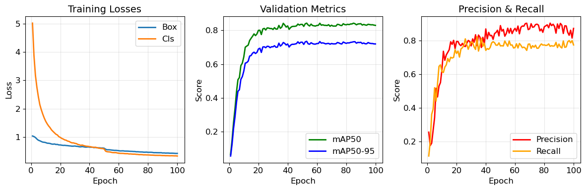
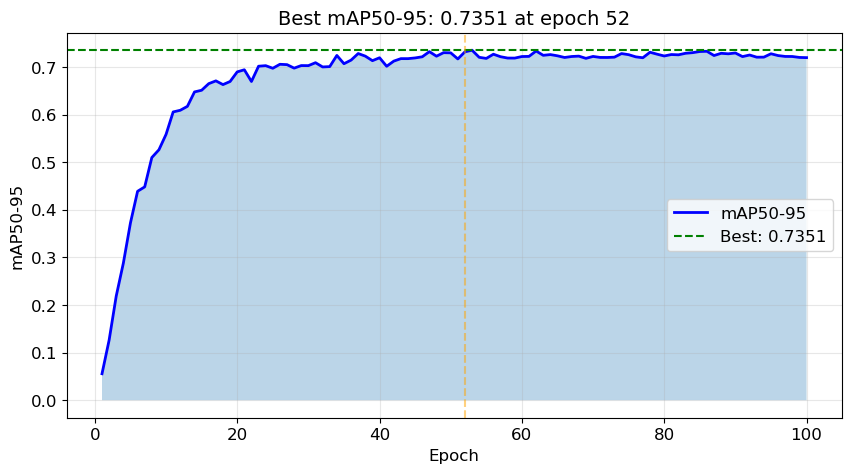
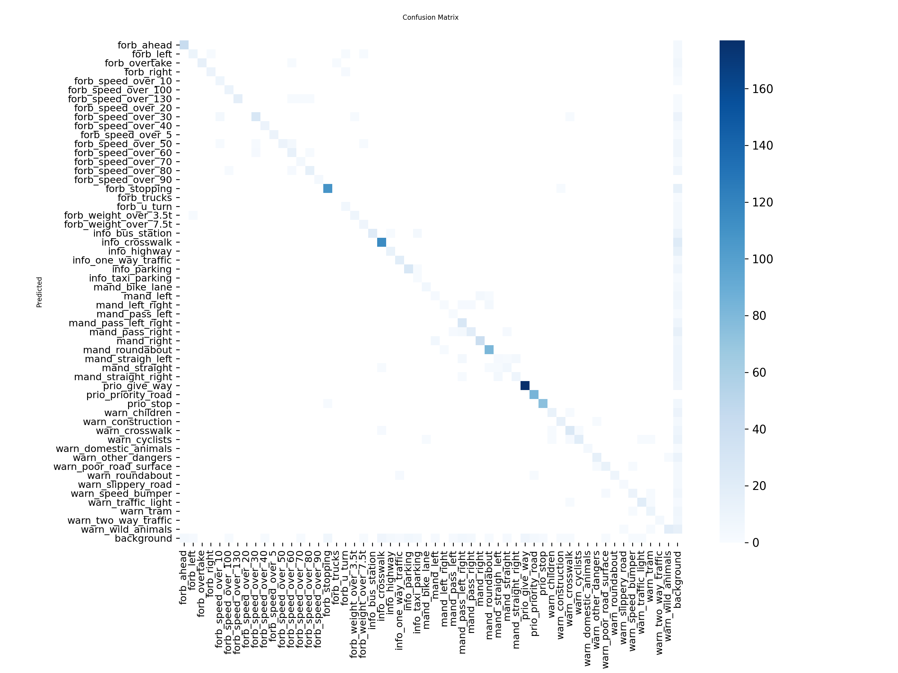

### Imports


```python
import os
os.environ["KMP_DUPLICATE_LIB_OK"] = "TRUE"

import yaml
from pathlib import Path
import torch
from ultralytics import YOLO, settings

import sys
sys.path.append('../scripts')  
from visualization import *
%matplotlib inline
```

### Paths


```python
DATASET_PATH = Path("../data/data_with_augmentation.yaml")
OUTPUT_PATH = Path("../models/")
OUTPUT_PATH.mkdir(parents=True, exist_ok=True)
```

### Configure runs directory


```python
new_runs_dir = OUTPUT_PATH  
settings.update({'runs_dir': str(new_runs_dir)})
```

### Device selection


```python
device = 'cuda' if torch.cuda.is_available() else 'cpu'
print(f"Using device: {device}")
```

    Using device: cuda
    

### Load dataset configuration


```python
with open(DATASET_PATH, 'r') as f:
    data_config = yaml.safe_load(f)
print(f"Number of classes: {data_config['nc']}")
```

    Number of classes: 55
    

### Initialize model


```python
model = YOLO("yolo11n.pt")
```

### Train the model


```python
results = model.train(
    data=str(DATASET_PATH),      # Path to dataset YAML
    epochs=100,                   # Number of training epochs
    batch=-1,                     # Auto-batch size (optimizes GPU memory)
    imgsz=640,                    # Input image size
    device=device,                # GPU or CPU
    lr0=0.01,                     # Initial learning rate
    weight_decay=0.0005,          # L2 regularization
    momentum=0.937,               # SGD momentum
    augment=True,                 # Enable data augmentation
    workers=4,                    # Number of data loading workers
    patience=50,                  # Early stopping patience
    save=True,                    # Save checkpoints
    name="data_with_augmentation",      # Experiment name
    exist_ok=True,                # Overwrite existing folder
    verbose=True,                 # Print training logs
    seed=42,                       # Print training logs
    close_mosaic=50,
    copy_paste=0.5,
    
)

print("Training completed!")
```

    Ultralytics 8.4.41  Python-3.12.12 torch-2.2.0+cu118 CUDA:0 (NVIDIA GeForce RTX 4070 Laptop GPU, 8188MiB)
    engine\trainer: agnostic_nms=False, amp=True, angle=1.0, augment=True, auto_augment=randaugment, batch=-1, bgr=0.0, box=7.5, cache=False, cfg=None, classes=None, close_mosaic=50, cls=0.5, cls_pw=0.0, compile=False, conf=None, copy_paste=0.5, copy_paste_mode=flip, cos_lr=False, cutmix=0.0, data=..\data\data_with_augmentation.yaml, degrees=0.0, deterministic=True, device=0, dfl=1.5, dnn=False, dropout=0.0, dynamic=False, embed=None, end2end=None, epochs=100, erasing=0.4, exist_ok=True, fliplr=0.5, flipud=0.0, format=torchscript, fraction=1.0, freeze=None, half=False, hsv_h=0.015, hsv_s=0.7, hsv_v=0.4, imgsz=640, int8=False, iou=0.7, keras=False, kobj=1.0, line_width=None, lr0=0.01, lrf=0.01, mask_ratio=4, max_det=300, mixup=0.0, mode=train, model=yolo11n.pt, momentum=0.937, mosaic=1.0, multi_scale=0.0, name=data_with_augmentation, nbs=64, nms=False, opset=None, optimize=False, optimizer=auto, overlap_mask=True, patience=50, perspective=0.0, plots=True, pose=12.0, pretrained=True, profile=False, project=None, rect=False, resume=False, retina_masks=False, rle=1.0, save=True, save_conf=False, save_crop=False, save_dir=C:\Users\isazo\OneDrive\ \courses\partfolio\pet_projects\traffic-sign-detection\models\detect\data_with_augmentation, save_frames=False, save_json=False, save_period=-1, save_txt=False, scale=0.5, seed=42, shear=0.0, show=False, show_boxes=True, show_conf=True, show_labels=True, simplify=True, single_cls=False, source=None, split=val, stream_buffer=False, task=detect, time=None, tracker=botsort.yaml, translate=0.1, val=True, verbose=True, vid_stride=1, visualize=False, warmup_bias_lr=0.1, warmup_epochs=3.0, warmup_momentum=0.8, weight_decay=0.0005, workers=4, workspace=None
    Overriding model.yaml nc=80 with nc=55
    
                       from  n    params  module                                       arguments                     
      0                  -1  1       464  ultralytics.nn.modules.conv.Conv             [3, 16, 3, 2]                 
      1                  -1  1      4672  ultralytics.nn.modules.conv.Conv             [16, 32, 3, 2]                
      2                  -1  1      6640  ultralytics.nn.modules.block.C3k2            [32, 64, 1, False, 0.25]      
      3                  -1  1     36992  ultralytics.nn.modules.conv.Conv             [64, 64, 3, 2]                
      4                  -1  1     26080  ultralytics.nn.modules.block.C3k2            [64, 128, 1, False, 0.25]     
      5                  -1  1    147712  ultralytics.nn.modules.conv.Conv             [128, 128, 3, 2]              
      6                  -1  1     87040  ultralytics.nn.modules.block.C3k2            [128, 128, 1, True]           
      7                  -1  1    295424  ultralytics.nn.modules.conv.Conv             [128, 256, 3, 2]              
      8                  -1  1    346112  ultralytics.nn.modules.block.C3k2            [256, 256, 1, True]           
      9                  -1  1    164608  ultralytics.nn.modules.block.SPPF            [256, 256, 5]                 
     10                  -1  1    249728  ultralytics.nn.modules.block.C2PSA           [256, 256, 1]                 
     11                  -1  1         0  torch.nn.modules.upsampling.Upsample         [None, 2, 'nearest']          
     12             [-1, 6]  1         0  ultralytics.nn.modules.conv.Concat           [1]                           
     13                  -1  1    111296  ultralytics.nn.modules.block.C3k2            [384, 128, 1, False]          
     14                  -1  1         0  torch.nn.modules.upsampling.Upsample         [None, 2, 'nearest']          
     15             [-1, 4]  1         0  ultralytics.nn.modules.conv.Concat           [1]                           
     16                  -1  1     32096  ultralytics.nn.modules.block.C3k2            [256, 64, 1, False]           
     17                  -1  1     36992  ultralytics.nn.modules.conv.Conv             [64, 64, 3, 2]                
     18            [-1, 13]  1         0  ultralytics.nn.modules.conv.Concat           [1]                           
     19                  -1  1     86720  ultralytics.nn.modules.block.C3k2            [192, 128, 1, False]          
     20                  -1  1    147712  ultralytics.nn.modules.conv.Conv             [128, 128, 3, 2]              
     21            [-1, 10]  1         0  ultralytics.nn.modules.conv.Concat           [1]                           
     22                  -1  1    378880  ultralytics.nn.modules.block.C3k2            [384, 256, 1, True]           
     23        [16, 19, 22]  1    441397  ultralytics.nn.modules.head.Detect           [55, 16, None, [64, 128, 256]]
    YOLO11n summary: 182 layers, 2,600,565 parameters, 2,600,549 gradients, 6.5 GFLOPs
    
    Transferred 448/499 items from pretrained weights
    Freezing layer 'model.23.dfl.conv.weight'
    AMP: running Automatic Mixed Precision (AMP) checks...
    AMP: checks passed 
    train: Fast image access  (ping: 0.00.0 ms, read: 219.1135.5 MB/s, size: 170.3 KB)
    train: Scanning C:\Users\isazo\OneDrive\Рабочий стол\courses\partfolio\pet_projects\traffic-sign-detection\data\processed\train_balanced\labels.cache... 4375 images, 93 backgrounds, 0 corrupt: 100% ━━━━━━━━━━━━ 4375/4375  0.0s
    albumentations: Blur(p=0.01, blur_limit=(3, 7)), MedianBlur(p=0.01, blur_limit=(3, 7)), ToGray(p=0.01, method='weighted_average', num_output_channels=3), CLAHE(p=0.01, clip_limit=(1.0, 4.0), tile_grid_size=(8, 8))
    AutoBatch: Computing optimal batch size for imgsz=640 at 60.0% CUDA memory utilization.
    AutoBatch: CUDA:0 (NVIDIA GeForce RTX 4070 Laptop GPU) 8.00G total, 0.29G reserved, 0.05G allocated, 7.65G free
          Params      GFLOPs  GPU_mem (GB)  forward (ms) backward (ms)                   input                  output
         2600565       6.499         0.659         68.34           nan        (1, 3, 640, 640)                    list
         2600565          13         1.074         41.13           nan        (2, 3, 640, 640)                    list
         2600565       25.99         1.952         58.55           nan        (4, 3, 640, 640)                    list
         2600565       51.99         2.944         35.09           nan        (8, 3, 640, 640)                    list
         2600565         104         5.813          82.9           nan       (16, 3, 640, 640)                    list
    AutoBatch: Using batch-size 13 for CUDA:0 5.12G/8.00G (64%) 
    train: Fast image access  (ping: 0.00.0 ms, read: 143.498.5 MB/s, size: 151.9 KB)
    train: Scanning C:\Users\isazo\OneDrive\Рабочий стол\courses\partfolio\pet_projects\traffic-sign-detection\data\processed\train_balanced\labels.cache... 4375 images, 93 backgrounds, 0 corrupt: 100% ━━━━━━━━━━━━ 4375/4375  0.0s
    albumentations: Blur(p=0.01, blur_limit=(3, 7)), MedianBlur(p=0.01, blur_limit=(3, 7)), ToGray(p=0.01, method='weighted_average', num_output_channels=3), CLAHE(p=0.01, clip_limit=(1.0, 4.0), tile_grid_size=(8, 8))
    val: Fast image access  (ping: 0.00.0 ms, read: 77.520.6 MB/s, size: 49.1 KB)
    val: Scanning C:\Users\isazo\OneDrive\Рабочий стол\courses\partfolio\pet_projects\traffic-sign-detection\data\raw\Traffic Signs\valid\labels.cache... 882 images, 43 backgrounds, 0 corrupt: 100% ━━━━━━━━━━━━ 882/882  0.0s
    optimizer: 'optimizer=auto' found, ignoring 'lr0=0.01' and 'momentum=0.937' and determining best 'optimizer', 'lr0' and 'momentum' automatically... 
    optimizer: AdamW(lr=0.000169, momentum=0.9) with parameter groups 81 weight(decay=0.0), 88 weight(decay=0.0005078125), 87 bias(decay=0.0)
    Plotting labels to C:\Users\isazo\OneDrive\ \courses\partfolio\pet_projects\traffic-sign-detection\models\detect\data_with_augmentation\labels.jpg... 
    MLflow: logging run_id(c2d47316411542bf8d6cfe50c8b855b9) to ..\models\mlflow
    MLflow: view at http://127.0.0.1:5000 with 'mlflow server --backend-store-uri ..\models\mlflow'
    MLflow: disable with 'yolo settings mlflow=False'
    Image sizes 640 train, 640 val
    Using 4 dataloader workers
    Logging results to C:\Users\isazo\OneDrive\ \courses\partfolio\pet_projects\traffic-sign-detection\models\detect\data_with_augmentation
    Starting training for 100 epochs...
    
          Epoch    GPU_mem   box_loss   cls_loss   dfl_loss  Instances       Size
          1/100      2.19G      1.039      5.019      1.037         21        640: 100% ━━━━━━━━━━━━ 337/337 6.9it/s 48.8s<0.2s
                     Class     Images  Instances      Box(P          R      mAP50  mAP50-95): 100% ━━━━━━━━━━━━ 34/34 6.2it/s 5.5s0.1s
                       all        882       1393      0.255      0.114     0.0651     0.0556
    
          Epoch    GPU_mem   box_loss   cls_loss   dfl_loss  Instances       Size
          2/100      2.19G      1.021      3.877      1.039         18        640: 100% ━━━━━━━━━━━━ 337/337 7.3it/s 46.4s0.3ss
                     Class     Images  Instances      Box(P          R      mAP50  mAP50-95): 100% ━━━━━━━━━━━━ 34/34 6.7it/s 5.1s0.2s
                       all        882       1393      0.176      0.198      0.152      0.126
    
          Epoch    GPU_mem   box_loss   cls_loss   dfl_loss  Instances       Size
          3/100      2.19G     0.9861       3.18      1.036         19        640: 100% ━━━━━━━━━━━━ 337/337 7.2it/s 46.8s<0.1s
                     Class     Images  Instances      Box(P          R      mAP50  mAP50-95): 100% ━━━━━━━━━━━━ 34/34 6.5it/s 5.3s0.1s
                       all        882       1393       0.19      0.361      0.254      0.219
    
          Epoch    GPU_mem   box_loss   cls_loss   dfl_loss  Instances       Size
          4/100      2.19G     0.9334       2.76      1.022         21        640: 100% ━━━━━━━━━━━━ 337/337 7.7it/s 43.6s<0.1s
                     Class     Images  Instances      Box(P          R      mAP50  mAP50-95): 100% ━━━━━━━━━━━━ 34/34 6.0it/s 5.6s0.2s
                       all        882       1393      0.266      0.392      0.336      0.288
    
          Epoch    GPU_mem   box_loss   cls_loss   dfl_loss  Instances       Size
          5/100      2.19G      0.891      2.426      1.002         21        640: 100% ━━━━━━━━━━━━ 337/337 6.6it/s 50.7s<0.2s
                     Class     Images  Instances      Box(P          R      mAP50  mAP50-95): 100% ━━━━━━━━━━━━ 34/34 6.5it/s 5.3s0.2s
                       all        882       1393      0.341      0.519      0.434      0.373
    
          Epoch    GPU_mem   box_loss   cls_loss   dfl_loss  Instances       Size
          6/100      2.19G     0.8718      2.147     0.9928         25        640: 100% ━━━━━━━━━━━━ 337/337 6.9it/s 49.1s<0.1s
                     Class     Images  Instances      Box(P          R      mAP50  mAP50-95): 100% ━━━━━━━━━━━━ 34/34 6.3it/s 5.4s0.1s
                       all        882       1393      0.516      0.439      0.508      0.439
    
          Epoch    GPU_mem   box_loss   cls_loss   dfl_loss  Instances       Size
          7/100      2.19G     0.8466      1.969      0.982         14        640: 100% ━━━━━━━━━━━━ 337/337 7.0it/s 48.2s<0.1s
                     Class     Images  Instances      Box(P          R      mAP50  mAP50-95): 100% ━━━━━━━━━━━━ 34/34 6.2it/s 5.4s0.2s
                       all        882       1393      0.464      0.542       0.52      0.448
    
          Epoch    GPU_mem   box_loss   cls_loss   dfl_loss  Instances       Size
          8/100      2.19G      0.824      1.813     0.9746         13        640: 100% ━━━━━━━━━━━━ 337/337 7.0it/s 48.0s<0.1s
                     Class     Images  Instances      Box(P          R      mAP50  mAP50-95): 100% ━━━━━━━━━━━━ 34/34 6.7it/s 5.0s0.1s
                       all        882       1393      0.529      0.646      0.591       0.51
    
          Epoch    GPU_mem   box_loss   cls_loss   dfl_loss  Instances       Size
          9/100      2.19G     0.8183      1.677     0.9731         20        640: 100% ━━━━━━━━━━━━ 337/337 6.8it/s 49.3s0.3sss
                     Class     Images  Instances      Box(P          R      mAP50  mAP50-95): 100% ━━━━━━━━━━━━ 34/34 6.1it/s 5.6s0.2s
                       all        882       1393      0.549      0.655      0.606      0.526
    
          Epoch    GPU_mem   box_loss   cls_loss   dfl_loss  Instances       Size
         10/100      2.19G     0.8082      1.562     0.9713         20        640: 100% ━━━━━━━━━━━━ 337/337 7.1it/s 47.8s<0.1s
                     Class     Images  Instances      Box(P          R      mAP50  mAP50-95): 100% ━━━━━━━━━━━━ 34/34 6.4it/s 5.3s0.2s
                       all        882       1393      0.626      0.615      0.642      0.558
    
          Epoch    GPU_mem   box_loss   cls_loss   dfl_loss  Instances       Size
         11/100      2.19G      0.787      1.472      0.963         29        640: 100% ━━━━━━━━━━━━ 337/337 7.0it/s 48.2s0.3ss
                     Class     Images  Instances      Box(P          R      mAP50  mAP50-95): 100% ━━━━━━━━━━━━ 34/34 6.1it/s 5.6s0.2s
                       all        882       1393      0.735      0.609        0.7      0.605
    
          Epoch    GPU_mem   box_loss   cls_loss   dfl_loss  Instances       Size
         12/100      2.19G     0.7838      1.395     0.9664         19        640: 100% ━━━━━━━━━━━━ 337/337 7.0it/s 48.2s<0.2s
                     Class     Images  Instances      Box(P          R      mAP50  mAP50-95): 100% ━━━━━━━━━━━━ 34/34 6.6it/s 5.1s0.2s
                       all        882       1393      0.682      0.642      0.707      0.609
    
          Epoch    GPU_mem   box_loss   cls_loss   dfl_loss  Instances       Size
         13/100      2.19G     0.7761      1.334     0.9582         29        640: 100% ━━━━━━━━━━━━ 337/337 7.1it/s 47.7s<0.1s
                     Class     Images  Instances      Box(P          R      mAP50  mAP50-95): 100% ━━━━━━━━━━━━ 34/34 6.0it/s 5.7s0.1s
                       all        882       1393      0.714      0.655      0.712      0.617
    
          Epoch    GPU_mem   box_loss   cls_loss   dfl_loss  Instances       Size
         14/100      2.19G     0.7575      1.255     0.9513         27        640: 100% ━━━━━━━━━━━━ 337/337 7.1it/s 47.7s0.3ss
                     Class     Images  Instances      Box(P          R      mAP50  mAP50-95): 100% ━━━━━━━━━━━━ 34/34 6.6it/s 5.1s0.1s
                       all        882       1393      0.729      0.693       0.74      0.647
    
          Epoch    GPU_mem   box_loss   cls_loss   dfl_loss  Instances       Size
         15/100      2.19G     0.7507      1.202     0.9509         14        640: 100% ━━━━━━━━━━━━ 337/337 6.9it/s 48.7s<0.1s
                     Class     Images  Instances      Box(P          R      mAP50  mAP50-95): 100% ━━━━━━━━━━━━ 34/34 6.5it/s 5.2s0.2s
                       all        882       1393      0.745      0.673      0.753      0.651
    
          Epoch    GPU_mem   box_loss   cls_loss   dfl_loss  Instances       Size
         16/100      2.19G     0.7582      1.152     0.9483         20        640: 100% ━━━━━━━━━━━━ 337/337 7.0it/s 48.4s<0.2s
                     Class     Images  Instances      Box(P          R      mAP50  mAP50-95): 100% ━━━━━━━━━━━━ 34/34 6.4it/s 5.3s0.2s
                       all        882       1393      0.792        0.7      0.765      0.665
    
          Epoch    GPU_mem   box_loss   cls_loss   dfl_loss  Instances       Size
         17/100      2.19G     0.7414      1.103      0.945         12        640: 100% ━━━━━━━━━━━━ 337/337 7.0it/s 47.9s<0.1s
                     Class     Images  Instances      Box(P          R      mAP50  mAP50-95): 100% ━━━━━━━━━━━━ 34/34 6.3it/s 5.4s0.1s
                       all        882       1393      0.776      0.695      0.779      0.671
    
          Epoch    GPU_mem   box_loss   cls_loss   dfl_loss  Instances       Size
         18/100      2.19G     0.7437      1.077     0.9464         25        640: 100% ━━━━━━━━━━━━ 337/337 6.9it/s 48.9s<0.2s
                     Class     Images  Instances      Box(P          R      mAP50  mAP50-95): 100% ━━━━━━━━━━━━ 34/34 6.2it/s 5.5s0.1s
                       all        882       1393        0.8      0.699      0.769      0.663
    
          Epoch    GPU_mem   box_loss   cls_loss   dfl_loss  Instances       Size
         19/100      2.19G     0.7254      1.017     0.9386         23        640: 100% ━━━━━━━━━━━━ 337/337 7.2it/s 47.0s0.3ss
                     Class     Images  Instances      Box(P          R      mAP50  mAP50-95): 100% ━━━━━━━━━━━━ 34/34 6.7it/s 5.1s0.2s
                       all        882       1393      0.752      0.745      0.779      0.669
    
          Epoch    GPU_mem   box_loss   cls_loss   dfl_loss  Instances       Size
         20/100      2.19G     0.7245     0.9895     0.9418         14        640: 100% ━━━━━━━━━━━━ 337/337 7.1it/s 47.5s<0.1s
                     Class     Images  Instances      Box(P          R      mAP50  mAP50-95): 100% ━━━━━━━━━━━━ 34/34 7.0it/s 4.8s0.1s
                       all        882       1393      0.794      0.723        0.8       0.69
    
          Epoch    GPU_mem   box_loss   cls_loss   dfl_loss  Instances       Size
         21/100      2.19G     0.7157     0.9547     0.9405         18        640: 100% ━━━━━━━━━━━━ 337/337 6.9it/s 48.8s<0.1s
                     Class     Images  Instances      Box(P          R      mAP50  mAP50-95): 100% ━━━━━━━━━━━━ 34/34 6.6it/s 5.1s0.2s
                       all        882       1393      0.793      0.737      0.801      0.694
    
          Epoch    GPU_mem   box_loss   cls_loss   dfl_loss  Instances       Size
         22/100      2.19G      0.708     0.9332     0.9331         34        640: 100% ━━━━━━━━━━━━ 337/337 7.2it/s 47.0s<0.1s
                     Class     Images  Instances      Box(P          R      mAP50  mAP50-95): 100% ━━━━━━━━━━━━ 34/34 7.0it/s 4.9s0.1s
                       all        882       1393      0.776      0.701      0.775      0.669
    
          Epoch    GPU_mem   box_loss   cls_loss   dfl_loss  Instances       Size
         23/100      2.19G     0.7107     0.9028      0.934         31        640: 100% ━━━━━━━━━━━━ 337/337 6.9it/s 48.5s<0.1s
                     Class     Images  Instances      Box(P          R      mAP50  mAP50-95): 100% ━━━━━━━━━━━━ 34/34 6.7it/s 5.1s0.1s
                       all        882       1393      0.769      0.749      0.808      0.701
    
          Epoch    GPU_mem   box_loss   cls_loss   dfl_loss  Instances       Size
         24/100      2.19G     0.7043      0.891     0.9307         14        640: 100% ━━━━━━━━━━━━ 337/337 7.3it/s 46.0s0.3ss
                     Class     Images  Instances      Box(P          R      mAP50  mAP50-95): 100% ━━━━━━━━━━━━ 34/34 5.7it/s 6.0s0.2s
                       all        882       1393      0.782      0.757      0.812      0.703
    
          Epoch    GPU_mem   box_loss   cls_loss   dfl_loss  Instances       Size
         25/100      2.19G     0.7007     0.8604     0.9264         18        640: 100% ━━━━━━━━━━━━ 337/337 7.3it/s 46.3s0.3ss
                     Class     Images  Instances      Box(P          R      mAP50  mAP50-95): 100% ━━━━━━━━━━━━ 34/34 6.7it/s 5.1s0.1s
                       all        882       1393      0.767       0.77      0.802      0.697
    
          Epoch    GPU_mem   box_loss   cls_loss   dfl_loss  Instances       Size
         26/100      2.19G      0.693     0.8495     0.9271         31        640: 100% ━━━━━━━━━━━━ 337/337 7.1it/s 47.4s0.3ss
                     Class     Images  Instances      Box(P          R      mAP50  mAP50-95): 100% ━━━━━━━━━━━━ 34/34 6.6it/s 5.1s0.2s
                       all        882       1393      0.763      0.809      0.814      0.706
    
          Epoch    GPU_mem   box_loss   cls_loss   dfl_loss  Instances       Size
         27/100      2.19G     0.6884     0.8179      0.926         17        640: 100% ━━━━━━━━━━━━ 337/337 6.9it/s 48.7s0.3ss
                     Class     Images  Instances      Box(P          R      mAP50  mAP50-95): 100% ━━━━━━━━━━━━ 34/34 6.5it/s 5.3s0.2s
                       all        882       1393      0.782      0.775      0.814      0.705
    
          Epoch    GPU_mem   box_loss   cls_loss   dfl_loss  Instances       Size
         28/100      2.19G     0.6812      0.798     0.9263         28        640: 100% ━━━━━━━━━━━━ 337/337 7.3it/s 46.2s<0.1s
                     Class     Images  Instances      Box(P          R      mAP50  mAP50-95): 100% ━━━━━━━━━━━━ 34/34 6.7it/s 5.1s0.2s
                       all        882       1393        0.8      0.747      0.811      0.697
    
          Epoch    GPU_mem   box_loss   cls_loss   dfl_loss  Instances       Size
         29/100      2.19G     0.6826     0.7972     0.9182         16        640: 100% ━━━━━━━━━━━━ 337/337 7.0it/s 48.4s<0.1s
                     Class     Images  Instances      Box(P          R      mAP50  mAP50-95): 100% ━━━━━━━━━━━━ 34/34 6.3it/s 5.4s0.1s
                       all        882       1393      0.794      0.772      0.811      0.703
    
          Epoch    GPU_mem   box_loss   cls_loss   dfl_loss  Instances       Size
         30/100      2.19G     0.6866     0.7809     0.9246         25        640: 100% ━━━━━━━━━━━━ 337/337 6.7it/s 50.4s0.3ss
                     Class     Images  Instances      Box(P          R      mAP50  mAP50-95): 100% ━━━━━━━━━━━━ 34/34 6.6it/s 5.1s0.1s
                       all        882       1393      0.767      0.791      0.805      0.703
    
          Epoch    GPU_mem   box_loss   cls_loss   dfl_loss  Instances       Size
         31/100      2.19G     0.6767     0.7709     0.9195         17        640: 100% ━━━━━━━━━━━━ 337/337 6.9it/s 48.8s<0.1s
                     Class     Images  Instances      Box(P          R      mAP50  mAP50-95): 100% ━━━━━━━━━━━━ 34/34 6.7it/s 5.1s0.1s
                       all        882       1393      0.809      0.787      0.816      0.709
    
          Epoch    GPU_mem   box_loss   cls_loss   dfl_loss  Instances       Size
         32/100      2.19G     0.6728     0.7429     0.9162         38        640: 100% ━━━━━━━━━━━━ 337/337 6.9it/s 48.6s<0.1s
                     Class     Images  Instances      Box(P          R      mAP50  mAP50-95): 100% ━━━━━━━━━━━━ 34/34 6.7it/s 5.0s0.1s
                       all        882       1393      0.789      0.762      0.807        0.7
    
          Epoch    GPU_mem   box_loss   cls_loss   dfl_loss  Instances       Size
         33/100      2.19G     0.6603     0.7299      0.915         21        640: 100% ━━━━━━━━━━━━ 337/337 7.2it/s 47.1s<0.1s
                     Class     Images  Instances      Box(P          R      mAP50  mAP50-95): 100% ━━━━━━━━━━━━ 34/34 6.5it/s 5.2s0.1s
                       all        882       1393      0.833      0.746      0.808      0.701
    
          Epoch    GPU_mem   box_loss   cls_loss   dfl_loss  Instances       Size
         34/100      2.19G     0.6571     0.7105     0.9109         17        640: 100% ━━━━━━━━━━━━ 337/337 6.9it/s 48.9s<0.1s
                     Class     Images  Instances      Box(P          R      mAP50  mAP50-95): 100% ━━━━━━━━━━━━ 34/34 6.5it/s 5.2s0.2s
                       all        882       1393      0.768      0.821      0.829      0.724
    
          Epoch    GPU_mem   box_loss   cls_loss   dfl_loss  Instances       Size
         35/100      2.19G     0.6683     0.7215      0.913         18        640: 100% ━━━━━━━━━━━━ 337/337 6.8it/s 49.7s<0.1s
                     Class     Images  Instances      Box(P          R      mAP50  mAP50-95): 100% ━━━━━━━━━━━━ 34/34 6.3it/s 5.4s0.1s
                       all        882       1393      0.832      0.737      0.812      0.707
    
          Epoch    GPU_mem   box_loss   cls_loss   dfl_loss  Instances       Size
         36/100      2.19G     0.6578     0.7027     0.9098         30        640: 100% ━━━━━━━━━━━━ 337/337 7.2it/s 46.9s<0.1s
                     Class     Images  Instances      Box(P          R      mAP50  mAP50-95): 100% ━━━━━━━━━━━━ 34/34 6.9it/s 5.0s0.1s
                       all        882       1393      0.819      0.771       0.82      0.714
    
          Epoch    GPU_mem   box_loss   cls_loss   dfl_loss  Instances       Size
         37/100      2.19G     0.6476     0.6886     0.9081         24        640: 100% ━━━━━━━━━━━━ 337/337 7.0it/s 48.0s0.3ss
                     Class     Images  Instances      Box(P          R      mAP50  mAP50-95): 100% ━━━━━━━━━━━━ 34/34 6.7it/s 5.1s0.1s
                       all        882       1393      0.758      0.813      0.842      0.728
    
          Epoch    GPU_mem   box_loss   cls_loss   dfl_loss  Instances       Size
         38/100      2.19G     0.6475     0.6781     0.9089         28        640: 100% ━━━━━━━━━━━━ 337/337 6.7it/s 50.0s<0.1s
                     Class     Images  Instances      Box(P          R      mAP50  mAP50-95): 100% ━━━━━━━━━━━━ 34/34 6.4it/s 5.3s0.1s
                       all        882       1393      0.818      0.765      0.831      0.723
    
          Epoch    GPU_mem   box_loss   cls_loss   dfl_loss  Instances       Size
         39/100      2.19G     0.6541     0.6756     0.9114         29        640: 100% ━━━━━━━━━━━━ 337/337 7.0it/s 48.3s<0.1s
                     Class     Images  Instances      Box(P          R      mAP50  mAP50-95): 100% ━━━━━━━━━━━━ 34/34 6.7it/s 5.1s0.1s
                       all        882       1393       0.78      0.783      0.819      0.713
    
          Epoch    GPU_mem   box_loss   cls_loss   dfl_loss  Instances       Size
         40/100      2.19G     0.6466     0.6643     0.9085         32        640: 100% ━━━━━━━━━━━━ 337/337 6.9it/s 48.8s0.3ss
                     Class     Images  Instances      Box(P          R      mAP50  mAP50-95): 100% ━━━━━━━━━━━━ 34/34 6.5it/s 5.3s0.1s
                       all        882       1393      0.868      0.741      0.826      0.719
    
          Epoch    GPU_mem   box_loss   cls_loss   dfl_loss  Instances       Size
         41/100      2.19G     0.6445     0.6588      0.911         11        640: 100% ━━━━━━━━━━━━ 337/337 7.1it/s 47.3s0.3ss
                     Class     Images  Instances      Box(P          R      mAP50  mAP50-95): 100% ━━━━━━━━━━━━ 34/34 6.4it/s 5.3s0.1s
                       all        882       1393      0.809      0.752      0.806      0.701
    
          Epoch    GPU_mem   box_loss   cls_loss   dfl_loss  Instances       Size
         42/100      2.19G      0.644      0.644      0.904         23        640: 100% ━━━━━━━━━━━━ 337/337 7.0it/s 48.2s0.3ss
                     Class     Images  Instances      Box(P          R      mAP50  mAP50-95): 100% ━━━━━━━━━━━━ 34/34 6.6it/s 5.1s0.1s
                       all        882       1393      0.848      0.747      0.816      0.712
    
          Epoch    GPU_mem   box_loss   cls_loss   dfl_loss  Instances       Size
         43/100      2.19G     0.6308     0.6404     0.9038         25        640: 100% ━━━━━━━━━━━━ 337/337 7.0it/s 48.1s<0.1s
                     Class     Images  Instances      Box(P          R      mAP50  mAP50-95): 100% ━━━━━━━━━━━━ 34/34 6.1it/s 5.6s0.2s
                       all        882       1393      0.828      0.758      0.823      0.717
    
          Epoch    GPU_mem   box_loss   cls_loss   dfl_loss  Instances       Size
         44/100      2.19G     0.6374     0.6397     0.9089         17        640: 100% ━━━━━━━━━━━━ 337/337 7.0it/s 48.0s0.3ss
                     Class     Images  Instances      Box(P          R      mAP50  mAP50-95): 100% ━━━━━━━━━━━━ 34/34 6.3it/s 5.4s0.1s
                       all        882       1393       0.83      0.785      0.824      0.717
    
          Epoch    GPU_mem   box_loss   cls_loss   dfl_loss  Instances       Size
         45/100      2.19G     0.6252     0.6311     0.8998         34        640: 100% ━━━━━━━━━━━━ 337/337 6.8it/s 49.3s<0.1s
                     Class     Images  Instances      Box(P          R      mAP50  mAP50-95): 100% ━━━━━━━━━━━━ 34/34 6.7it/s 5.1s0.2s
                       all        882       1393      0.806      0.792      0.824      0.719
    
          Epoch    GPU_mem   box_loss   cls_loss   dfl_loss  Instances       Size
         46/100      2.19G      0.623     0.6145      0.901         17        640: 100% ━━━━━━━━━━━━ 337/337 7.0it/s 48.2s0.3ss
                     Class     Images  Instances      Box(P          R      mAP50  mAP50-95): 100% ━━━━━━━━━━━━ 34/34 6.7it/s 5.1s0.2s
                       all        882       1393      0.841      0.786      0.826      0.721
    
          Epoch    GPU_mem   box_loss   cls_loss   dfl_loss  Instances       Size
         47/100      2.19G     0.6221     0.6068     0.8959         20        640: 100% ━━━━━━━━━━━━ 337/337 7.1it/s 47.5s0.3ss
                     Class     Images  Instances      Box(P          R      mAP50  mAP50-95): 100% ━━━━━━━━━━━━ 34/34 6.6it/s 5.1s0.2s
                       all        882       1393      0.847      0.772      0.837      0.732
    
          Epoch    GPU_mem   box_loss   cls_loss   dfl_loss  Instances       Size
         48/100      2.19G      0.615     0.6002     0.8969         13        640: 100% ━━━━━━━━━━━━ 337/337 7.0it/s 48.3s<0.1s
                     Class     Images  Instances      Box(P          R      mAP50  mAP50-95): 100% ━━━━━━━━━━━━ 34/34 6.6it/s 5.2s0.2s
                       all        882       1393       0.86      0.772      0.831      0.722
    
          Epoch    GPU_mem   box_loss   cls_loss   dfl_loss  Instances       Size
         49/100      2.19G      0.616     0.5976     0.8975         16        640: 100% ━━━━━━━━━━━━ 337/337 6.8it/s 49.8s<0.1s
                     Class     Images  Instances      Box(P          R      mAP50  mAP50-95): 100% ━━━━━━━━━━━━ 34/34 6.3it/s 5.4s0.2s
                       all        882       1393      0.827      0.785      0.835       0.73
    
          Epoch    GPU_mem   box_loss   cls_loss   dfl_loss  Instances       Size
         50/100      2.19G     0.6082     0.5824     0.8937         13        640: 100% ━━━━━━━━━━━━ 337/337 6.8it/s 49.3s0.3ss
                     Class     Images  Instances      Box(P          R      mAP50  mAP50-95): 100% ━━━━━━━━━━━━ 34/34 6.7it/s 5.1s0.1s
                       all        882       1393      0.888      0.767      0.835       0.73
    Closing dataloader mosaic
    albumentations: Blur(p=0.01, blur_limit=(3, 7)), MedianBlur(p=0.01, blur_limit=(3, 7)), ToGray(p=0.01, method='weighted_average', num_output_channels=3), CLAHE(p=0.01, clip_limit=(1.0, 4.0), tile_grid_size=(8, 8))
    
          Epoch    GPU_mem   box_loss   cls_loss   dfl_loss  Instances       Size
         51/100      2.19G     0.5736     0.5047     0.8807         14        640: 100% ━━━━━━━━━━━━ 337/337 7.0it/s 47.9s0.3ss
                     Class     Images  Instances      Box(P          R      mAP50  mAP50-95): 100% ━━━━━━━━━━━━ 34/34 6.8it/s 5.0s0.2s
                       all        882       1393      0.855      0.768      0.823      0.717
    
          Epoch    GPU_mem   box_loss   cls_loss   dfl_loss  Instances       Size
         52/100      2.19G      0.554     0.4858     0.8713         13        640: 100% ━━━━━━━━━━━━ 337/337 7.1it/s 47.2s<0.1s
                     Class     Images  Instances      Box(P          R      mAP50  mAP50-95): 100% ━━━━━━━━━━━━ 34/34 6.0it/s 5.7s0.2s
                       all        882       1393      0.865      0.767      0.839      0.732
    
          Epoch    GPU_mem   box_loss   cls_loss   dfl_loss  Instances       Size
         53/100      2.19G     0.5548     0.4803     0.8743         12        640: 100% ━━━━━━━━━━━━ 337/337 6.5it/s 51.5s<0.2s
                     Class     Images  Instances      Box(P          R      mAP50  mAP50-95): 100% ━━━━━━━━━━━━ 34/34 5.4it/s 6.3s0.2s
                       all        882       1393      0.825      0.796      0.843      0.735
    
          Epoch    GPU_mem   box_loss   cls_loss   dfl_loss  Instances       Size
         54/100      2.19G     0.5517     0.4763     0.8703         12        640: 100% ━━━━━━━━━━━━ 337/337 6.6it/s 51.1s<0.2s
                     Class     Images  Instances      Box(P          R      mAP50  mAP50-95): 100% ━━━━━━━━━━━━ 34/34 5.1it/s 6.7s0.2s
                       all        882       1393      0.841       0.78      0.832       0.72
    
          Epoch    GPU_mem   box_loss   cls_loss   dfl_loss  Instances       Size
         55/100      2.19G     0.5443     0.4627     0.8669         18        640: 100% ━━━━━━━━━━━━ 337/337 6.8it/s 49.9s<0.1s
                     Class     Images  Instances      Box(P          R      mAP50  mAP50-95): 100% ━━━━━━━━━━━━ 34/34 5.1it/s 6.7s0.2s
                       all        882       1393      0.872      0.765      0.826      0.718
    
          Epoch    GPU_mem   box_loss   cls_loss   dfl_loss  Instances       Size
         56/100      2.19G     0.5387     0.4547     0.8664         16        640: 100% ━━━━━━━━━━━━ 337/337 6.7it/s 50.4s<0.2s
                     Class     Images  Instances      Box(P          R      mAP50  mAP50-95): 100% ━━━━━━━━━━━━ 34/34 5.7it/s 6.0s0.2s
                       all        882       1393      0.844      0.796      0.837      0.727
    
          Epoch    GPU_mem   box_loss   cls_loss   dfl_loss  Instances       Size
         57/100      2.19G     0.5326     0.4531     0.8653         15        640: 100% ━━━━━━━━━━━━ 337/337 6.6it/s 51.1s<0.2s
                     Class     Images  Instances      Box(P          R      mAP50  mAP50-95): 100% ━━━━━━━━━━━━ 34/34 5.6it/s 6.1s0.2s
                       all        882       1393      0.871      0.772      0.829      0.721
    
          Epoch    GPU_mem   box_loss   cls_loss   dfl_loss  Instances       Size
         58/100      2.19G     0.5332     0.4541     0.8666         17        640: 100% ━━━━━━━━━━━━ 337/337 6.7it/s 50.2s<0.2s
                     Class     Images  Instances      Box(P          R      mAP50  mAP50-95): 100% ━━━━━━━━━━━━ 34/34 6.1it/s 5.6s0.1s
                       all        882       1393       0.84      0.773      0.827      0.719
    
          Epoch    GPU_mem   box_loss   cls_loss   dfl_loss  Instances       Size
         59/100      2.19G     0.5286     0.4407     0.8639         15        640: 100% ━━━━━━━━━━━━ 337/337 6.6it/s 51.2s<0.1s
                     Class     Images  Instances      Box(P          R      mAP50  mAP50-95): 100% ━━━━━━━━━━━━ 34/34 6.2it/s 5.4s0.2s
                       all        882       1393       0.86      0.755      0.825      0.719
    
          Epoch    GPU_mem   box_loss   cls_loss   dfl_loss  Instances       Size
         60/100      2.19G     0.5213     0.4328     0.8621         10        640: 100% ━━━━━━━━━━━━ 337/337 6.5it/s 52.2s<0.2s
                     Class     Images  Instances      Box(P          R      mAP50  mAP50-95): 100% ━━━━━━━━━━━━ 34/34 4.0it/s 8.6s0.2s
                       all        882       1393      0.872      0.757      0.829      0.722
    
          Epoch    GPU_mem   box_loss   cls_loss   dfl_loss  Instances       Size
         61/100      2.19G      0.513     0.4268     0.8577         17        640: 100% ━━━━━━━━━━━━ 337/337 6.7it/s 50.1s0.3ss
                     Class     Images  Instances      Box(P          R      mAP50  mAP50-95): 100% ━━━━━━━━━━━━ 34/34 6.4it/s 5.3s0.2s
                       all        882       1393      0.854       0.78       0.83      0.722
    
          Epoch    GPU_mem   box_loss   cls_loss   dfl_loss  Instances       Size
         62/100      2.19G     0.5153     0.4269     0.8567         16        640: 100% ━━━━━━━━━━━━ 337/337 6.9it/s 49.1s<0.1s
                     Class     Images  Instances      Box(P          R      mAP50  mAP50-95): 100% ━━━━━━━━━━━━ 34/34 6.4it/s 5.3s0.2s
                       all        882       1393      0.885      0.755      0.842      0.733
    
          Epoch    GPU_mem   box_loss   cls_loss   dfl_loss  Instances       Size
         63/100      2.19G     0.5167     0.4258     0.8593         13        640: 100% ━━━━━━━━━━━━ 337/337 7.1it/s 47.4s<0.1s
                     Class     Images  Instances      Box(P          R      mAP50  mAP50-95): 100% ━━━━━━━━━━━━ 34/34 6.6it/s 5.2s0.1s
                       all        882       1393      0.839      0.782      0.831      0.724
    
          Epoch    GPU_mem   box_loss   cls_loss   dfl_loss  Instances       Size
         64/100      2.19G     0.5082     0.4191     0.8581         15        640: 100% ━━━━━━━━━━━━ 337/337 6.8it/s 49.4s<0.1s
                     Class     Images  Instances      Box(P          R      mAP50  mAP50-95): 100% ━━━━━━━━━━━━ 34/34 6.4it/s 5.3s0.2s
                       all        882       1393      0.878      0.771      0.833      0.726
    
          Epoch    GPU_mem   box_loss   cls_loss   dfl_loss  Instances       Size
         65/100      2.19G     0.5074     0.4163     0.8551         18        640: 100% ━━━━━━━━━━━━ 337/337 6.9it/s 49.1s<0.1s
                     Class     Images  Instances      Box(P          R      mAP50  mAP50-95): 100% ━━━━━━━━━━━━ 34/34 6.1it/s 5.6s0.2s
                       all        882       1393      0.885      0.757       0.83      0.723
    
          Epoch    GPU_mem   box_loss   cls_loss   dfl_loss  Instances       Size
         66/100      2.19G     0.5069     0.4173     0.8569         11        640: 100% ━━━━━━━━━━━━ 337/337 7.0it/s 48.4s0.3ss
                     Class     Images  Instances      Box(P          R      mAP50  mAP50-95): 100% ━━━━━━━━━━━━ 34/34 6.3it/s 5.4s0.1s
                       all        882       1393      0.884       0.76       0.83       0.72
    
          Epoch    GPU_mem   box_loss   cls_loss   dfl_loss  Instances       Size
         67/100      2.19G     0.5029     0.4061     0.8555         14        640: 100% ━━━━━━━━━━━━ 337/337 6.8it/s 49.5s0.3ss
                     Class     Images  Instances      Box(P          R      mAP50  mAP50-95): 100% ━━━━━━━━━━━━ 34/34 6.1it/s 5.6s0.2s
                       all        882       1393        0.9      0.754      0.829      0.722
    
          Epoch    GPU_mem   box_loss   cls_loss   dfl_loss  Instances       Size
         68/100      2.19G     0.4988     0.4078     0.8551         15        640: 100% ━━━━━━━━━━━━ 337/337 6.7it/s 50.0s<0.1s
                     Class     Images  Instances      Box(P          R      mAP50  mAP50-95): 100% ━━━━━━━━━━━━ 34/34 6.0it/s 5.6s0.2s
                       all        882       1393      0.902      0.741      0.833      0.723
    
          Epoch    GPU_mem   box_loss   cls_loss   dfl_loss  Instances       Size
         69/100      2.19G     0.4976     0.4022     0.8551         15        640: 100% ━━━━━━━━━━━━ 337/337 6.9it/s 49.0s<0.1s
                     Class     Images  Instances      Box(P          R      mAP50  mAP50-95): 100% ━━━━━━━━━━━━ 34/34 6.4it/s 5.3s0.2s
                       all        882       1393      0.864      0.778      0.824      0.718
    
          Epoch    GPU_mem   box_loss   cls_loss   dfl_loss  Instances       Size
         70/100      2.19G     0.4934     0.3994     0.8517         17        640: 100% ━━━━━━━━━━━━ 337/337 6.8it/s 49.3s<0.1s
                     Class     Images  Instances      Box(P          R      mAP50  mAP50-95): 100% ━━━━━━━━━━━━ 34/34 6.0it/s 5.7s0.2s
                       all        882       1393      0.869      0.779       0.83      0.722
    
          Epoch    GPU_mem   box_loss   cls_loss   dfl_loss  Instances       Size
         71/100      2.19G     0.4931     0.3994     0.8511         15        640: 100% ━━━━━━━━━━━━ 337/337 6.8it/s 49.9s0.3ss
                     Class     Images  Instances      Box(P          R      mAP50  mAP50-95): 100% ━━━━━━━━━━━━ 34/34 6.4it/s 5.3s0.2s
                       all        882       1393      0.899      0.753      0.825       0.72
    
          Epoch    GPU_mem   box_loss   cls_loss   dfl_loss  Instances       Size
         72/100      2.19G     0.4832      0.392      0.845         10        640: 100% ━━━━━━━━━━━━ 337/337 6.9it/s 48.6s<0.1s
                     Class     Images  Instances      Box(P          R      mAP50  mAP50-95): 100% ━━━━━━━━━━━━ 34/34 6.1it/s 5.6s0.2s
                       all        882       1393      0.878      0.769      0.825       0.72
    
          Epoch    GPU_mem   box_loss   cls_loss   dfl_loss  Instances       Size
         73/100      2.19G      0.485     0.3899     0.8492         14        640: 100% ━━━━━━━━━━━━ 337/337 6.8it/s 49.5s<0.1s
                     Class     Images  Instances      Box(P          R      mAP50  mAP50-95): 100% ━━━━━━━━━━━━ 34/34 6.3it/s 5.4s0.2s
                       all        882       1393       0.88       0.76      0.825       0.72
    
          Epoch    GPU_mem   box_loss   cls_loss   dfl_loss  Instances       Size
         74/100      2.19G       0.48     0.3823     0.8476         10        640: 100% ━━━━━━━━━━━━ 337/337 6.9it/s 48.6s0.3ss
                     Class     Images  Instances      Box(P          R      mAP50  mAP50-95): 100% ━━━━━━━━━━━━ 34/34 6.4it/s 5.3s0.1s
                       all        882       1393      0.894      0.771      0.836      0.728
    
          Epoch    GPU_mem   box_loss   cls_loss   dfl_loss  Instances       Size
         75/100      2.19G      0.477     0.3843     0.8454         15        640: 100% ━━━━━━━━━━━━ 337/337 6.8it/s 49.5s0.3ss
                     Class     Images  Instances      Box(P          R      mAP50  mAP50-95): 100% ━━━━━━━━━━━━ 34/34 6.1it/s 5.6s0.1s
                       all        882       1393      0.896      0.753      0.834      0.726
    
          Epoch    GPU_mem   box_loss   cls_loss   dfl_loss  Instances       Size
         76/100      2.19G     0.4769     0.3814     0.8436         13        640: 100% ━━━━━━━━━━━━ 337/337 6.8it/s 49.2s0.3ss
                     Class     Images  Instances      Box(P          R      mAP50  mAP50-95): 100% ━━━━━━━━━━━━ 34/34 6.4it/s 5.3s0.1s
                       all        882       1393      0.891      0.754       0.83      0.721
    
          Epoch    GPU_mem   box_loss   cls_loss   dfl_loss  Instances       Size
         77/100      2.19G      0.469     0.3746      0.844         16        640: 100% ━━━━━━━━━━━━ 337/337 6.9it/s 48.5s0.3ss
                     Class     Images  Instances      Box(P          R      mAP50  mAP50-95): 100% ━━━━━━━━━━━━ 34/34 6.4it/s 5.3s0.1s
                       all        882       1393      0.856      0.769      0.828      0.719
    
          Epoch    GPU_mem   box_loss   cls_loss   dfl_loss  Instances       Size
         78/100      2.19G     0.4689      0.376     0.8421         17        640: 100% ━━━━━━━━━━━━ 337/337 6.8it/s 49.8s<0.1s
                     Class     Images  Instances      Box(P          R      mAP50  mAP50-95): 100% ━━━━━━━━━━━━ 34/34 6.4it/s 5.3s0.1s
                       all        882       1393      0.868      0.779      0.839      0.731
    
          Epoch    GPU_mem   box_loss   cls_loss   dfl_loss  Instances       Size
         79/100      2.19G      0.472     0.3731     0.8436         18        640: 100% ━━━━━━━━━━━━ 337/337 6.9it/s 48.7s<0.1s
                     Class     Images  Instances      Box(P          R      mAP50  mAP50-95): 100% ━━━━━━━━━━━━ 34/34 5.7it/s 5.9s0.2s
                       all        882       1393      0.848      0.772      0.834      0.727
    
          Epoch    GPU_mem   box_loss   cls_loss   dfl_loss  Instances       Size
         80/100      2.19G      0.464     0.3721      0.841         14        640: 100% ━━━━━━━━━━━━ 337/337 7.0it/s 47.9s0.3ss
                     Class     Images  Instances      Box(P          R      mAP50  mAP50-95): 100% ━━━━━━━━━━━━ 34/34 6.4it/s 5.4s0.2s
                       all        882       1393      0.881      0.773      0.833      0.723
    
          Epoch    GPU_mem   box_loss   cls_loss   dfl_loss  Instances       Size
         81/100      2.19G     0.4648     0.3692     0.8417         18        640: 100% ━━━━━━━━━━━━ 337/337 6.8it/s 49.5s0.3ss
                     Class     Images  Instances      Box(P          R      mAP50  mAP50-95): 100% ━━━━━━━━━━━━ 34/34 6.3it/s 5.4s0.2s
                       all        882       1393      0.886       0.77      0.836      0.726
    
          Epoch    GPU_mem   box_loss   cls_loss   dfl_loss  Instances       Size
         82/100      2.19G     0.4652      0.365     0.8434         12        640: 100% ━━━━━━━━━━━━ 337/337 6.9it/s 49.0s0.3ss
                     Class     Images  Instances      Box(P          R      mAP50  mAP50-95): 100% ━━━━━━━━━━━━ 34/34 6.2it/s 5.5s0.2s
                       all        882       1393      0.892      0.771      0.834      0.725
    
          Epoch    GPU_mem   box_loss   cls_loss   dfl_loss  Instances       Size
         83/100      2.19G     0.4611     0.3646     0.8393          9        640: 100% ━━━━━━━━━━━━ 337/337 7.0it/s 48.1s<0.1s
                     Class     Images  Instances      Box(P          R      mAP50  mAP50-95): 100% ━━━━━━━━━━━━ 34/34 6.2it/s 5.5s0.2s
                       all        882       1393      0.875      0.779      0.838      0.729
    
          Epoch    GPU_mem   box_loss   cls_loss   dfl_loss  Instances       Size
         84/100      2.19G     0.4514     0.3613     0.8385         16        640: 100% ━━━━━━━━━━━━ 337/337 6.7it/s 50.1s<0.1s
                     Class     Images  Instances      Box(P          R      mAP50  mAP50-95): 100% ━━━━━━━━━━━━ 34/34 6.5it/s 5.2s0.1s
                       all        882       1393      0.902      0.765      0.838       0.73
    
          Epoch    GPU_mem   box_loss   cls_loss   dfl_loss  Instances       Size
         85/100      2.19G     0.4534     0.3576     0.8385         13        640: 100% ━━━━━━━━━━━━ 337/337 7.0it/s 48.3s<0.2s
                     Class     Images  Instances      Box(P          R      mAP50  mAP50-95): 100% ━━━━━━━━━━━━ 34/34 6.2it/s 5.5s0.2s
                       all        882       1393      0.888      0.769      0.842      0.732
    
          Epoch    GPU_mem   box_loss   cls_loss   dfl_loss  Instances       Size
         86/100      2.19G     0.4509     0.3574     0.8388         18        640: 100% ━━━━━━━━━━━━ 337/337 6.9it/s 48.6s<0.1s
                     Class     Images  Instances      Box(P          R      mAP50  mAP50-95): 100% ━━━━━━━━━━━━ 34/34 6.2it/s 5.5s0.2s
                       all        882       1393      0.896      0.766      0.839      0.733
    
          Epoch    GPU_mem   box_loss   cls_loss   dfl_loss  Instances       Size
         87/100      2.19G     0.4499     0.3562     0.8357         22        640: 100% ━━━━━━━━━━━━ 337/337 6.7it/s 49.9s<0.1s
                     Class     Images  Instances      Box(P          R      mAP50  mAP50-95): 100% ━━━━━━━━━━━━ 34/34 6.2it/s 5.5s0.1s
                       all        882       1393      0.883      0.768      0.833      0.724
    
          Epoch    GPU_mem   box_loss   cls_loss   dfl_loss  Instances       Size
         88/100      2.19G     0.4494     0.3578      0.837         16        640: 100% ━━━━━━━━━━━━ 337/337 6.8it/s 49.8s<0.1s
                     Class     Images  Instances      Box(P          R      mAP50  mAP50-95): 100% ━━━━━━━━━━━━ 34/34 6.1it/s 5.5s0.2s
                       all        882       1393      0.843      0.788      0.838      0.729
    
          Epoch    GPU_mem   box_loss   cls_loss   dfl_loss  Instances       Size
         89/100      2.19G     0.4503     0.3529     0.8412         17        640: 100% ━━━━━━━━━━━━ 337/337 6.9it/s 49.2s0.3ss
                     Class     Images  Instances      Box(P          R      mAP50  mAP50-95): 100% ━━━━━━━━━━━━ 34/34 6.1it/s 5.6s0.2s
                       all        882       1393      0.897      0.757      0.838      0.728
    
          Epoch    GPU_mem   box_loss   cls_loss   dfl_loss  Instances       Size
         90/100      2.19G       0.44     0.3502     0.8342         17        640: 100% ━━━━━━━━━━━━ 337/337 6.9it/s 49.0s<0.1s
                     Class     Images  Instances      Box(P          R      mAP50  mAP50-95): 100% ━━━━━━━━━━━━ 34/34 6.2it/s 5.5s0.2s
                       all        882       1393      0.871      0.778      0.839      0.729
    
          Epoch    GPU_mem   box_loss   cls_loss   dfl_loss  Instances       Size
         91/100      2.19G     0.4436       0.35      0.833         14        640: 100% ━━━━━━━━━━━━ 337/337 6.8it/s 49.5s<0.1s
                     Class     Images  Instances      Box(P          R      mAP50  mAP50-95): 100% ━━━━━━━━━━━━ 34/34 6.1it/s 5.5s0.2s
                       all        882       1393      0.901      0.762      0.831      0.722
    
          Epoch    GPU_mem   box_loss   cls_loss   dfl_loss  Instances       Size
         92/100      2.19G     0.4366     0.3453     0.8338         17        640: 100% ━━━━━━━━━━━━ 337/337 6.8it/s 49.9s<0.1s
                     Class     Images  Instances      Box(P          R      mAP50  mAP50-95): 100% ━━━━━━━━━━━━ 34/34 6.3it/s 5.4s0.2s
                       all        882       1393       0.89      0.755      0.835      0.725
    
          Epoch    GPU_mem   box_loss   cls_loss   dfl_loss  Instances       Size
         93/100      2.19G     0.4393     0.3463     0.8347         28        640: 100% ━━━━━━━━━━━━ 337/337 6.9it/s 49.0s<0.1s
                     Class     Images  Instances      Box(P          R      mAP50  mAP50-95): 100% ━━━━━━━━━━━━ 34/34 5.9it/s 5.8s0.2s
                       all        882       1393      0.841      0.797      0.832       0.72
    
          Epoch    GPU_mem   box_loss   cls_loss   dfl_loss  Instances       Size
         94/100      2.19G      0.438     0.3445     0.8342         18        640: 100% ━━━━━━━━━━━━ 337/337 7.0it/s 48.4s<0.1s
                     Class     Images  Instances      Box(P          R      mAP50  mAP50-95): 100% ━━━━━━━━━━━━ 34/34 6.3it/s 5.4s0.2s
                       all        882       1393      0.887      0.759       0.83      0.721
    
          Epoch    GPU_mem   box_loss   cls_loss   dfl_loss  Instances       Size
         95/100      2.19G     0.4326      0.342     0.8347         12        640: 100% ━━━━━━━━━━━━ 337/337 6.8it/s 49.6s<0.1s
                     Class     Images  Instances      Box(P          R      mAP50  mAP50-95): 100% ━━━━━━━━━━━━ 34/34 6.5it/s 5.3s0.1s
                       all        882       1393      0.886      0.761      0.836      0.728
    
          Epoch    GPU_mem   box_loss   cls_loss   dfl_loss  Instances       Size
         96/100      2.19G     0.4337     0.3443     0.8378         11        640: 100% ━━━━━━━━━━━━ 337/337 6.9it/s 48.8s<0.1s
                     Class     Images  Instances      Box(P          R      mAP50  mAP50-95): 100% ━━━━━━━━━━━━ 34/34 5.7it/s 5.9s0.2s
                       all        882       1393      0.848      0.792      0.834      0.724
    
          Epoch    GPU_mem   box_loss   cls_loss   dfl_loss  Instances       Size
         97/100      2.19G     0.4323     0.3423     0.8317         18        640: 100% ━━━━━━━━━━━━ 337/337 6.8it/s 49.9s<0.1s
                     Class     Images  Instances      Box(P          R      mAP50  mAP50-95): 100% ━━━━━━━━━━━━ 34/34 6.4it/s 5.3s0.2s
                       all        882       1393       0.83      0.799      0.833      0.722
    
          Epoch    GPU_mem   box_loss   cls_loss   dfl_loss  Instances       Size
         98/100      2.19G      0.429     0.3393     0.8285         11        640: 100% ━━━━━━━━━━━━ 337/337 6.9it/s 48.7s<0.1s
                     Class     Images  Instances      Box(P          R      mAP50  mAP50-95): 100% ━━━━━━━━━━━━ 34/34 5.9it/s 5.8s0.2s
                       all        882       1393       0.86      0.786      0.833      0.722
    
          Epoch    GPU_mem   box_loss   cls_loss   dfl_loss  Instances       Size
         99/100      2.19G     0.4256     0.3398     0.8277         18        640: 100% ━━━━━━━━━━━━ 337/337 6.8it/s 49.7s<0.2s
                     Class     Images  Instances      Box(P          R      mAP50  mAP50-95): 100% ━━━━━━━━━━━━ 34/34 6.1it/s 5.6s0.2s
                       all        882       1393      0.814      0.799      0.831       0.72
    
          Epoch    GPU_mem   box_loss   cls_loss   dfl_loss  Instances       Size
        100/100      2.19G     0.4258     0.3345     0.8307         12        640: 100% ━━━━━━━━━━━━ 337/337 7.0it/s 48.4s<0.1s
                     Class     Images  Instances      Box(P          R      mAP50  mAP50-95): 100% ━━━━━━━━━━━━ 34/34 5.9it/s 5.7s0.2s
                       all        882       1393      0.871      0.773       0.83      0.719
    
    100 epochs completed in 1.522 hours.
    Optimizer stripped from C:\Users\isazo\OneDrive\ \courses\partfolio\pet_projects\traffic-sign-detection\models\detect\data_with_augmentation\weights\last.pt, 5.5MB
    Optimizer stripped from C:\Users\isazo\OneDrive\ \courses\partfolio\pet_projects\traffic-sign-detection\models\detect\data_with_augmentation\weights\best.pt, 5.5MB
    
    Validating C:\Users\isazo\OneDrive\ \courses\partfolio\pet_projects\traffic-sign-detection\models\detect\data_with_augmentation\weights\best.pt...
    Ultralytics 8.4.41  Python-3.12.12 torch-2.2.0+cu118 CUDA:0 (NVIDIA GeForce RTX 4070 Laptop GPU, 8188MiB)
    YOLO11n summary (fused): 101 layers, 2,592,877 parameters, 0 gradients, 6.4 GFLOPs
                     Class     Images  Instances      Box(P          R      mAP50  mAP50-95): 100% ━━━━━━━━━━━━ 34/34 3.4it/s 10.0s.3s
                       all        882       1393      0.854       0.79      0.851      0.735
                forb_ahead         45         46      0.976      0.913       0.96      0.862
                 forb_left         12         12          1      0.786      0.877      0.768
             forb_overtake         13         14       0.82      0.974      0.965      0.818
                forb_right         11         11      0.947      0.909      0.988      0.886
        forb_speed_over_10         11         12          1      0.637      0.835      0.714
       forb_speed_over_100         11         13          1      0.803      0.995      0.917
       forb_speed_over_130         14         17      0.878          1      0.971      0.839
        forb_speed_over_30         30         30       0.95      0.833      0.949      0.797
        forb_speed_over_40         11         11      0.985      0.909      0.955      0.859
         forb_speed_over_5         10         10          1       0.74      0.986      0.875
        forb_speed_over_50          9         10      0.633        0.9      0.918      0.805
        forb_speed_over_60         20         21      0.884      0.726      0.825      0.698
        forb_speed_over_70          5          5      0.711        0.6      0.595      0.509
        forb_speed_over_80         17         17      0.771      0.941      0.914      0.847
        forb_speed_over_90          4          4          1      0.958      0.995      0.814
             forb_stopping        115        115      0.964      0.922      0.971      0.872
               forb_trucks          1          1      0.883          1      0.995      0.895
               forb_u_turn          8          8      0.971       0.75      0.762      0.683
     forb_weight_over_3.5t          9          9      0.903      0.667      0.886      0.657
     forb_weight_over_7.5t         10         10      0.834        0.7      0.888      0.763
          info_bus_station         21         21      0.779       0.84      0.859      0.771
            info_crosswalk        113        125      0.948      0.875      0.932      0.756
              info_highway         16         17      0.746      0.647      0.703      0.518
      info_one_way_traffic         22         23      0.945       0.74      0.835      0.691
              info_parking         25         32      0.949      0.584       0.88      0.673
         info_taxi_parking         10         10          1          0      0.271      0.243
            mand_bike_lane          6          6       0.61      0.833      0.686      0.606
                 mand_left          9          9      0.604      0.222      0.298      0.278
           mand_left_right          2          2      0.558          1      0.663      0.514
            mand_pass_left          5          5          1      0.247      0.515      0.463
      mand_pass_left_right         40         42      0.926      0.593      0.835       0.69
           mand_pass_right         23         24      0.712      0.708      0.726      0.614
                mand_right         41         42      0.854      0.976      0.896      0.785
           mand_roundabout         87         87      0.999      0.989      0.994      0.913
         mand_straigh_left          6          6       0.45        0.5      0.543       0.49
             mand_straight         10         10      0.742        0.6      0.727      0.631
       mand_straight_right         11         11      0.645      0.825      0.842      0.745
             prio_give_way        181        184      0.994      0.943      0.977      0.849
        prio_priority_road         87         87          1      0.957      0.968      0.875
                 prio_stop         76         76      0.948      0.974      0.986       0.92
             warn_children         14         14      0.849      0.929      0.967      0.874
         warn_construction         16         16      0.923      0.812       0.91      0.773
            warn_crosswalk         32         32      0.894      0.781      0.889      0.728
             warn_cyclists         20         20      0.769       0.95      0.891      0.772
     warn_domestic_animals          3          3      0.915          1      0.995       0.83
        warn_other_dangers         17         17      0.737      0.882      0.921      0.811
    warn_poor_road_surface         14         15      0.846        0.8      0.847        0.7
           warn_roundabout          8          8      0.605      0.767       0.84       0.72
        warn_slippery_road          3          3      0.858      0.667      0.755      0.601
         warn_speed_bumper         13         13      0.781      0.769      0.817      0.709
        warn_traffic_light         21         21      0.992      0.905      0.982      0.853
                 warn_tram         13         13      0.856      0.912      0.952      0.849
      warn_two_way_traffic          4          4      0.729       0.75       0.87      0.791
         warn_wild_animals         18         19      0.842          1      0.938      0.796
    Speed: 0.2ms preprocess, 7.1ms inference, 0.0ms loss, 1.0ms postprocess per image
    Results saved to C:\Users\isazo\OneDrive\ \courses\partfolio\pet_projects\traffic-sign-detection\models\detect\data_with_augmentation
    MLflow: results logged to ..\models\mlflow
    MLflow: disable with 'yolo settings mlflow=False'
    Training completed!
    

### Evaluate on validation set


```python
best_model_path = OUTPUT_PATH / "detect/data_with_augmentation/weights/best.pt"
best_model = YOLO(str(best_model_path))

val_results = best_model.val(
    data=str(DATASET_PATH),      # Dataset configuration
    batch=16,                     # Validation batch size
    imgsz=640,                    # Image size for validation
    device=device,                # GPU or CPU
    verbose=True,                 # Print validation results
    name='data_with_augmentation_val'
)


```

    Ultralytics 8.4.41  Python-3.12.12 torch-2.2.0+cu118 CUDA:0 (NVIDIA GeForce RTX 4070 Laptop GPU, 8188MiB)
    YOLO11n summary (fused): 101 layers, 2,592,877 parameters, 0 gradients, 6.4 GFLOPs
    val: Fast image access  (ping: 0.00.0 ms, read: 338.7107.7 MB/s, size: 64.4 KB)
    val: Scanning C:\Users\isazo\OneDrive\Рабочий стол\courses\partfolio\pet_projects\traffic-sign-detection\data\raw\Traffic Signs\valid\labels.cache... 882 images, 43 backgrounds, 0 corrupt: 100% ━━━━━━━━━━━━ 882/882  0.0s
                     Class     Images  Instances      Box(P          R      mAP50  mAP50-95): 100% ━━━━━━━━━━━━ 56/56 6.7it/s 8.3s0.1s
                       all        882       1393      0.825      0.796      0.843      0.737
                forb_ahead         45         46      0.955      0.913      0.966       0.86
                 forb_left         12         12      0.655      0.833      0.762      0.663
             forb_overtake         13         14      0.755          1      0.944      0.794
                forb_right         11         11      0.935          1      0.995      0.882
        forb_speed_over_10         11         12          1      0.692      0.835      0.741
       forb_speed_over_100         11         13      0.921      0.892      0.979      0.909
       forb_speed_over_130         14         17      0.841      0.934      0.961      0.863
        forb_speed_over_30         30         30      0.928      0.867      0.917      0.775
        forb_speed_over_40         11         11      0.967      0.909      0.905      0.844
         forb_speed_over_5         10         10          1      0.814      0.951      0.876
        forb_speed_over_50          9         10      0.745       0.88      0.918      0.822
        forb_speed_over_60         20         21      0.873      0.658      0.804      0.697
        forb_speed_over_70          5          5      0.646        0.6      0.595      0.535
        forb_speed_over_80         17         17      0.756      0.824      0.885        0.8
        forb_speed_over_90          4          4      0.928          1      0.995      0.858
             forb_stopping        115        115      0.957      0.922      0.966      0.857
               forb_trucks          1          1      0.752          1      0.995      0.895
               forb_u_turn          8          8      0.887       0.75      0.745      0.677
     forb_weight_over_3.5t          9          9          1      0.638      0.803      0.626
     forb_weight_over_7.5t         10         10      0.864        0.8      0.921      0.805
          info_bus_station         21         21      0.738      0.938      0.912      0.823
            info_crosswalk        113        125      0.918        0.9      0.948      0.782
              info_highway         16         17      0.812      0.647      0.699      0.502
      info_one_way_traffic         22         23      0.896       0.75      0.828      0.694
              info_parking         25         32      0.918      0.697      0.887      0.699
         info_taxi_parking         10         10          1          0      0.395      0.356
            mand_bike_lane          6          6      0.593      0.833       0.72      0.648
                 mand_left          9          9          0          0      0.136      0.105
           mand_left_right          2          2       0.53          1      0.663      0.497
            mand_pass_left          5          5          1          0      0.545       0.51
      mand_pass_left_right         40         42      0.961      0.583       0.78      0.645
           mand_pass_right         23         24      0.682      0.708      0.714      0.607
                mand_right         41         42      0.844      0.903      0.871      0.763
           mand_roundabout         87         87          1      0.961      0.994        0.9
         mand_straigh_left          6          6      0.393        0.5      0.578      0.521
             mand_straight         10         10       0.69      0.671      0.705      0.616
       mand_straight_right         11         11      0.657      0.909       0.82      0.736
             prio_give_way        181        184      0.994      0.949      0.976      0.859
        prio_priority_road         87         87          1      0.963      0.965      0.881
                 prio_stop         76         76      0.946      0.974      0.988      0.909
             warn_children         14         14      0.771      0.965      0.979       0.88
         warn_construction         16         16          1      0.851      0.907      0.821
            warn_crosswalk         32         32      0.939      0.812        0.9      0.735
             warn_cyclists         20         20      0.679       0.95      0.875      0.767
     warn_domestic_animals          3          3      0.899          1      0.995       0.83
        warn_other_dangers         17         17      0.812      0.824      0.858      0.759
    warn_poor_road_surface         14         15      0.735       0.74      0.804      0.692
           warn_roundabout          8          8      0.615          1      0.872      0.733
        warn_slippery_road          3          3      0.744      0.667      0.706      0.564
         warn_speed_bumper         13         13      0.855      0.923      0.863      0.763
        warn_traffic_light         21         21      0.965      0.905      0.978      0.888
                 warn_tram         13         13      0.959      0.846      0.938      0.838
      warn_two_way_traffic          4          4      0.762      0.811      0.945      0.859
         warn_wild_animals         18         19      0.877      0.895      0.937      0.819
    Speed: 1.2ms preprocess, 3.7ms inference, 0.0ms loss, 1.1ms postprocess per image
    Results saved to C:\Users\isazo\OneDrive\ \courses\partfolio\pet_projects\traffic-sign-detection\models\detect\data_with_augmentation_val
    

### Print validation metrics


```python
print("\nValidation Results:")
print(f"mAP50-95: {val_results.box.map:.4f}")
print(f"mAP50: {val_results.box.map50:.4f}")
print(f"Precision: {val_results.box.mp:.4f}")
print(f"Recall: {val_results.box.mr:.4f}")

print(f"\nModel saved to: {OUTPUT_PATH}")
```

    
    Validation Results:
    mAP50-95: 0.7367
    mAP50: 0.8430
    Precision: 0.8250
    Recall: 0.7963
    
    Model saved to: ..\models
    

### Visualization


```python
df = load_results("data_with_augmentation")
```

    Loaded 100 epochs from data_with_augmentation
    


```python
plot_losses(df)

```


    

    


```python
plot_map_progress(df)

```


    

    


    (52, 0.73506)


```python
print_summary(df)

```

    
    ==================================================
    TRAINING SUMMARY
    ==================================================
    Best mAP50-95:  0.7351 (epoch 52)
    Final mAP50-95: 0.7195
    Best mAP50:     0.8427
    Best Precision: 0.9025
    Best Recall:    0.8212
    ==================================================
    
      48 epochs wasted after peak!
       Try: patience=53 or lower
    


```python
plot_confusion_matrix("data_with_augmentation")
```


    

    


```python
plot_confusion_matrix("data_with_augmentation")
```


    

    


# Traffic Sign Detection: Model Training Summary & Analysis

## 1. Training Configuration & Execution

- **Model:** YOLO11n (Nano) - Pretrained on COCO, adapted for 55 classes.
- **Dataset:** Processed dataset (`data_with_augmentation.yaml`), balanced training set.
- **Training Duration:** 100 epochs completed in **1.52 hours**.
- **Early Stopping:** Not triggered (patience=50, metrics improved throughout).
- **Best Epoch:** The final epoch (100) produced the best weights, as metrics continued to improve.

---

## 2. Overall Performance Metrics (Validation)

The model demonstrates **strong performance** across all key metrics.

| Metric | Value | Interpretation |
| :--- | :--- | :--- |
| **mAP50-95** | **0.735** | Excellent localization precision across different IoU thresholds. |
| **mAP50** | **0.843** | Very high accuracy at standard IoU threshold (0.5). |
| **Precision** | **0.825** | Out of all detected objects, 82.5% are actual traffic signs. |
| **Recall** | **0.796** | The model successfully finds ~80% of all traffic signs in the validation set. |

---

## 3. Training Progression

### 3.1 Loss Curves

| Loss Type | Start (Epoch 1) | End (Epoch 100) | Trend | Interpretation |
| :--- | :--- | :--- | :--- | :--- |
| **Box Loss** | 1.039 | 0.426 | ↓ Steady decrease | Model learned precise bounding boxes. |
| **Class Loss** | 5.019 | 0.335 | ↓ Sharp decrease → plateau | Classification confidence is high and stable. |
| **DFL Loss** | 1.037 | 0.831 | ↓ Slow decrease | Distribution focal loss converged well. |

**Conclusion:** All loss curves show **healthy convergence** without signs of overfitting (losses did not increase in later epochs).

### 3.2 Metric Progression

| Metric | Epoch 1 | Epoch 100 | Improvement |
| :--- | :--- | :--- | :--- |
| **mAP50-95** | 0.056 | 0.735 | **+0.679** (+1212%) |
| **mAP50** | 0.065 | 0.843 | **+0.778** (+1197%) |
| **Precision** | 0.255 | 0.825 | **+0.570** (+223%) |
| **Recall** | 0.114 | 0.796 | **+0.682** (+598%) |

**Observation:** The most rapid improvement occurred during the first 30-40 epochs, followed by steady refinement until the end.

---

## 4. Class-Level Performance Analysis

### 4.1 Best Performing Classes (mAP50-95 > 0.85)

| Class | Images | Instances | mAP50-95 | Notes |
| :--- | :--- | :--- | :--- | :--- |
| `forb_speed_over_100` | 11 | 13 | 0.917 | Perfect classification (P=1.0, R=0.803) |
| `prio_stop` | 76 | 76 | 0.920 | Excellent detection (P=0.948, R=0.974) |
| `mand_roundabout` | 87 | 87 | 0.913 | Nearly perfect (P=0.999, R=0.989) |
| `forb_speed_over_130` | 14 | 17 | 0.863 | Perfect recall (R=1.0) |
| `forb_stopping` | 115 | 115 | 0.872 | High confidence detection |

**Pattern:** Classes with **sufficient training examples (>50 instances)** achieved excellent results.


### 4.2 Classes with Detection Difficulties

| Class | Issue |
| :--- | :--- | 
| `info_taxi_parking` | Recall = 0.000 | 
| `mand_left` | P=0.604, R=0.222 |
| `mand_straigh_left` | mAP50-95 = 0.521 |

---

## 5. Key Findings & Conclusions


 **Architecture:** YOLO11n is well-suited for traffic sign detection.  
 **Hyperparameters:** Learning rate, batch size (auto-tuned to 13), and optimizer (AdamW) worked effectively.  
 **Data Augmentation:** Current augmentation strategy (`Blur`, `MedianBlur`, `CLAHE`, `ToGray`) prevented overfitting.  
 **Training Stability:** Loss curves show smooth convergence without spikes or divergence.


```python

```
